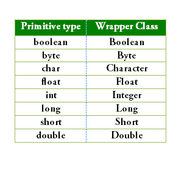

# Java 中包装类的需求

> 原文:[https://www . geesforgeks . org/Java 中需要包装类/](https://www.geeksforgeeks.org/need-of-wrapper-classes-in-java/)

首先，困扰程序员的问题是，当我们有原始数据类型时，为什么在 java 中需要包装类的概念。这是因为 Wrapper 类在使用时比原始数据类型有更多的特性。这些方法主要包括[](https://www.geeksforgeeks.org/data-conversion-using-valueof-method-java/)*[*Parseint()*](https://www.geeksforgeeks.org/string-to-integer-in-java-parseint/)[*ToString()*](https://www.geeksforgeeks.org/integer-tostring-in-java/)等方法。*

*包装类包装(包围)数据类型，并赋予它一个对象外观。包装类是最终的，不可变的。包装类中有两个概念，即自动装箱和取消装箱。*

*自动装箱是将一个基元值转换为相应[包装类](https://www.geeksforgeeks.org/wrapper-classes-java/)的对象的过程，称为自动装箱。例如，将 int 转换为 Integer 类。当基元值为:*

*   *作为参数传递给方法**，该方法需要相应包装类的对象**。*
*   *分配给相应的**包装类**的变量。*

*取消装箱是将包装类型的对象转换为其对应基元值的过程，称为取消装箱。例如整数到整数的转换。当包装类的对象是:*

*   *作为参数传递给方法**，该方法需要相应基元类型的值**。*
*   *分配给相应的**基本类型**的变量。*

> *自动装箱和拆箱图示如下:*

**

*现在让我们开始讨论包装类的有用特性，它们如下所示:*

1.  *它们将原始数据类型转换为对象。如果我们希望修改传递给方法的参数，就需要对象(因为基元类型是通过值传递的)。*
2.  *[*java.util 包*](https://www.geeksforgeeks.org/java-util-package-java/) 中的类只处理对象，因此包装类在这种情况下也有帮助。*
3.  *集合框架中的数据结构，如数组列表和向量，只存储对象(引用类型)，而不存储基元类型。*
4.  *需要一个对象来支持多线程中的同步。*

*包装类提供的主要重要特性之一是许多实用方法。比方说，当我们有一个浮点值，我们想找到这个浮点的整数值，那么我们有一个具体的方法，如下图所示。*

*插图:*

*如果我们想从一个字符串创建一个整数值或者从一个字符串创建一个布尔值。我们可以在包装类的帮助下做到这一点。*

***语法:**从其他数据类型创建*

```
*Integer hundred = Integer.valueOf("100");
Boolean value = Boolean.valueOf("True");*
```

***示例:***

## *Java 语言(一种计算机语言，尤用于创建网站)*

```
*// Java Program to Show Wrapper class concept

// Importing input output classes
import java.io.*;

// Main Class
class GFG {

    // Main driver method
    public static void main(String[] args)
    {

        // In java, in case of floating values
        // they are stored as x = (y)f

        // Conversion of float value to int
        Float floatWrap = Float.valueOf(45.158f);

        // Invoking the intValue() method over the stored
        // float value to store
        int floatToInt = floatWrap.intValue();

        // Print the non-primitive(Integer) value
        System.out.println(floatToInt);

        // Now for another number N
        // Say N = 5

        // Convert the binary number to the integer value
        Integer five = Integer.valueOf("101", 2);

        // Print the number
        System.out.println(five);
    }
}*
```

***Output**

```
45
5
```*