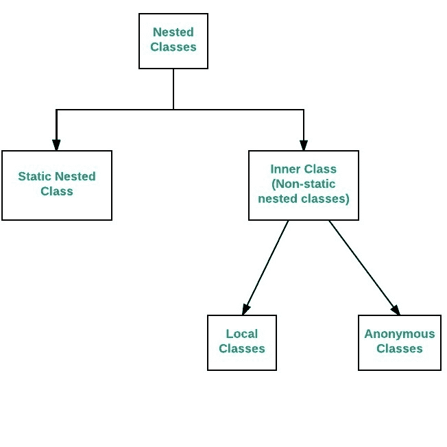

# Java 中的嵌套类

> 原文:[https://www.geeksforgeeks.org/nested-classes-java/](https://www.geeksforgeeks.org/nested-classes-java/)

在 Java 中，可以在另一个类中定义一个类，这样的类称为*嵌套*类。它们使您能够对仅在一个地方使用的类进行逻辑分组，从而增加了[封装](https://www.geeksforgeeks.org/encapsulation-in-java/)的使用，并创建了更可读和可维护的代码。

*   嵌套类的范围由其封闭类的范围限定。因此在上面的例子中，类*嵌套类*并不独立于类*外类*而存在。
*   嵌套类可以访问其嵌套所在类的成员，包括私有成员。然而，反之则不然，即封闭类不能访问嵌套类的成员。
*   嵌套类也是其封闭类的成员。
*   作为其封闭类的成员，嵌套类可以声明为*私有*、*公共*、*受保护*或*包私有*(默认)。
*   嵌套类分为两类:
    1.  **静态嵌套类:**声明为*静态的嵌套类*称为静态嵌套类。
    2.  **内部类:**内部类是非静态嵌套类。

**语法:**

```
class OuterClass
{
...
    class NestedClass
    {
        ...
    }
}
```

[](https://media.geeksforgeeks.org/wp-content/uploads/d3.jpeg)

**静态嵌套类**

在普通或常规内部类的情况下，如果不存在外部类对象，就不可能有内部类对象。即内部类的对象总是与外部类对象强关联。但是在静态嵌套类的情况下，如果不存在外部类对象，则可能存在静态嵌套类对象。即静态嵌套类的对象与外部类对象没有强关联。
与类方法和变量一样，静态嵌套类与其外部类相关联。像静态类方法一样，静态嵌套类不能直接引用其封闭类中定义的实例变量或方法:它只能通过对象引用来使用它们。
使用封闭类名访问它们。

```
OuterClass.StaticNestedClass

```

例如，要为静态嵌套类创建对象，请使用以下语法:

```
OuterClass.StaticNestedClass nestedObject =
     new OuterClass.StaticNestedClass();

```

```
// Java program to demonstrate accessing
// a static nested class

// outer class
class OuterClass
{
    // static member
    static int outer_x = 10;

    // instance(non-static) member
    int outer_y = 20;

    // private member
    private static int outer_private = 30;

    // static nested class
    static class StaticNestedClass
    {
        void display()
        {
            // can access static member of outer class
            System.out.println("outer_x = " + outer_x);

            // can access display private static member of outer class
            System.out.println("outer_private = " + outer_private);

            // The following statement will give compilation error
            // as static nested class cannot directly access non-static members
            // System.out.println("outer_y = " + outer_y);

        }
    }
}

// Driver class
public class StaticNestedClassDemo
{
    public static void main(String[] args)
    {
        // accessing a static nested class
        OuterClass.StaticNestedClass nestedObject = new OuterClass.StaticNestedClass();

        nestedObject.display();

    }
}
```

**输出:**

```
outer_x = 10
outer_private = 30

```

**内班**

要实例化内部类，必须首先实例化外部类。然后，使用以下语法在外部对象中创建内部对象:

```
OuterClass.InnerClass innerObject = outerObject.new InnerClass();

```

**有两种特殊的内部类:**

1.  [本地内部类](https://www.geeksforgeeks.org/local-inner-class-java/)
2.  [匿名内部类](https://www.geeksforgeeks.org/anonymous-inner-class-java/)

```
// Java program to demonstrate accessing
// a inner class

// outer class
class OuterClass
{
    // static member
    static int outer_x = 10;

    // instance(non-static) member
    int outer_y = 20;

    // private member
    private int outer_private = 30;

    // inner class
    class InnerClass
    {
        void display()
        {
            // can access static member of outer class
            System.out.println("outer_x = " + outer_x);

            // can also access non-static member of outer class
            System.out.println("outer_y = " + outer_y);

            // can also access a private member of the outer class
            System.out.println("outer_private = " + outer_private);

        }
    }
}

// Driver class
public class InnerClassDemo
{
    public static void main(String[] args)
    {
        // accessing an inner class
        OuterClass outerObject = new OuterClass();
        OuterClass.InnerClass innerObject = outerObject.new InnerClass();

        innerObject.display();

    }
}
```

输出:

```
outer_x = 10
outer_y = 20
outer_private = 30

```

**普通类或正则类与静态嵌套类的比较**

| S.NO | 普通/常规内部类 | 静态嵌套类 |
| --- | --- | --- |
| 1. | 没有外部类对象，就不可能有内部类对象。也就是说，内部类对象总是与外部类对象相关联。 | 如果不存在外部类对象，则可能存在静态嵌套类对象。也就是说，静态嵌套类对象不与外部类对象相关联。 |
| 2. | 在普通/常规内部类中，不能声明静态成员。 | 在静态嵌套类中，可以声明静态成员。 |
| 3. | 由于不能声明 main()方法，所以不能从命令提示符直接调用常规内部类。 | 由于可以声明 main()方法，因此可以直接从命令提示符调用静态嵌套类。 |
| 4. | 外部类的静态和非静态成员都可以直接访问。 | 只能直接访问外部类的静态成员。 |