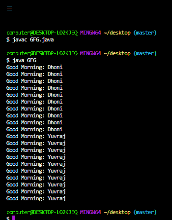

# Java 中的对象级锁与类级锁

> 原文:[https://www . geesforgeks . org/object-level-lock-vs-class-level-lock-in-Java/](https://www.geeksforgeeks.org/object-level-lock-vs-class-level-lock-in-java/)

[Synchronized](https://www.geeksforgeeks.org/synchronized-in-java/) 是仅适用于方法和块的修饰符，不适用于类和变量。如果多个线程试图同时对同一个 java 对象进行操作，那么可能会出现数据不一致的问题。要解决这个问题，我们应该使用“**”关键字。如果一个方法或块声明为同步的，那么一次只允许一个线程在给定的对象上执行该方法或块，这样数据不一致的问题就会得到解决。内部同步概念是通过使用锁来实现的。java 中的每个对象都有一个唯一的锁。每当我们使用一个“ ***【同步】*** ”关键词时，只有锁的概念才会出现在画面中。**

**如果一个线程想要在给定的对象上执行一个同步的方法，它首先必须获得该对象的锁，一旦线程获得了锁，那么它就被允许在该对象上执行任何同步的方法。内部获取和释放锁由 JVM 负责，程序员不负责这项活动。当一个线程在给定对象上执行同步方法时，其余线程不允许在同一对象上同时执行任何同步方法。但是允许剩余的线程同时执行非同步的方法。**

**[对象级锁](https://www.geeksforgeeks.org/object-level-lock-in-java/)是一种机制，其中 java 中的每个对象都有一个唯一的锁，这个锁只不过是一个对象**–**级锁。如果一个线程想要在给定的对象上执行一个同步的方法，那么该线程首先需要对象级锁，一旦该线程获得对象级锁，那么它就被允许在给定的对象上执行任何同步的方法，并且一旦该方法执行完成，该线程自动释放该对象的锁。**

****示例:****

## **Java 语言(一种计算机语言，尤用于创建网站)**

```
// Java program to illustrate Object Level Lock Concept

// Import required packages
import java.io.*;
import java.util.*;

// Class 1
// Helper Class 1
// Consists of synchronized method wish
class Display {

    // Declaring Non-static wish method
    public void wish(String name)
    {

        // synchronizing wish method
        // and getting the lock of current object
        synchronized (this)
        {

            for (int i = 1; i <= 10; i++) {

                // display message only
                System.out.print("Good Morning: ");

                // Try block to check. for exceptions
                try {

                    // Putting thread on sleep for specified
                    // time
                    // using the sleep() method
                    Thread.sleep(1000);
                }

                // Catch block to handle the exceptions
                catch (InterruptedException e) {

                    // Print the occurred exception/s
                    System.out.println(e);
                }
                // Display message only
                System.out.println(name);
            }
        }
    }
}

// Class 2
// Helper Class 2 (extending main Thread Class)
// myThread with override the run method and
// consists of parameterized constructor
class myThread extends Thread {
    // member variable of this class
    Display d;
    String name;

    // Constructor(Parameterized) of this class
    myThread(Display d, String name)
    {

        // this keyword refers to current object itself
        this.d = d;
        this.name = name;
    }

    // run() method for thread
    public void run()
    {

        // Calling wish method of display class
        d.wish(name);
    }
}

// Class 3
// Main Class
class GFG {

    // Main driver method
    public static void main(String[] args)
    {

        // Creating display class(Class 1) object
        // in the main() method
        Display d = new Display();

        // Creating thread objects in main method()
        myThread t1 = new myThread(d, "Dhoni");
        myThread t2 = new myThread(d, "Yuvraj");

        // Starting the threads using the start() method
        t1.start();
        t2.start();
    }
}
```

****

**[类级锁](https://www.geeksforgeeks.org/class-level-lock-in-java/)是一种机制，java 中的每个类都有一个唯一的锁，它只是一个类级锁。如果一个线程想要执行一个静态同步方法，那么这个线程需要一个类级别的锁，一旦这个线程获得了一个类级别的锁，那么它就被允许执行这个类的任何静态同步方法。一旦方法执行完成，线程会自动释放锁。当一个线程执行一个静态同步方法时，其余线程不允许同时执行该类的任何静态同步方法。**

****示例:****

## **Java 语言(一种计算机语言，尤用于创建网站)**

```
// java program to illustrate Class Level Lock Concept

// Importing required packages
import java.io.*;
import java.util.*;

// Class 1
// Helper Class
// Consist of synchronized method wish
class Display {

    // Declaring static wish method
    public static void wish(String name)
    {

        // synchronizing wish method
        // and getting the lock of display class
        synchronized (Display.class)
        {

            for (int i = 1; i <= 10; i++) {

                // Display message only
                System.out.print("Good Morning: ");

                // Try block to check for exceptions
                try {
                    // Putting thread on sleep for specified
                    // time
                    //  using the sleep() method
                    Thread.sleep(1000);
                }

                // Catch block to handle the exception
                catch (InterruptedException e) {

                    // Throwing exception
                    System.out.println(e);
                }
                // Display message
                System.out.println(name);
            }
        }
    }
}

// C;asss 2
// Helper Class (extends the Thread class)
// myThread with override the run method
// as per our requirements it also consists
// of parameterised constructor
class myThread extends Thread {
    // Member variables of this class
    Display d;
    String name;

    // Constructor of this class
    myThread(Display d, String name)
    {

        // This keyword refers to current object itself
        this.d = d;
        this.name = name;
    }

    // run method for thread/s
    public void run()
    {

        // Calling wish method of display class
        d.wish(name);
    }
}

// Class 3
// Main Class
class GFG {

    // Main driver method
    public static void main(String[] args)
    {

        // Creating Display class(Class 1) object
        // in the main() method
        Display d = new Display();

        // Creating a thread objects
        myThread t1 = new myThread(d, "Dhoni");
        myThread t2 = new myThread(d, "Yuvraj");

        // Starting the threads using start() method
        t1.start();
        t2.start();
    }
}
```

****

<figure class="table"> **| 

类级锁

 | 

对象级锁

 |
| --- | --- |
| This lock can be used when we want to prevent multiple threads from entering the synchronization block of the available instance at runtime. | Use this lock when we want a non-static method or a non-static block of our code to be accessed by only one thread at a time. |
| This lock is used to secure the static data path. | This lock is used to secure non-static data lines. |
| Multiple objects of a particular class may exist, but there is always one class object lock available. | Each object in the class has its own lock. |
| 我们可以获得一个类级锁如下:公共类 GFG {公共类虚空 m1( ) {同步(GFG.class) {//一些行代码}} | 我们可以获得对象级锁如下:公共类 GFG { } |** </figure>