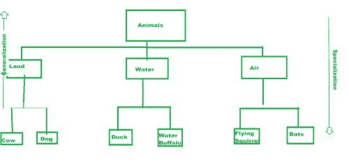

# Java 中的对象模型

> 原文:[https://www.geeksforgeeks.org/object-model-in-java/](https://www.geeksforgeeks.org/object-model-in-java/)

对象模型是一个系统或界面，它基本上用于根据软件应用程序中的对象来可视化元素。它是使用面向对象技术建模的，在完成任何编程或开发之前，对象模型被用来创建系统模型或体系结构。它定义了系统的面向对象特性，如继承、封装和许多其他面向对象的接口。让我们深入学习一些面向对象的术语:

## 对象和类

这些构成了 Java 或任何其他面向对象编程语言中面向对象范例的基础。这里详细解释了它们:

### **物体**

在面向对象的环境中，对象是物理或概念上的现实世界元素。

**特征:**

1.  与系统中的其他对象唯一且不同。
2.  指示属于特定对象的某些属性和值的状态。
3.  指示其与其他对象的交互或其外部可见活动的行为。

物理对象的例子是狗或人，而概念对象的例子是过程或产品。

### 班级

一个类是一个对象的蓝图或原型，并且代表了一组从该对象创建的对象。对象基本上是这些类的实例。一个类包括–

*   同一个类的对象在属性的值方面可能互不相同。这些属性被称为类数据。
*   识别和显示这些对象行为的操作称为函数和方法。

**示例:**

假设，有一个班级叫学生。该类的属性可以是–

*   学生的分数
*   学生学习的部门
*   一学年的学习
*   个人身份，即姓名、卷号、出生日期等。

要执行的一些操作可以使用以下功能来指示–

*   average marks()–计算学生的平均分数。
*   total marks()–计算学生的总分数。
*   library fine()–计算学生因延迟还书到图书馆而需要支付的罚款。

下面的代码演示了这一点:

## Java 语言(一种计算机语言，尤用于创建网站)

```java
// package whatever

import java.io.*;

public class Student {

  public static void main (String[] args) {
        // passing parameters to functions
        int tot = total_marks(93,99);
        double avg = avg_marks(tot, 2);

        // printing the output
        System.out.println("The total marks is = "+tot+". Th average is = "+avg+".");
    }

  // function to calculate total
  public static int total_marks(int math, int science) {
    int total = math + science;
    return total;
  }

  // function to calculate average marks
  public static double avg_marks(int total, int num_subs) {
   double avg = total/num_subs;
   return avg;
  }
}
```

**输出:**

```java
The total marks is = 192\. Th average is = 96.0.
```

## 封装和数据隐藏

为了保护我们的数据不被外部使用访问和利用，我们需要执行封装。这将在下面详细解释–

### 包装

将类中的方法和属性绑定在一起的过程称为封装。如果接口是由类提供的，那么只有封装允许外部访问内部细节或类属性。

### 数据隐藏

保护对象不被外部方法直接访问的过程称为数据隐藏。

**示例:**

*   setStudentValues()–为系、学术和学生的所有个人身份分配值。
*   getStudentValues()–获取存储在相应属性中的这些值。

**消息传递**

要使应用程序具有交互性，需要许多对象。使用以下功能在对象之间传递消息–

*   在消息传递中，可以涉及来自不同进程的对象。
*   在消息传递中需要调用类方法。
*   在两个对象之间，消息传递通常是单向的。
*   两个对象之间的交互是在消息传递中实现的。

下面的代码演示了上述示例–

## Java 语言(一种计算机语言，尤用于创建网站)

```java
// package whatever 

import java.io.*;

public class Student {

   private int rollNo;
   private String name;
   private String dep;

    // default constructor
    public Student() {}

    public Student(int rollNo, String name, String dep)
    {
        this.rollNo = rollNo;
        this.name = name;
        this.dep = dep;
    }

    // Methods to get and set the student properties
    public int getRollNo() { return rollNo; }

    public void setRollNo(int rollNo)
    {
        this.rollNo = rollNo;
    }

    public String getName() { return name; }

    public void setName(String name) { this.name = name; }

    public String getDep() { return dep; }

    public void setDep(String dep) { this.dep = dep; }

    // function to calculate total
    public static int totalMarks(int math, int science)
    {
        int total = math + science;
        return total;
    }

    // function to calculate average marks
    public static double avgMarks(int total, int num_subs)
    {
        double avg = total / num_subs;
        return avg;
    }

    public static void main(String[] args)
    {
        // setting student attributes
        Student s1 = new Student(23, "Deepthi", "CSE");
        // setRollNo(23);
        // setName("Deepthi");
        // setDep("CSE");

        // printing student attributes
        System.out.println(
            "Roll number of student : " + s1.getRollNo()
            + ". The name of student : " + s1.getName()
            + ". Department of the student : " + s1.getDep() + ".");

        // passing parameters to functions
        int tot = totalMarks(93, 99);
        double avg = avgMarks(tot, 2);

        // printing the output
        System.out.println("The total marks is = " + tot
                           + ". The averge is = " + avg
                           + ".");
    }
}
```

**输出:**

```java
Roll number of student : 23\. The name of student : Deepthi. Department of the student : CSE.
The total marks is = 192\. The averge is = 96.0.
```

## 遗产

通过维护现有类的部分或全部属性从现有类生成新类的过程称为继承。可以通过其生成其他类的原始类被归类为父类、超类或基类，而生成的类被称为派生类或子类。

**示例:**

对于类 Vehicle，派生类可以是汽车、自行车、公共汽车等。在本例中，这些派生类将它们的父类 Vehicle 的属性以及它们自己的属性(如车轮数量、座椅数量等)传递下去。下面的代码演示了上述示例–

## Java 语言(一种计算机语言，尤用于创建网站)

```java
class Vehicle {
    String belongsTo = "automobiles";
}
public class Car extends Vehicle {
    int wheels = 4;
    public static void main(String args[])
    {
        Car c = new Car();
        System.out.println("Car belongs to- "
                           + c.belongsTo);
        System.out.println("Car has " + c.wheels
                           + " wheels.");
    }
}
```

**输出:**

```java
Car belongs to- automobiles
Car has 4 wheels.
```

### 继承的类型

1.  **单一继承**–从单一基类生成的一个派生类。
2.  **多重继承**–从两个或多个基类中生成的一个派生类。
3.  **多级继承**–一个派生类由一个基类生成，这个基类也由另一个基类生成。
4.  **层次继承**–一组从基类生成的派生类，而基类又可能有自己的派生类。
5.  **混合遗传**–多级和多重遗传组合而成的点阵结构。

### 多态性

对象可以具有不同内部结构的公共外部接口的能力。在实现继承的同时，多态特别有效。在多态性中，函数可以有相同的名称，但有不同的参数列表。

**示例:**一个 Car 和一个 Bus 类都可以有 wheels()方法，但是两者的 wheels 数量不同，因此由于内部实现不同，因此不会产生冲突。

### 泛化与特殊化

不同类的层次结构的表示，其中派生类是从基类中生成的–

**概括**

来自派生类的共同特征的组合，以形成一个广义的基类。例子——“牛是陆地动物”。

**专精**

将对象从现有的类区分到专门的组是专门化。这几乎就像是一个泛化的反向过程。

下图展示了通用化与专门化–



### 链接和关联

**链接:**一个对象与其他对象协作的连接的表示，即对象之间的关系称为链接。

**关联:**识别和演示对象之间行为的一组链接称为关联。关联的实例称为链接。

### 关联度

**有三种类型的关联:**

*   一元关系:同一类的对象被连接起来。
*   二元关系:两个类的对象是相连的。
*   三元关系:三个或更多类的对象是连接的。

### 二元关联的基数

*   一对一:A 类的一个对象与 b 类的一个对象相关联
*   一对多:A 类的一个对象与 b 类的多个对象相关联
*   多对多:A 类的多个对象与 b 类的多个对象相关联

### 合成还是聚合

一个类通常可以由其他类和对象组合而成。这是类组成或聚合。关系的“有”或“部分”通常是集合。如果一个对象由其他对象组成，那么这个对象称为聚合对象。

**示例:**

在学生与书本的关系中，学生“拥有”一本书，而这本书是学生课程的“一部分”。在这里，学生是完整的对象。集合包括–

*   **物理密封–**例如，一个袋子由拉链和瓶托组成。
*   **概念包含–**例如，一个学生有分数。

### 对象模型的优势

*   启用 DRY(不要重复自己)的代码编写方式。
*   在集成复杂系统的同时，降低开发风险。
*   支持快速软件开发。
*   非常容易实现升级。
*   使软件更容易维护。