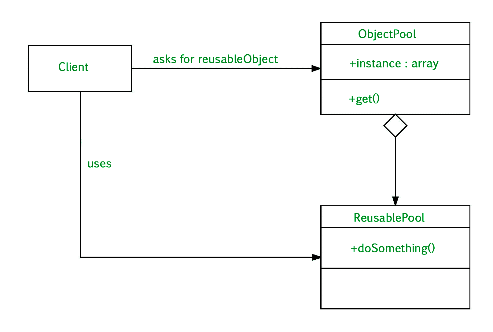

# 对象池设计模式

> 原文:[https://www.geeksforgeeks.org/object-pool-design-pattern/](https://www.geeksforgeeks.org/object-pool-design-pattern/)

对象池模式是一种软件创建设计模式，用于初始化类实例的成本非常高的情况。

基本上，对象池是包含一定数量对象的容器。因此，当对象从池中取出时，在放回之前，它在池中不可用。
池中的对象具有生命周期:

*   创造
*   确认
*   摧毁。

**UML 图对象池设计模式**



*   **客户端:**这是使用池对象类型的对象的类。
*   **重用工具:**池对象类是实例化成本高或速度慢的类型，或者可用性有限的类型，因此要保存在对象池中。
*   **object Pool:**Pool 类是对象池设计模式中最重要的类。对象池维护可用对象的列表和已经从池中请求的对象的集合。

让我们以数据库连接为例。很明显，打开太多的连接可能会影响性能，原因有几个:

*   创建连接是一项昂贵的操作。
*   当打开的连接太多时，创建新的连接需要更长的时间，数据库服务器将会过载。

在这里，对象池管理连接，并提供重用和共享它们的方法。它还可以限制可以创建的最大对象数量。

## Java 语言(一种计算机语言，尤用于创建网站)

```
// Java program to illustrate
// Object Pool Design Pattern
abstract class ObjectPool<T> {
    long deadTime;

    Hashtable<T, Long> lock, unlock;

    ObjectPool()
    {
        deadTime = 50000; // 50 seconds
        lock = new Hashtable<T, Long>();
        unlock = new Hashtable<T, Long>();
    }

    abstract T create();

    abstract boolean validate(T o);

    abstract void dead(T o);

    synchronized T takeOut()
    {
        long now = System.currentTimeMillis();
        T t;
        if (unlock.size() > 0) {
            Enumeration<T> e = unlock.keys();
            while (e.hasMoreElements()) {
                t = e.nextElement();
                if ((now - unlock.get(t)) > deadTime) {
                    // object has deadd
                    unlock.remove(t);
                    dead(t);
                    t = null;
                }
                else {
                    if (validate(t)) {
                        unlock.remove(t);
                        lock.put(t, now);
                        return (t);
                    }
                    else {
                        // object failed validation
                        unlock.remove(t);
                        dead(t);
                        t = null;
                    }
                }
            }
        }
        // no objects available, create a new one
        t = create();
        lock.put(t, now);
        return (t);
    }
    synchronized void takeIn(T t)
    {
        lock.remove(t);
        unlock.put(t, System.currentTimeMillis());
    }
}

// Three methods are abstract
// and therefore must be implemented by the subclass

class JDBCConnectionPool extends ObjectPool<Connection> {
    String dsn, usr, pwd;

    JDBCConnectionPool(String driver, String dsn, String usr, String pwd)
    {
        super();
        try {
            Class.forName(driver).newInstance();
        }
        catch (Exception e) {
            e.printStackTrace();
        }
        this.dsn = dsn;
        this.usr = usr;
        this.pwd = pwd;
    }

    Connection create()
    {
        try {
            return (DriverManager.getConnection(dsn, usr, pwd));
        }
        catch (SQLException e) {
            e.printStackTrace();
            return (null);
        }
    }

    void dead(Connection o)
    {
        try {
            ((Connection)o).close();
        }
        catch (SQLException e) {
            e.printStackTrace();
        }
    }

    boolean validate(Connection o)
    {
        try {
            return (!((Connection)o).isClosed());
        }
        catch (SQLException e) {
            e.printStackTrace();
            return (false);
        }
    }
}

class Main {
    public static void main(String args[])
    {
        // Create the ConnectionPool:
        JDBCConnectionPool pool = new JDBCConnectionPool(
            "org.hsqldb.jdbcDriver", "jdbc:hsqldb: //localhost/mydb",
            "sa", "password");

        // Get a connection:
        Connection con = pool.takeOut();
        // Return the connection:
        pool.takeIn(con);
    }
}
```

**优势**

*   它提供了显著的性能提升。
*   它管理连接，并提供重用和共享它们的方法。
*   当初始化类实例的速率很高时，使用对象池模式。

**何时使用对象池设计模式**

*   当我们有工作要分配或释放许多对象时
*   此外，当我们知道我们同时在内存中的对象数量有限时。

**参考:**T2[https://sourcemaking.com/design_patterns/object_pool](https://sourcemaking.com/design_patterns/object_pool)T5】