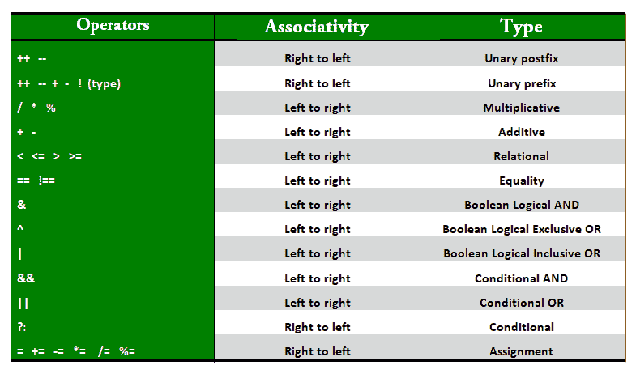

# Java 中的运算符

> 原文:[https://www.geeksforgeeks.org/operators-in-java/](https://www.geeksforgeeks.org/operators-in-java/)

Java 提供了多种类型的运算符，可以根据需要使用。它们根据提供的功能进行分类。有些类型是-

1.  [算术运算符](https://www.geeksforgeeks.org/java-arithmetic-operators-with-examples/)
2.  [一元运算符](https://www.geeksforgeeks.org/java-unary-operator-with-examples/)
3.  [赋值运算符](https://www.geeksforgeeks.org/java-assignment-operator-with-examples/)
4.  [关系运算符](https://www.geeksforgeeks.org/java-relational-operators-with-examples/)
5.  [逻辑运算符](https://www.geeksforgeeks.org/java-logical-operators-with-examples/)
6.  [三元运算符](https://www.geeksforgeeks.org/java-ternary-operator-with-examples/)

9.  [操作员实例](https://www.geeksforgeeks.org/java-instanceof-and-its-applications/)

让我们详细看看它们。

*   **算术运算符:**用于对原始数据类型进行简单的算术运算。
    *   *:乘法
    *   **/ :** 分部
    *   **% :** 模块
    *   **+ :** 加法
    *   **–:**减法
*   **一元运算符:**一元运算符只需要一个操作数。它们用于增加、减少或否定一个值。
    *   **–:一元减**，用于否定数值。
    *   **+:一元加**，表示正值(但是，没有这个数字是正数)。当操作数的类型为字节、字符或短整型时，它会自动转换为 int。这被称为一元数值提升。
    *   **++:递增运算符**，用于将数值递增 1。增量运算符有两种。
        *   **后递增:**值首先用于计算结果，然后递增。
        *   **预增量:**值首先递增，然后计算结果。
    *   **—:递减运算符**，用于将数值递减 1。减量运算符有两种。
        *   **后递减:**值首先用于计算结果，然后递减。
        *   **预递减:**值先递减，然后计算结果。
    *   **！:逻辑非运算符**，用于反转布尔值。
*   **赋值运算符:“=”**赋值运算符用于给任何变量赋值。它具有从右到左的关联性，即运算符右侧给出的值被赋给左侧的变量，因此右侧的值必须在使用之前声明，或者应该是常数。
    赋值运算符的一般格式是，

```
variable = value;
```

*   在许多情况下，赋值运算符可以与其他运算符组合在一起，构建一个名为**复合语句**的较短版本的语句。例如，我们可以写一个 **+=** 5，而不是一个 **=** a+5。
    *   **+=** ，用于将左操作数和右操作数相加，然后分配给左边的变量。
    *   **-=** ，用于用右操作数减去左操作数，然后分配给左边的变量。
    *   ***=** ，用于将左操作数乘以右操作数，然后分配给左边的变量。
    *   **/=** ，用于左操作数除以右操作数，然后分配给左边的变量。
    *   **%=** ，用于将左操作数的模赋给右操作数，然后赋给左边的变量。
*   **关系运算符:**这些运算符用于检查等式、大于、小于等关系。它们在比较后返回布尔结果，广泛用于循环语句和条件 if else 语句。一般格式是，

```
variable relation_operator value
```

*   一些关系运算符是-
    *   **==，等于:**如果左手边等于右手边，则返回真。
    *   **！=，不等于:**如果左侧不等于右侧，则返回真。
    *   **<，小于:**如果左手边小于右手边则返回真。
    *   **< =，小于或等于:**如果左手边小于或等于右手边，则返回 true。
    *   **>，大于:**如果左手边大于右手边，则返回真。
    *   **> =，大于或等于:**如果左手边大于或等于右手边，则返回真。
*   **逻辑运算器:**这些运算器用于执行“逻辑与”和“逻辑或”运算，即数字电子中类似于与门和或门的功能。需要记住的一点是，如果第一个条件为假，则不评估第二个条件，即它具有短路效应。广泛用于测试做决定的几个条件。
    条件运算符是-
    *   **& &，逻辑与:**当两个条件都为真时返回真。
    *   **||，逻辑或:**如果至少有一个条件为真，则返回真。
*   **三元运算符:**三元运算符是 if-else 语句的简写版本。它有三个操作数，因此得名三元。一般格式是-

```
condition ? if true : if false
```

上面的语句意味着，如果条件评估为真，则执行“？”后面的语句否则执行“:”后面的语句。

## Java 语言(一种计算机语言，尤用于创建网站)

```
// Java program to illustrate
// max of three numbers using
// ternary operator.
public class operators {
    public static void main(String[] args)
    {
        int a = 20, b = 10, c = 30, result;

        // result holds max of three
        // numbers
        result = ((a > b)
                      ? (a > c)
                            ? a
                            : c
                      : (b > c)
                            ? b
                            : c);
        System.out.println("Max of three numbers = "
                           + result);
    }
}
```

**Output:** 

```
Max of three numbers = 30
```

*   **按位运算符:**这些运算符用于对一个数字的各个位进行操作。它们可以用于任何整数类型。它们在执行二进制索引树的更新和查询操作时使用。
    *   **&，按位与运算符:**逐位返回输入值的与。
    *   **|，按位或运算符:**逐位返回输入值的或。
    *   **^，按位 XOR 运算符:**返回输入值的逐位 XOR。
    *   **~，按位补码运算符:**这是一个一元运算符，它返回输入值的补码表示，即所有位反转。
*   **移位运算符:**这些运算符用于向左或向右移位一个数的位，从而分别将该数乘以或除以 2。当我们必须将一个数乘以或除以 2 时，它们可以被使用。通用格式-

```
 number shift_op number_of_places_to_shift;
```

*   [**运算符实例**](https://www.geeksforgeeks.org/java-instanceof-and-its-applications/) **:** 运算符实例用于类型检查。它可以用来测试对象是类、子类还是接口的实例。通用格式-

```
object instance of class/subclass/interface
```

## Java 语言(一种计算机语言，尤用于创建网站)

```
// Java program to illustrate
// instance of operator
class operators {
    public static void main(String[] args)
    {

        Person obj1 = new Person();
        Person obj2 = new Boy();

        // As obj is of type person, it is not an
        // instance of Boy or interface
        System.out.println("obj1 instanceof Person: "
                           + (obj1 instanceof Person));
        System.out.println("obj1 instanceof Boy: "
                           + (obj1 instanceof Boy));
        System.out.println("obj1 instanceof MyInterface: "
                           + (obj1 instanceof MyInterface));

        // Since obj2 is of type boy,
        // whose parent class is person
        // and it implements the interface Myinterface
        // it is instance of all of these classes
        System.out.println("obj2 instanceof Person: "
                           + (obj2 instanceof Person));
        System.out.println("obj2 instanceof Boy: "
                           + (obj2 instanceof Boy));
        System.out.println("obj2 instanceof MyInterface: "
                           + (obj2 instanceof MyInterface));
    }
}

class Person {
}

class Boy extends Person implements MyInterface {
}

interface MyInterface {
}
```

**Output:** 

```
obj1 instanceof Person: true
obj1 instanceof Boy: false
obj1 instanceof MyInterface: false
obj2 instanceof Person: true
obj2 instanceof Boy: true
obj2 instanceof MyInterface: true
```

**运算符的优先级和结合性**

当处理包含一种以上运算符的混合方程时，使用优先和关联规则。在这种情况下，这些规则决定了首先考虑等式的哪一部分，因为同一等式可能有许多不同的估值。下表按大小顺序描述了运算符的优先级，顶部表示最高优先级，底部表示最低优先级。



**操作员的有趣问题**

*   **优先性和结合性:**说到混合方程，也就是有多个算符的方程，经常会出现混淆。问题是先解决哪个部分。在这些情况下，有一个黄金法则可以遵循。如果运算符具有不同的优先级，请先解决较高的优先级。如果它们具有相同的优先级，则根据结合律求解，即从右向左或从左向右。以下程序的解释在程序本身的注释中写得很好。

## Java 语言(一种计算机语言，尤用于创建网站)

```
public class operators {
    public static void main(String[] args)
    {
        int a = 20, b = 10, c = 0, d = 20, e = 40, f = 30;

        // precedence rules for arithmetic operators.
        // (* = / = %) > (+ = -)
        // prints a+(b/d)
        System.out.println("a+b/d = " + (a + b / d));

        // if same precendence then associative
        // rules are followed.
        // e/f -> b*d -> a+(b*d) -> a+(b*d)-(e/f)
        System.out.println("a+b*d-e/f = "
                           + (a + b * d - e / f));
    }
}
```

**Output:** 

```
a+b/d = 20
a+b*d-e/f = 219
```

*   **做一个编译器:**我们系统中的编译器在生成令牌的时候使用 lex 工具来匹配最大匹配。如果忽视这一点，就会产生一些问题。例如，考虑语句**a = b+++c；**，对于许多读者来说，这可能会产生编译器错误。但是这个语句是绝对正确的，因为 lex 创建的 token 是 a，=，b，++，+，c，因此这个语句有一个类似的效果，先给 a 赋值 b+c，然后递增 b，类似的，a = b++ +++ c；会产生错误，因为生成的标记是 a，=，b，++，++，++，c，这实际上是一个错误，因为在第二个一元操作数之后没有操作数。

## Java 语言(一种计算机语言，尤用于创建网站)

```
public class operators {
    public static void main(String[] args)
    {
        int a = 20, b = 10, c = 0;

        // a=b+++c is compiled as
        // b++ +c
        // a=b+c then b=b+1
        a = b++ + c;
        System.out.println("Value of a(b+c), "
                           + " b(b+1), c = "
                           + a + ", " + b
                           + ", " + c);

        // a=b+++++c is compiled as
        // b++ ++ +c
        // which gives error.
        // a=b+++++c;
        // System.out.println(b+++++c);
    }
}
```

**Output:** 

```
Value of a(b+c), b(b+1), c = 10, 11, 0
```

*   **使用+ over ():** 在 system.out.println()内部使用+运算符时，请确保使用括号进行加法。如果我们在做加法之前写一些东西，那么就会发生字符串加法，也就是说加法的结合性是从左到右的，因此整数被添加到字符串中，首先产生一个字符串，当使用+时字符串对象被连接起来，因此它会产生不需要的结果。

## Java 语言(一种计算机语言，尤用于创建网站)

```
public class operators {
    public static void main(String[] args)
    {

        int x = 5, y = 8;

        // concatenates x and y as
        // first x is added to "concatenation (x+y) = "
        // producing "concatenation (x+y) = 5"
        // and then 8 is further concatenated.
        System.out.println("Concatenation (x+y)= "
                           + x + y);

        // addition of x and y
        System.out.println("Addition (x+y) = "
                           + (x + y));
    }
}
```

**Output:** 

```
Concatenation (x+y)= 58
Addition (x+y) = 13
```

**参考文献:** [官方 Java 文档](https://docs.oracle.com/javase/tutorial/java/nutsandbolts/op1.html)
本文由**里沙布·马尔塞**供稿。如果你喜欢 GeeksforGeeks 并想投稿，你也可以使用[write.geeksforgeeks.org](https://write.geeksforgeeks.org)写一篇文章或者把你的文章邮寄到 review-team@geeksforgeeks.org。看到你的文章出现在极客博客主页上，帮助其他极客。
如果发现有不正确的地方，或者想分享更多关于上述话题的信息，请写评论。