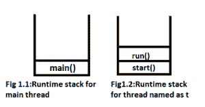
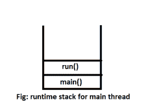

# 线程类运行()方法的重载

> 原文:[https://www . geesforgeks . org/overloading-thread-class-run-method/](https://www.geeksforgeeks.org/overloading-thread-class-run-method/)

run()方法可能会重载。但是 Thread 类 start()方法可以调用无参数方法。我们必须像普通方法调用一样显式调用另一个重载方法。

```
// Java Program to illustrate the behavior of
// run() method overloading
class Geeks extends Thread {
    public void run()
    {
        System.out.println("GeeksforGeeks");
    }
    public void run(int i)
    {
        System.out.println("Bishal");
    }
} 

class Test {
    public static void main(String[] args)
    {
        Geeks t = new Geeks();
        t.start();
    }
}
```

**输出:**

```
GeeksforGeeks
```

**JVM 为上述程序提供的运行时栈:**



**注意:**重载 run()方法将被 Thread 类忽略，除非我们自己调用它。Thread 类需要一个不带-arg 的 run()，在线程启动后，它将在一个单独的调用堆栈中执行。使用 run(int i)，即使我们直接调用它，它也不会启动任何单独的调用堆栈。它将像任何其他方法一样在同一个调用堆栈中(如果您从 run()方法调用)。

示例:

```
// Java Program to illustrate the execution of
// program using main thread
class Geeks extends Thread {
    public void run()
    {
        System.out.println("GeeksforGeeks");
    }
    public void run(int i)
    {
        System.out.println("Bishal");
    }
} 

class Test extends Geeks {
    public static void main(String[] args)
    {
        Geeks t = new Geeks();
        t.run(1);
    }
}
```

**输出:**

```
Bishal

```

**Runtime stack provided by JVM for the above program:**



相关文章:[线程类 start()方法的重载覆盖](https://www.geeksforgeeks.org/overriding-thread-class-start-method/)

本文由**比沙尔·库马尔·杜贝**供稿。如果你喜欢 GeeksforGeeks 并想投稿，你也可以使用[contribute.geeksforgeeks.org](http://www.contribute.geeksforgeeks.org)写一篇文章或者把你的文章邮寄到 contribute@geeksforgeeks.org。看到你的文章出现在极客博客主页上，帮助其他极客。

如果你发现任何不正确的地方，或者你想分享更多关于上面讨论的话题的信息，请写评论。