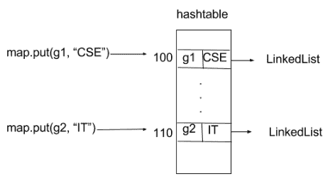
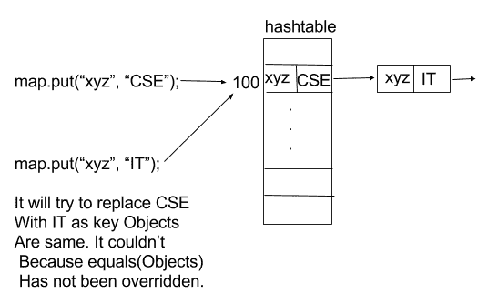

# 为什么要覆盖 equals(对象)和 hashCode()方法？

> 原文:[https://www . geesforgeks . org/override-equalsobject-hashcode-method/](https://www.geeksforgeeks.org/override-equalsobject-hashcode-method/)

先决条件–[Equals 和 hashcode 方法](https://www.geeksforgeeks.org/equals-hashcode-methods-java/)
HashMap 和 HashSet 使用对象的 hashcode 值来找出该对象将如何存储在集合中，随后 Hashcode 用于帮助在集合中定位该对象。散列检索包括:

1.  首先，使用 hashCode()找到合适的桶。
2.  其次，使用 equals()在桶中搜索正确的元素

让我们考虑这些方法中所有的覆盖情况

**情况 1:同时覆盖 equals(对象)和 hashCode()方法**

您必须在每个重写 equals()的类中重写 hashCode()。否则将导致违反 Object.hashCode()的一般约定，这将阻止您的类与所有基于哈希的集合(包括 HashMap、HashSet 和 Hashtable)一起正常运行。(-约书亚·布洛赫)
这是契约，来自 java.lang.Object 专门化:

*   在 Java 应用程序执行过程中，每当在同一个对象上多次调用它(hashcode)时，hashCode 方法必须一致地返回同一个整数，前提是对象上的 equals 比较中使用的信息没有被修改。从一个应用程序的一次执行到同一应用程序的另一次执行，该整数不需要保持一致。
*   如果两个对象根据 equals(Object)方法是相等的，那么在两个对象上调用 hashCode 方法必须产生相同的整数结果。
*   不要求如果两个对象根据 equals(java.lang.Object)方法不相等，那么在两个对象的每一个上调用 hashCode 方法都必须产生不同的整数结果。但是，程序员应该知道，为不相等的对象生成不同的整数结果可能会提高哈希表的性能。

```java
// Java program to illustrate
// overriding of equals and
// hashcode methods
import java.io.*;
import java.util.*;

class Geek 
{

    String name;
    int id;

    Geek(String name, int id)
    {

        this.name = name;
        this.id = id;
    }

    @Override
    public boolean equals(Object obj)
    {

    // if both the object references are 
    // referring to the same object.
    if(this == obj)
            return true;

        // it checks if the argument is of the 
        // type Geek by comparing the classes 
        // of the passed argument and this object.
        // if(!(obj instanceof Geek)) return false; ---> avoid.
        if(obj == null || obj.getClass()!= this.getClass())
            return false;

        // type casting of the argument. 
        Geek geek = (Geek) obj;

        // comparing the state of argument with 
        // the state of 'this' Object.
        return (geek.name.equals(this.name)  && geek.id == this.id);
    }

    @Override
    public int hashCode()
    {

        // We are returning the Geek_id 
        // as a hashcode value.
        // we can also return some 
        // other calculated value or may
        // be memory address of the 
        // Object on which it is invoked. 
        // it depends on how you implement 
        // hashCode() method.
        return this.id;
    }

}

// Driver code
class GFG 
{
    public static void main (String[] args) 
    {

        // creating two Objects with 
        // same state
        Geek g1 = new Geek("aditya", 1);
        Geek g2 = new Geek("aditya", 1);

        Map<Geek, String> map = new HashMap<Geek, String>();
        map.put(g1, "CSE");
        map.put(g2, "IT");

        for(Geek geek : map.keySet())
        {
            System.out.println(map.get(geek).toString());
        }

    }
}
```

输出:

```java
IT

```

在这种情况下，我们适当地覆盖这两种方法。
我们叫 **map.put(g1，“CSE”)的时候；**它会散列到某个桶位置，当我们调用 **map.put(g2，“IT”)；**，它将生成相同的 hashcode 值(与 g1 相同)并用第二个值替换第一个值，因为当迭代同一个桶时，它发现一个 k，使得 k.equals(g2)为真，这意味着搜索关键字已经存在。因此，它会用新值替换该键的旧值。

**情况 2:仅覆盖等于(对象)方法**

如果我们只覆盖 equals(Object)方法，当我们调用 **map.put(g1，“CSE”)时；**它会散列到某个桶位置，当我们调用 **map.put(g2，“it”)时；**由于 hashcode()方法没有被覆盖，因此由于 hashCode 值不同，它将散列到其他一些桶位置。
[](https://media.geeksforgeeks.org/wp-content/uploads/hashcoe_1.png) 
正如你在图中清楚看到的，两个值都被存储到不同的桶位置。像这样，无论我们使用相同的关键对象还是不同的关键对象(即关键对象的状态相同或不同)，每次插入到地图中都会得到不同的桶位置。

```java
// Java program to illustrate
// Overriding only the equals(Object) method
import java.io.*;
import java.util.*;

class Geek 
{
    String name;
    int id;

    Geek(String name, int id)
    {
        this.name = name;
        this.id = id;
     }

    @Override
    public boolean equals(Object obj)
    {
       // if both the object references are 
       // referring to the same object.
       if(this == obj)
            return true;

        // it checks if the argument is of the 
        // type Geek by comparing the classes 
        // of the passed argument and this object.
        // if(!(obj instanceof Geek)) return false; ---> avoid.
        if(obj == null || obj.getClass()!= this.getClass())
            return false;

        // type casting of the argument.    
        Geek geek = (Geek) obj;

        // comparing the state of argument with 
        // the state of 'this' Object.
        return (geek.name.equals(this.name) && geek.id == this.id);
    }
}

class GFG 
{
    public static void main (String[] args) 
    {

        // creating two Objects with 
        // same state
        Geek g1 = new Geek("aditya", 1);
        Geek g2 = new Geek("aditya", 1);

        Map<Geek, String> map = new HashMap<Geek, String>();
        map.put(g1, "CSE");
        map.put(g2, "IT");

        for(Geek geek : map.keySet())
        {
            System.out.println(map.get(geek).toString());
        }

    }
}
```

输出:

```java
CSE
IT
```

**情况 3:只覆盖 hashCode()方法**

考虑地图的另一个例子:

```java
Map map = new HashMap();
map.put(“xyz”, “CSE”);
map.put(“xyz”, “IT”);

```

当我们称**为 map . put(“XYZ”、“CSE”)；**它将生成 hashcode 值，并将其存储到用该地址指定的存储桶位置(hashcode 值)。当我们称**为地图时(“xyz”，“IT”)；**它生成与前一个条目相同的 hashcode 值，因为键对象相同，hashCode()方法已被覆盖。所以它应该按照规则用第二个代替第一个。但事实并非如此。原因是，当它遍历该桶并试图找到 k，使得 k 等于(“xyz”)时，即如果搜索关键字已经存在。但是它找不到，因为 equals(Object)方法没有被覆盖。这违反了散列规则。

```java
// Java program to illustrate 
// Overriding only hashCode() method

import java.io.*;
import java.util.*;

class Geek 
{
    String name;
    int id;

    Geek(String name, int id)
    {
        this.name = name;
        this.id = id;
     }

    @Override
    public int hashCode()
    {

        // We are returning the Geek_id 
        // as a hashcode value.
        // we can also return some 
        // other calculated value or may
        // be memory address of the 
        // Object on which it is invoked. 
        // it depends on how you implement 
        // hashCode() method.
        return this.id;
    }

}

class GFG 
{
    public static void main (String[] args)
    {

        // creating two Objects with 
        // same state
        Geek g1 = new Geek("aditya", 1);
        Geek g2 = new Geek("aditya", 1);

        Map<Geek, String> map = new HashMap<Geek, String>();
        map.put(g1, "CSE");
        map.put(g2, "IT");

        for(Geek geek : map.keySet())
        {
            System.out.println(map.get(geek).toString());
        }

    }
}
```

输出:

```java
CSE
IT
```

[](https://media.geeksforgeeks.org/wp-content/uploads/hashcode_3.png)

在上图中当我们调用**map . put(“XYZ”、“IT”)时；**然后它试图用第二个值(it)替换第一个值(CSE)，但这是不可能，所以它将第二对(键，值)插入到内部使用 hashmap 的新 LinkedList 节点中。它完全违反了规则，因为密钥在地图中是唯一的。

参考: [StackOverflow](http://stackoverflow.com/questions/2265503/why-do-i-need-to-override-the-equals-and-hashcode-methods-in-java)

本文由 **Nitsdheerendra** 供稿。如果你喜欢 GeeksforGeeks 并想投稿，你也可以使用[contribute.geeksforgeeks.org](http://www.contribute.geeksforgeeks.org)写一篇文章或者把你的文章邮寄到 contribute@geeksforgeeks.org。看到你的文章出现在极客博客主页上，帮助其他极客。

如果你发现任何不正确的地方，或者你想分享更多关于上面讨论的话题的信息，请写评论。