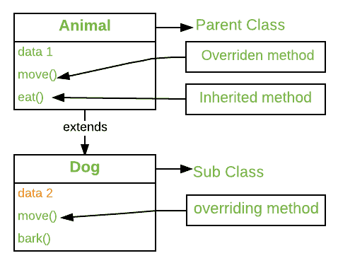
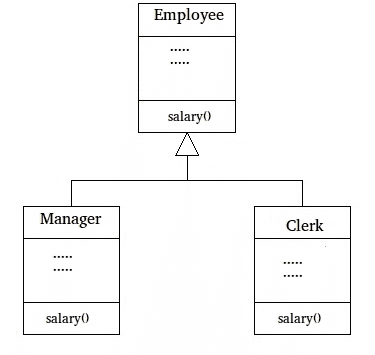

# 在 Java 中覆盖

> 原文:[https://www.geeksforgeeks.org/overriding-in-java/](https://www.geeksforgeeks.org/overriding-in-java/)

在任何面向对象的编程语言中，Overriding 都是一种允许子类或子类提供某个方法的特定实现的特性，该方法已经由其超类或父类之一提供。当子类中的方法与其超类中的方法具有相同的名称、相同的参数或签名以及相同的返回类型(或子类型)时，则称子类中的方法*覆盖超类中的方法*。



方法重写是 java 实现[运行时多态性](https://www.geeksforgeeks.org/dynamic-method-dispatch-runtime-polymorphism-java/)的方式之一。执行的方法版本将由用于调用它的对象决定。如果父类的对象被用来调用方法，那么父类中的版本将被执行，但是如果子类的对象被用来调用方法，那么子类中的版本将被执行。换句话说，*被引用对象的类型*(不是引用变量的类型)决定了被覆盖方法的哪个版本将被执行。

```
// A Simple Java program to demonstrate
// method overriding in java

// Base Class
class Parent {
    void show()
    {
        System.out.println("Parent's show()");
    }
}

// Inherited class
class Child extends Parent {
    // This method overrides show() of Parent
    @Override
    void show()
    {
        System.out.println("Child's show()");
    }
}

// Driver class
class Main {
    public static void main(String[] args)
    {
        // If a Parent type reference refers
        // to a Parent object, then Parent's
        // show is called
        Parent obj1 = new Parent();
        obj1.show();

        // If a Parent type reference refers
        // to a Child object Child's show()
        // is called. This is called RUN TIME
        // POLYMORPHISM.
        Parent obj2 = new Child();
        obj2.show();
    }
}
```

**Output:**

```
Parent's show()
Child's show()

```

**方法覆盖规则:**

1.  **Overriding and Access-Modifiers :** The [access modifier](https://www.geeksforgeeks.org/access-modifiers-java/) for an overriding method can allow more, but not less, access than the overridden method. For example, a protected instance method in the super-class can be made public, but not private, in the subclass. Doing so, will generate compile-time error.

    ```
    // A Simple Java program to demonstrate
    // Overriding and Access-Modifiers

    class Parent {
        // private methods are not overridden
        private void m1()
        {
            System.out.println("From parent m1()");
        }

        protected void m2()
        {
            System.out.println("From parent m2()");
        }
    }

    class Child extends Parent {
        // new m1() method
        // unique to Child class
        private void m1()
        {
            System.out.println("From child m1()");
        }

        // overriding method
        // with more accessibility
        @Override
        public void m2()
        {
            System.out.println("From child m2()");
        }
    }

    // Driver class
    class Main {
        public static void main(String[] args)
        {
            Parent obj1 = new Parent();
            obj1.m2();
            Parent obj2 = new Child();
            obj2.m2();
        }
    }
    ```

    **Output:**

    ```
    From parent m2()
    From child m2()

    ```

2.  **Final methods can not be overridden :** If we don’t want a method to be overridden, we declare it as [final](https://www.geeksforgeeks.org/final-keyword-java/). Please see [Using final with Inheritance](https://www.geeksforgeeks.org/using-final-with-inheritance-in-java/) .

    ```
    // A Java program to demonstrate that
    // final methods cannot be overridden

    class Parent {
        // Can't be overridden
        final void show() {}
    }

    class Child extends Parent {
        // This would produce error
        void show() {}
    }
    ```

    **输出:**

    ```
    13: error: show() in Child cannot override show() in Parent
        void show() {  }
             ^
      overridden method is final

    ```

3.  **Static methods can not be overridden(Method Overriding vs Method Hiding) :** When you define a static method with same signature as a static method in base class, it is known as [method hiding](https://www.geeksforgeeks.org/can-we-overload-or-override-static-methods-in-java/).

    下表总结了当您定义的方法与超类中的方法具有相同的签名时会发生什么。

    |   | 超类实例方法 | 超类静态方法 |
    | 子类实例方法 | 推翻 | 生成编译时错误 |
    | 子类静态方法 | 生成编译时错误 | 隐瞒 |

    ```
    // Java program to show that
    // if the static method is redefined by
    // a derived class, then it is not
    // overriding, it is hiding

    class Parent {
        // Static method in base class
        // which will be hidden in subclass
        static void m1()
        {
            System.out.println("From parent "
                               + "static m1()");
        }

        // Non-static method which will
        // be overridden in derived class
        void m2()
        {
            System.out.println("From parent "
                               + "non-static(instance) m2()");
        }
    }

    class Child extends Parent {
        // This method hides m1() in Parent
        static void m1()
        {
            System.out.println("From child static m1()");
        }

        // This method overrides m2() in Parent
        @Override
        public void m2()
        {
            System.out.println("From child "
                               + "non-static(instance) m2()");
        }
    }

    // Driver class
    class Main {
        public static void main(String[] args)
        {
            Parent obj1 = new Child();

            // As per overriding rules this
            // should call to class Child static
            // overridden method. Since static
            // method can not be overridden, it
            // calls Parent's m1()
            obj1.m1();

            // Here overriding works
            // and Child's m2() is called
            obj1.m2();
        }
    }
    ```

    **Output:**

    ```
    From parent static m1()
    From child non-static(instance) m2()

    ```

4.  **Private methods can not be overridden :** [Private methods](https://www.geeksforgeeks.org/can-override-private-methods-java/) cannot be overridden as they are bonded during compile time. Therefore we can’t even override private methods in a subclass.(See [this](https://www.geeksforgeeks.org/can-override-private-methods-java/) for details).
5.  **The overriding method must have same return type (or subtype) :** From Java 5.0 onwards it is possible to have different return type for a overriding method in child class, but child’s return type should be sub-type of parent’s return type. This phenomena is known as [**covariant return type**](https://www.geeksforgeeks.org/covariant-return-types-java/).
6.  **从子类调用覆盖方法:**我们可以使用[超级关键字](https://www.geeksforgeeks.org/super-keyword/)在覆盖方法中调用父类方法。

    ```
    // A Java program to demonstrate that overridden
    // method can be called from sub-class

    // Base Class
    class Parent {
        void show()
        {
            System.out.println("Parent's show()");
        }
    }

    // Inherited class
    class Child extends Parent {
        // This method overrides show() of Parent
        @Override
        void show()
        {
            super.show();
            System.out.println("Child's show()");
        }
    }

    // Driver class
    class Main {
        public static void main(String[] args)
        {
            Parent obj = new Child();
            obj.show();
        }
    }
    ```

    **输出:**

    ```
    Parent's show()
    Child's show()

    ```

7.  **重写和构造函数:**我们不能重写构造函数，因为父类和子类永远不能有同名的构造函数(构造函数名称必须始终与类名相同)。
    T3】
8.  **覆盖和异常处理:**下面是覆盖与异常处理相关的方法时需要注意的两条规则。
    *   **Rule#1 :** If the super-class overridden method does not throw an exception, subclass overriding method can only throws the [unchecked exception](https://www.geeksforgeeks.org/checked-vs-unchecked-exceptions-in-java/), throwing checked exception will lead to compile-time error.

        ```
        /* Java program to demonstrate overriding when 
          superclass method does not declare an exception
        */

        class Parent {
            void m1()
            {
                System.out.println("From parent m1()");
            }

            void m2()
            {
                System.out.println("From parent  m2()");
            }
        }

        class Child extends Parent {
            @Override
            // no issue while throwing unchecked exception
            void m1() throws ArithmeticException
            {
                System.out.println("From child m1()");
            }

            @Override
            // compile-time error
            // issue while throwin checked exception
            void m2() throws Exception
            {
                System.out.println("From child m2");
            }
        }
        ```

        **输出:**

        ```
        error: m2() in Child cannot override m2() in Parent
            void m2() throws Exception{ System.out.println("From child m2");}
                 ^
          overridden method does not throw Exception

        ```

    *   **Rule#2 :** If the super-class overridden method does throws an exception, subclass overriding method can only throw same, subclass exception. Throwing parent exception in [Exception hierarchy](https://www.geeksforgeeks.org/exceptions-in-java/) will lead to compile time error.Also there is no issue if subclass overridden method is not throwing any exception.

        ```
        // Java program to demonstrate overriding when
        // superclass method does declare an exception

        class Parent {
            void m1() throws RuntimeException
            {
                System.out.println("From parent m1()");
            }
        }

        class Child1 extends Parent {
            @Override
            // no issue while throwing same exception
            void m1() throws RuntimeException
            {
                System.out.println("From child1 m1()");
            }
        }
        class Child2 extends Parent {
            @Override
            // no issue while throwing subclass exception
            void m1() throws ArithmeticException
            {
                System.out.println("From child2 m1()");
            }
        }
        class Child3 extends Parent {
            @Override
            // no issue while not throwing any exception
            void m1()
            {
                System.out.println("From child3 m1()");
            }
        }
        class Child4 extends Parent {
            @Override
            // compile-time error
            // issue while throwing parent exception
            void m1() throws Exception
            {
                System.out.println("From child4 m1()");
            }
        }
        ```

        **输出:**

        ```
        error: m1() in Child4 cannot override m1() in Parent
            void m1() throws Exception
                 ^
          overridden method does not throw Exception

        ```

10.  **Overriding and abstract method:** Abstract methods in an interface or abstract class are meant to be overridden in derived concrete classes otherwise a compile-time error will be thrown.
11.  **覆盖和 synchronized/strictfp 方法:**synchronized/strictfp 修饰符和方法的存在对覆盖规则没有影响，即 synchronized/strictfp 方法可以覆盖非 synchronized/strict FP 方法，反之亦然。

**注:**

1.  在 C++中，我们需要[虚拟关键字](https://www.geeksforgeeks.org/virtual-functions-and-runtime-polymorphism-in-c-set-1-introduction/)来实现覆盖或者[运行时多态](https://www.geeksforgeeks.org/dynamic-method-dispatch-runtime-polymorphism-java/)。在 Java 中，默认情况下方法是虚拟的。
2.  我们可以有多级方法重写。

    ```
    // A Java program to demonstrate
    // multi-level overriding

    // Base Class
    class Parent {
        void show()
        {
            System.out.println("Parent's show()");
        }
    }

    // Inherited class
    class Child extends Parent {
        // This method overrides show() of Parent
        void show() { System.out.println("Child's show()"); }
    }

    // Inherited class
    class GrandChild extends Child {
        // This method overrides show() of Parent
        void show()
        {
            System.out.println("GrandChild's show()");
        }
    }

    // Driver class
    class Main {
        public static void main(String[] args)
        {
            Parent obj1 = new GrandChild();
            obj1.show();
        }
    }
    ```

    **输出:**

    ```
    GrandChild's show()

    ```

3.  **超越 vs [超载](https://www.geeksforgeeks.org/overloading-in-java/):
    T4】**

1.  Overloading is about same method have different signatures. Overriding is about same method, same signature but different classes connected through inheritance.

    [](https://media.geeksforgeeks.org/wp-content/uploads/OverridingVsOverloading.png)

2.  重载是编译器时多态的一个例子，重写是[运行时多态](https://www.geeksforgeeks.org/dynamic-method-dispatch-runtime-polymorphism-java/)的一个例子。

**为什么方法优先？**

如前所述，被覆盖的方法允许 Java 支持[运行时多态性](https://www.geeksforgeeks.org/dynamic-method-dispatch-runtime-polymorphism-java/)。多态性对于面向对象编程是必不可少的，原因有一个:它允许一个通用类指定对其所有派生方法通用的方法，同时允许子类定义这些方法中的一些或全部的具体实现。重写方法是 Java 实现多态性的“一个接口，多个方法”方面的另一种方式。

[动态方法分派](https://www.geeksforgeeks.org/dynamic-method-dispatch-runtime-polymorphism-java/)是面向对象设计对代码重用和健壮性带来的最强大的机制之一。现有代码库能够在不重新编译的情况下调用新类实例上的方法，同时维护干净的抽象接口，这是一个非常强大的工具。

重写的方法允许我们调用任何派生类的方法，甚至不知道派生类对象的类型。

**何时应用方法覆盖？(附示例)**

**覆盖和[继承](https://www.geeksforgeeks.org/inheritance-in-java/)** :成功应用多态性的部分关键是理解超类和子类形成了一个从较小到较大专门化的层次结构。如果使用得当，超类提供了子类可以直接使用的所有元素。它还定义了派生类必须自己实现的那些方法。这允许子类灵活地定义它的方法，但仍然强制执行一致的接口。**因此，通过将继承与被覆盖的方法相结合，超类可以定义其所有子类将使用的方法的一般形式。**

让我们看一个使用方法重写的更实际的例子。考虑一个组织的员工管理软件，让代码有一个简单的基类 employee，这个类有 raiseSalary()，transfer()，promote()，..等等。不同类型的员工，如经理、工程师，..etc 可能在基类 Employee 中实现了这些方法。在我们完整的软件中，我们只需要到处传递一个员工列表，调用适当的方法，甚至不知道员工的类型。例如，我们可以通过遍历员工列表轻松提高所有员工的工资。每种类型的雇员可能在它的类中都有它的逻辑，我们不需要担心，因为如果特定的雇员类型存在 raiseSalary()，那么只会调用那个方法。

[](https://media.geeksforgeeks.org/wp-content/cdn-uploads/JavaOVerriding.jpg)

```
// A Simple Java program to demonstrate application
// of overriding in Java

// Base Class
class Employee {
    public static int base = 10000;
    int salary()
    {
        return base;
    }
}

// Inherited class
class Manager extends Employee {
    // This method overrides salary() of Parent
    int salary()
    {
        return base + 20000;
    }
}

// Inherited class
class Clerk extends Employee {
    // This method overrides salary() of Parent
    int salary()
    {
        return base + 10000;
    }
}

// Driver class
class Main {
    // This method can be used to print the salary of
    // any type of employee using base class reference
    static void printSalary(Employee e)
    {
        System.out.println(e.salary());
    }

    public static void main(String[] args)
    {
        Employee obj1 = new Manager();

        // We could also get type of employee using
        // one more overridden method.loke getType()
        System.out.print("Manager's salary : ");
        printSalary(obj1);

        Employee obj2 = new Clerk();
        System.out.print("Clerk's salary : ");
        printSalary(obj2);
    }
}
```

**Output:**

```
Manager's salary : 30000
Clerk's salary : 20000

```

**相关文章:**

*   [Java 中的动态方法调度或运行时多态性](https://www.geeksforgeeks.org/dynamic-method-dispatch-runtime-polymorphism-java/)
*   [覆盖对象类的 equals()方法](https://www.geeksforgeeks.org/overriding-equals-method-in-java/)
*   [覆盖对象类的 toString()方法](https://www.geeksforgeeks.org/overriding-tostring-method-in-java/)
*   [Java 中的重载](https://www.geeksforgeeks.org/overloading-in-java/)
*   [Java 程序输出|第 18 集(覆盖)](https://www.geeksforgeeks.org/output-java-program-set-18-overriding/)

本文由**钿泰吉和高拉夫米格兰尼**供稿。如果你喜欢 GeeksforGeeks 并想投稿，你也可以使用[write.geeksforgeeks.org](https://write.geeksforgeeks.org)写一篇文章或者把你的文章邮寄到 review-team@geeksforgeeks.org。看到你的文章出现在极客博客主页上，帮助其他极客。

如果你发现任何不正确的地方，或者你想分享更多关于上面讨论的话题的信息，请写评论。