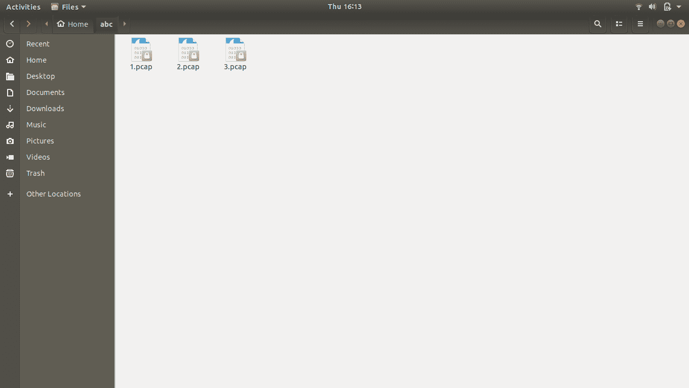
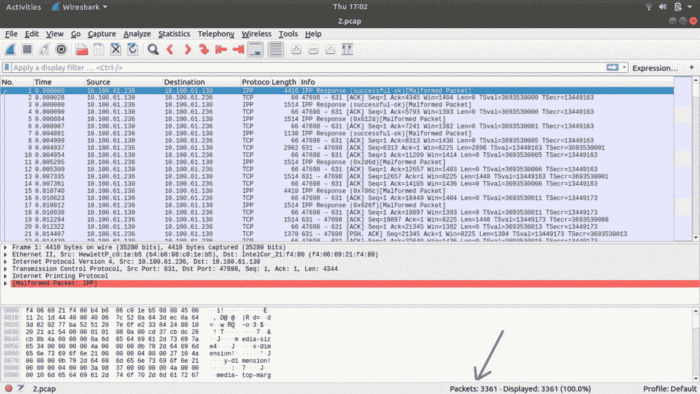
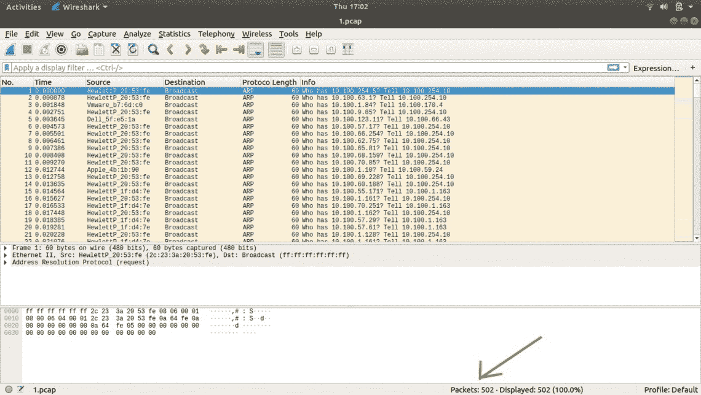
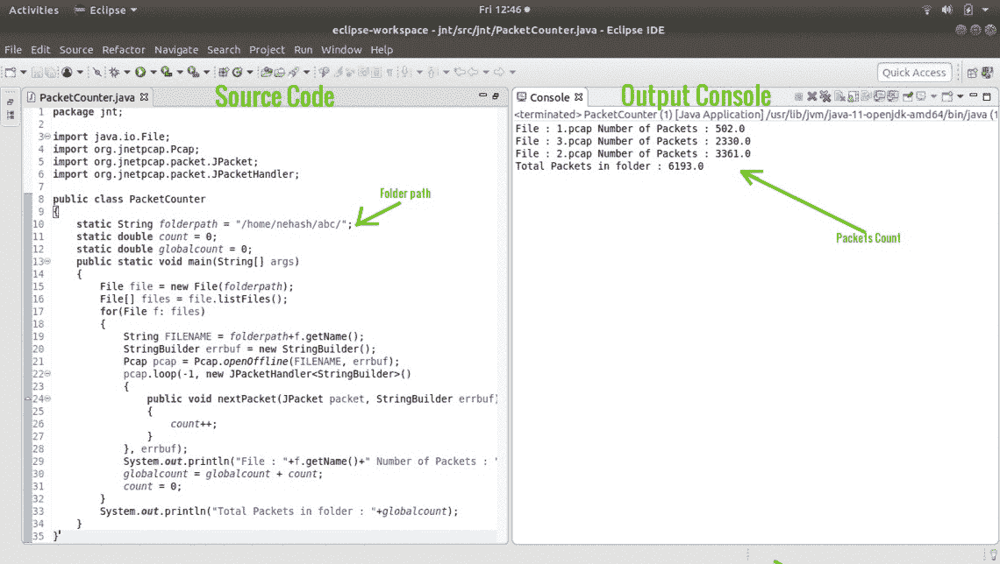

# 在 Java 中使用 JnetPcap 进行数据包捕获

> 原文:[https://www . geesforgeks . org/packet-capture-use-jnetpcap-in-Java/](https://www.geeksforgeeks.org/packet-capturing-using-jnetpcap-in-java/)

**什么是 JnetPcap？**

1.  JnetPcap 是一个开源的 Java 库。
2.  它是所有 libpcap 库本机调用的 java 包装。
3.  它可用于捕获实时和离线数据。
4.  解码数据包是 Jnetpcap 的一个特殊功能。
5.  为了处理数据包，您需要可以使用 Wireshark 生成的 pcap 文件。

**JNETPCAP 安装步骤:**

*   **对于 Windows: (x64)**
    1.  下载并安装最新稳定版本的适用于 Windows 64 位的 JRE 和 JDK。
    2.  下载并安装最新稳定的 64 位版本的 Eclipse。
    3.  从 http://jnetpcap.com/download.下载 jNetPcap 的稳定版本(适用于 64 位窗口)
    4.  提取。rar 文件。
    5.  提取后，将其数据链接库(jnetpcap.dll)复制到具有管理权限的 system32 文件夹中。
    6.  Now open Eclipse, create the project. right click on the project, go to properties, go to java build

        路径，单击添加外部 jar 并提供 jnetpcap.jar 的路径

    7.  写一个程序然后运行。
*   **对于 Linux: (x64)**
    1.  首选 Ubuntu 14.04 或 16.04(稳定版)。它包含 java 作为默认的操作系统安装。
    2.  安装 eclipse-full，如果找不到它，它将自动安装最新支持的 java。(从命令行或软件中心)
    3.  安装 g++和 libpcap-dev(从命令行安装，因为如果它
        不是更新的，它不会出现在软件中心)。
    4.  从 http://jnetpcap.com/download.下载 jNetPcap 的稳定版本(适用于 64 位 Linux)
    5.  提取。rar 文件。
    6.  提取后，在/usr/lib/ (as sudo)中复制 libjnetpcap.so 和 libjnetpcap-pcap100.so。
    7.  现在打开 Eclipse，创建项目。右键单击项目，转到属性，转到 java build
        路径，单击添加外部 jar 并提供 jnetpcap.jar 的路径。
    8.  写一个程序然后运行。

**什么是 pcap 文件？**

Pcap 代表数据包捕获。它用于捕获网络流量。这些 pcap 文件可以被 tcpdump、wireshark 等应用程序读取

> **输入:**在本程序中，我们将传递以 pcap 文件为输入的文件夹名称。
> **输出:**程序会统计每个 pcap 文件中的数据包总数。

**首先，我们将使用 wireshark** 从实时网络生成三个 pcap 文件



文件夹 _having_pcap_file

从上面的截图中，我们可以看到 abc 文件夹中有 3 个 pcap 文件。

**打开这些 pcap 文件，我们可以看到:**

1.  **3 . pcap**T3T5

    3 . pcap

    T8

    ```java
    Total number of packets inside 3.pcap = 2330 
    ```

2.  **2 . pcap**
    

    2 . pcap

    ```java
    Total number of packets inside 2.pcap = 3361 
    ```

3.  **1.pcap**
    

    1.pcap

    ```java
    Total number of packets inside 1.pcap = 502 
    ```

    现在让我们在任何 IDE 中使用 java 部署上述方法:

    

    源代码

**源代码**

```java
// Counting the number of packets in pcap files.

// User defined package
package jnt;

import java.io.File;
import org.jnetpcap.Pcap;
import org.jnetpcap.packet.JPacket;
import org.jnetpcap.packet.JPacketHandler;

public class PacketCounter {

    // Path of the folder having pcap files
    // generated by Wireshark(change accordingly)
    static String folderpath
        = "/home/folder_where_you_have_pcap_files";

    static double count = 0;
    static double globalcount = 0;

    // main function starts here
    public static void main(String[] args)
    {

        // Making the object of a file
        // and giving that object address
        // of the pcap folder
        File file = new File(folderpath);

        // Making file array which is used
        // to access each file
        // inside the folder one-by-one
        File[] files = file.listFiles();

        // Accessing each file
        // one-by-one of files array
        for (File f : files) {

            // Getting each pcap file name
            String FILENAME
                = folderpath + f.getName();

            // StringBuilder is used to get
            // error messages in case
            // if any error occurs
            StringBuilder errbuf = new StringBuilder();

            // Making Pcap object an opening pcap file
            // in offline mode and passing pcap filename
            // and StringBuilder object to the function
            Pcap pcap = Pcap.openOffline(FILENAME, errbuf);

            // Here pcap object is used to start a loop
            // for capturing each  packet of an
            // each pcap file(as a pcap file can
            // have many packets) one at a time, here -1
            // indicates eof(end of file) i.e
            // until every packet is captured execute the
            // loop, we can also give some value
            // instead of -1 which will indicate the
            // number of packets to execute
            // in each pcap file

            pcap.loop(-1, new JPacketHandler() {

                // nextPacket is override function
                // of JPacketHandler( Handler which is
                // use to receive fully decoded packets)
                public void nextPacket(JPacket packet,
                                       StringBuilder errbuf)
                {

                    // counter to count the number of packet
                    // in each pcap file
                    count++;
                }
            }, errbuf);

            System.out.println("File : " + f.getName()
                               + " Number of Packets : "
                               + count);

            // Global counter to count the total number
            // of packets in all pcap file
            globalcount = globalcount + count;

            count = 0;
        }

        System.out.println("Total Packets in folder : "
                           + globalcount);
    }
}
```

**输出:**

> **第一个例子:**
> 输入:“/home/abc/”(程序中硬编码的文件夹名称)
> 输出:文件:1.pcap 包数:502.0
> 文件:3.pcap 包数:2330.0
> 文件:2.pcap 包数:3361.0
> 文件夹中的总包数:6193.0
> 
> **第二个例子:**
> 输入:“/home/abc/”(程序中硬编码的文件夹名)
> 输出:文件:tcp.pcap 包数:10.0
> 文件:http11.pcap 包数:9.0
> 文件:to_be_evaluated.pcap 包数:100.0
> 文件:abcd.pcapng 包数:2.0
> 文件:ACKStormAttack.pcap 包数:63.0