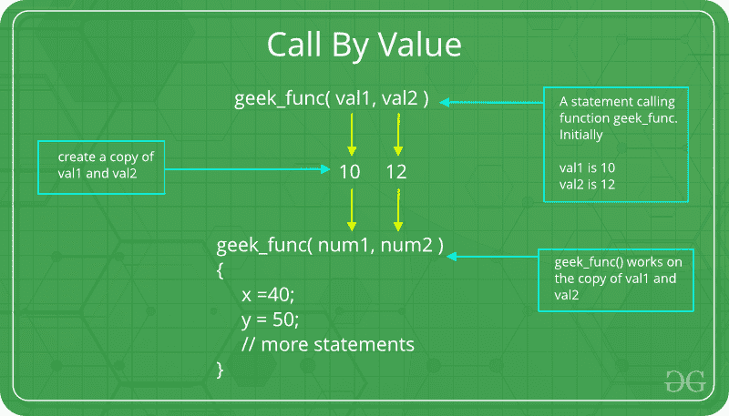
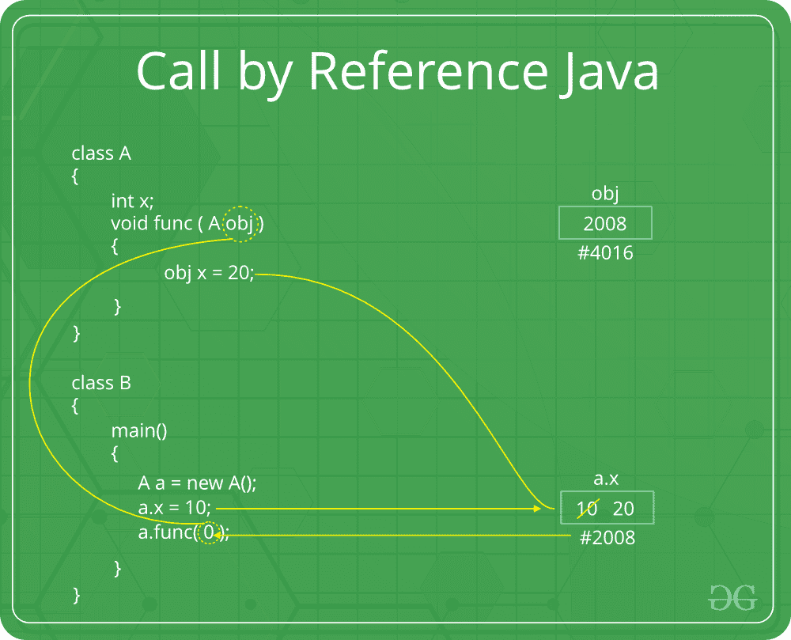

# Java 中的参数传递技术，示例

> 原文:[https://www . geesforgeks . org/parameter-passing-technologies-in-Java-with-examples/](https://www.geeksforgeeks.org/parameter-passing-techniques-in-java-with-examples/)

参数数据进出[方法和功能](https://www.geeksforgeeks.org/methods-in-java/)有不同的方式。让我们假设一个函数 *B()* 是从另一个函数 *A()* 调用的。在这种情况下 *A* 称为 ***【调用者函数】****B*称为 ***【被调用者函数或被调用者函数】*** 。并且 *A* 发送给 *B* 的参数称为*实际参数*，而 *B* 的参数称为*形式参数*。

**参数类型:**

*   **形式参数:**出现在函数或方法原型中的变量及其类型。
    **语法:**

```java
function_name(datatype variable_name)

```

*   **实际参数:**在调用环境中出现在函数或方法调用中的形式参数对应的变量或表达式。
    **语法:**

```java
func_name(variable name(s)); 
```

**参数传递的重要方法**

1.**传递值:**对形式参数所做的更改不会传回给调用者。对被调用函数或方法内部的形式参数变量的任何修改只影响单独的存储位置，不会反映在调用环境中的实际参数中。此法又称***按值调用*** 。
[Java 其实是严格按值调用的。](https://www.geeksforgeeks.org/g-fact-31-java-is-strictly-pass-by-value/)



**例:**

## Java 语言(一种计算机语言，尤用于创建网站)

```java
// Java program to illustrate
// Call by Value

// Callee
class CallByValue {

    // Function to change the value
    // of the parameters
    public static void Example(int x, int y)
    {
        x++;
        y++;
    }
}

// Caller
public class Main {
    public static void main(String[] args)
    {

        int a = 10;
        int b = 20;

        // Instance of class is created
        CallByValue object = new CallByValue();

        System.out.println("Value of a: " + a
                           + " & b: " + b);

        // Passing variables in the class function
        object.Example(a, b);

        // Displaying values after
        // calling the function
        System.out.println("Value of a: "
                           + a + " & b: " + b);
    }
}
```

**Output:** 

```java
Value of a: 10 & b: 20
Value of a: 10 & b: 20
```

**缺点:**

*   存储分配效率低
*   对于对象和数组，复制语义成本很高

2.**引用调用(别名):**对形式参数所做的更改确实会通过参数传递传递回调用方。对形式参数的任何更改都会反映在调用环境中的实际参数中，因为形式参数接收对实际数据的引用(或指针)。这个方法也被称为**引用调用**。这种方法在时间和空间上都是有效的。



## Java 语言(一种计算机语言，尤用于创建网站)

```java
// Java program to illustrate
// Call by Reference

// Callee
class CallByReference {

    int a, b;

    // Function to assign the value
    // to the class variables
    CallByReference(int x, int y)
    {
        a = x;
        b = y;
    }

    // Changing the values of class variables
    void ChangeValue(CallByReference obj)
    {
        obj.a += 10;
        obj.b += 20;
    }
}

// Caller
public class Main {

    public static void main(String[] args)
    {

        // Instance of class is created
        // and value is assigned using constructor
        CallByReference object
            = new CallByReference(10, 20);

        System.out.println("Value of a: "
                           + object.a
                           + " & b: "
                           + object.b);

        // Changing values in class function
        object.ChangeValue(object);

        // Displaying values
        // after calling the function
        System.out.println("Value of a: "
                           + object.a
                           + " & b: "
                           + object.b);
    }
}
```

**Output:** 

```java
Value of a: 10 & b: 20
Value of a: 20 & b: 40
```

请注意，当我们传递引用时，会创建一个指向同一对象的新引用变量。因此，我们只能更改其引用被传递的对象的成员。我们不能更改引用来引用其他对象，因为收到的引用是原始引用的副本。请看 [Java 中的例子 2 是严格按值传递！](https://www.geeksforgeeks.org/g-fact-31-java-is-strictly-pass-by-value/)