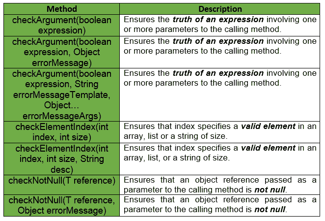

# 先决条件|番石榴|爪哇

> 原文:[https://www.geeksforgeeks.org/preconditions-guava-java/](https://www.geeksforgeeks.org/preconditions-guava-java/)

**简介:**preferences 类提供了一个 ***静态方法*** 的列表，用于检查某个方法或构造函数是否用有效的参数值调用。如果前提条件失败，则会引发定制的异常。

*   这些方法通常接受一个预期为真的布尔表达式。
*   在 checkNotNull 的情况下，这些方法接受预期为非 Null 的对象引用。
*   当传递 false/null 时，preferences 方法会引发未检查的异常。

**申报:**

```java
@GwtCompatible
public final class Preconditions
extends Object

```

**示例 1 :** 在本例中，checkArgument 抛出一个***IllegalArgumentException***来指示 examplePre1 在调用 sqrt 时出错，因为传递的参数是负数。

```java
// Returns the positive square
// root of the given value.
// throws IllegalArgumentException
// if the value is negative
public static double sqrt(double value)
{
    Preconditions.checkArgument(value >= 0.0, "negative value: %s", value);
    // calculate the square root
}

void examplePre1()
{
    // Function calling
    double ans = sqrt(-5.0);
}
```

**例 2 :** 假设给我们一个以 List 作为参数的方法。当调用这个方法时，我们要检查列表是否为空。这个问题的一个简单的 Java 解决方案如下所示:

```java
// Method to check if passed list
// is null or empty
public void example(List<Object> myList)
{
    // To check if passed list is null
    if (myList == null) {
        throw new IllegalArgumentException("List must not be null");
    }

    // To check if passed list is empty
    if (myList.isEmpty()) {
        throw new IllegalArgumentException("List must not be empty");
    }

    // Function calling
    example(myList);
}
```

但是，当我们使用番石榴的先决条件时，代码量大大减少。解决方案类似于:

```java
// Method to check if passed list
// is null or empty
public void example(List<Object> myList)
{
    // Check if list is null or not
    checkArgument(myList != null, "List must not be null");

    // Check if list is empty or not
    checkArgument(!myList.isEmpty(), "List must not be empty");

    // Function calling
    example(myList);
}
```

**示例 3 :** 如果要验证年龄以确保其大于 18，可以使用 prepreprecedent . checkargument()。

```java
// To check if age is greater than 18 or not
public static void validateAge(int age)
{
    // Guava Preconditions
    checkArgument(age > 18);
}
```

下表显示了番石榴先决条件提供的一些方法。


每种方法都有**三个变体**，如下所示:

*   **没有额外的参数:**抛出任何异常都不会有错误消息。
*   **一个额外的对象参数:**任何异常都会引发错误消息 object.toString()。
*   **一个额外的字符串参数:**这个方法使用一个额外的字符串参数和任意数量的附加对象参数。这表现得有点像 printf，但是为了 GWT 的兼容性和效率，它 ***只允许%s 指标*** 。

第三种变体的例子:

```java
checkArgument(i >= 0, "Argument was %s but expected nonnegative", i);
checkArgument(i < j, "Expected i = %s", i, j);

```

番石榴先决条件提供的其他一些方法有:


**要点:**下面给出了一些关于番石榴先决条件的要点。

*   当然可以使用这个类的方法来检查无效条件，这些无效条件不是调用者的错。不建议这样做，因为它会误导代码的未来读者。
*   使用 ***的项目一般应该避免使用对象。取而代之的是，使用 checkNotNull(对象)或 Verify.verifyNotNull(对象)中适合这种情况的任何一个。***
*   在先决条件错误消息模板字符串中， ***仅支持“%s”说明符*** ，而不支持全部格式化程序说明符。

**示例:**

```java
// Java code to show implementation of
// Guava Preconditions
import com.google.common.base.Preconditions;

class GFG {

    // Driver code
    public static void main(String args[])
    {

        // Creating object of GFG Class
        GFG obj = new GFG();

        // try block
        try {
            System.out.println(obj.sum(5, null));
        }

        // catch block
        catch (NullPointerException e) {
            System.out.println(e.getMessage());
        }
    }

    // Method to compute sum of 2 Integers
    public int sum(Integer num1, Integer num2)
    {
        // Guava Preconditions
        num1 = Preconditions.checkNotNull(num1,
                                          "Illegal Argument, First parameter is Null.");

        // Guava Preconditions
        num2 = Preconditions.checkNotNull(num2,
                                          "Illegal Argument, Second parameter is Null.");

        return (num1 + num2);
    }
}
```

输出:

```java
Illegal Argument, Second parameter is Null.

```

**参考:**T2】谷歌番石榴