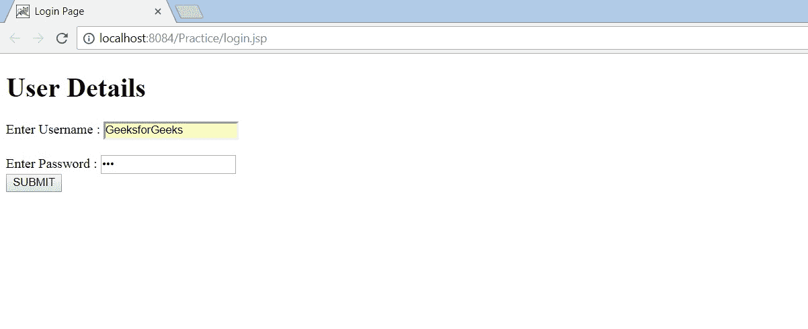

# 使用 JSP 对用户进行验证的程序

> 原文:[https://www . geesforgeks . org/program-to-validate-a-user-use-JSP/](https://www.geeksforgeeks.org/program-to-validate-a-user-using-jsp/)

**JSP 简介:** JSP(Java Server Page)是一种服务器端技术，用于开发支持动态内容的网页。它实现了动态和静态内容的分离，从而降低了开发复杂性。因此，开发人员有能力通过使用特殊的 JSP 标签在 HTML 页面中插入 java 代码，其中大多数标签以 **< %** 开头，以 **% >** 结尾。这里还需要注意的是，JSP 是建立在 Java Servlet API 之上的，并且还允许以

 ```java
<jsp:name_of_tag>
```** 开头，以 ```java
</jsp:name_of_tag>
```** 
结尾的标签，从而决定了其中的代码将如何表现。

在这里，JSP 的力量将被利用来验证用户的用户名和密码。用户最初将在提供的 JSP 表单中输入用户名和密码。然后，数据将被传递给另一个 JSP，以从给定的范围中获取 java bean 对象，或者创建一个新的 java bean 对象。然后将使用表单数据设置 bean 属性，并使用另一个 java 类进行验证。最后，将显示验证结果。

在本例中，JSP Action 标签用于实现上述目的。JSP 标签是在请求处理过程中专门使用的。这里使用的标签如下:
**jsp:useBean:** 它将用于创建 java bean 并将其实例化。
**jsp:setProperty:** 它将使用表单数据来设置创建的 bean 的属性。
**jsp:getProperty:** 将用于显示输入的详细信息。

这里需要注意的是，所有动作标签都使用 id 属性来唯一标识一个动作元素，并在 JSP 页面中引用它。
该程序已经在 Netbeans IDE 8.1 上使用 Apache Tomcat 作为应用服务器进行了测试。

**验证用户的步骤:**

1.  我们单击 index.html 页面上的链接来部署应用程序。
2.  然后我们会看到一个表单，我们在其中输入用户名和密码，然后单击提交。
3.  JSP 被自动调用，并返回表单中输入的数据和验证结果。

**接受用户名和密码的表单:login.jsp**

```java
<%@page contentType="text/html" pageEncoding="UTF-8"%>
<!DOCTYPE html>
<html>
    <head>
       <meta http-equiv="Content-Type" content="text/html; charset=UTF-8">
       <title>Login Page</title>
    </head>
    <body>
        <h1>User Details</h1>
        <%-- The form data will be passed to acceptuser.jsp 
             for validation on clicking submit
        --%> 
        <form method ="get" action="acceptuser.jsp">
            Enter Username : <input type="text" name="user"><br/><br/>
            Enter Password : <input type="password" name ="pass"><br/>
                <input type ="submit" value="SUBMIT">    
        </form>
    </body>
</html>

```

**JSP 接受表单数据并验证用户:acceptuser.jsp**

```java
<%@page contentType="text/html" pageEncoding="UTF-8"%>
<!DOCTYPE html>
<html>
    <head>
       <meta http-equiv="Content-Type" content="text/html; charset=UTF-8">
       <title>Accept User Page</title>
    </head>
    <body>
        <h1>Verifying Details</h1>
        <%-- Include the ValidateUser.java class whose method 
             boolean validate(String, String) we will be using
        --%>
        <%-- Create and instantiate a bean and assign an id to 
             uniquely identify the action element throughout the jsp
        --%>
        <jsp:useBean id="snr" class="saagnik.ValidateUser"/>

        <%-- Set the value of the created bean using form data --%>
        <jsp:setProperty name="snr" property="user"/>
        <jsp:setProperty name="snr" property="pass"/>

        <%-- Display the form data --%>
        The Details Entered Are as Under<br/>
        <p>Username : <jsp:getProperty name="snr" property="user"/></p>
        <p>Password : <jsp:getProperty name="snr" property="pass"/></p>

        <%-- Validate the user using the validate() of 
             ValidateUser.java class
        --%>
        <%if(snr.validate("GeeksforGeeks", "GfG"))else%>  
    </body>
</html>
```

**ValidateUser.java 级**

```java
package saagnik;
import java.io.Serializable;

// To persist the data for future use,
// implement serializable
public class ValidateUser implements Serializable {
    private String user, pass;

    // Methods to set username and password 
    // according to form data
    public void setUser(String u1) { this.user = u1; }
    public void setPass(String p1) { this.pass = p1; }

    // Methods to obtain back the values set 
    // by setter methods
    public String getUser() { return user; }
    public String getPass() { return pass; }

    // Method to validate a user
    public boolean validate(String u1, String p1)
    {
        if (u1.equals(user) && p1.equals(pass))
            return true;
        else
            return false;
    }
}
```

**输出:**
 ****

**点击“提交”按钮后，将生成以下页面。
**【acceptuser.jsp】**
**