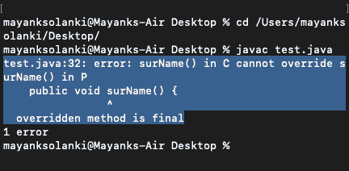

# Java 中受保护与最终访问修饰符

> 原文:[https://www . geesforgeks . org/protected-vs-final-access-修饰符-in-java/](https://www.geeksforgeeks.org/protected-vs-final-access-modifier-in-java/)

每当我们编写类时，我们都必须向 [JVM](https://www.geeksforgeeks.org/jvm-works-jvm-architecture/) 提供一些关于我们的类的信息，比如这个类是否可以从任何地方访问，子类创建是否可能，对象创建是否可能等。我们可以通过在 java 中使用一个称为访问修饰符的适当关键字来指定这些信息。因此，访问修饰符用于设置类、方法和其他成员的可访问性。

**受保护访问修饰符**

此修饰符可以应用于数据成员、方法和构造函数，但不能应用于顶级类和接口。成员被声明为受保护的，因为我们只能在当前包中访问该成员，但只能在外部包的子类中访问。

**例**

## Java 语言(一种计算机语言，尤用于创建网站)

```java
// Java Program to illustrate Protected Access Modifier

// Importing required classes
import java.io.*;
import java.util.*;

// Class 1
// Declaring a parent class A
class A {

    // Declaring a protected method m1()
    protected void m1() { System.out.println("GFG"); }
}

// Class 2
// Creating a child class by extending the class A
class B extends A {

    // Main driver method
    public static void main(String[] args)
    {
        // Creating an object of parent class
        // using parent reference
        A a = new A();

        /// Calling method m1
        a.m1();

        // Creating an object of child class
        // using child reference
        B b = new B();

        // Calling method m1
        b.m1();

        // Creating an object of child class
        // using parent reference
        A a1 = new B();

        // Calling m1 method
        a1.m1();
    }
}
```

**Output**

```java
GFG
GFG
GFG
```

输出解释:

在这里，我们使用父引用和子引用创建了 3 个对象，并在其上调用 m1()方法，它成功地执行了，因此从上面的示例中，我们可以说，我们可以通过使用父引用或子引用在任何地方访问当前包中的受保护方法。

**最终访问修改器**

它是一个适用于类、方法和变量的修饰符。基本上是指一旦初始化以后就不能改变的样本。假设如果我们将父类方法声明为 final，那么我们不能在子类中覆盖该方法，因为它的实现是 final，并且如果一个类被声明为 final，我们不能扩展该类的功能，即我们不能为该类创建子类，即最终类不可能继承。默认情况下，最终类中的每个方法都是最终的，但是最终类中的每个变量不一定是最终的。final 关键字的主要优势是我们可以实现安全性，并且我们可以提供独特的实现。但是最后一个关键字的主要缺点是我们缺少了像继承(因为最后一个类)、多态(因为最后一个方法)这样的 OOPs 的主要好处，因此如果没有具体的要求，那么不建议使用最后一个关键字。

简单地说，它是一个简单的修饰符，用于创建最终的方法，变量，无论我们想根据需求在程序中创建什么。我们使用我们想让程序的一部分，从最小的变量到更大的块，这是考虑出生日期的方法。

```java
final int dob = 25011947 ;
```

现在你一定想知道我们只是声明什么，而不是初始化什么。记住，在这种情况下，值只能在构造函数的帮助下初始化，这些构造函数不能被继承。

> **注:**
> 
> *   如果变量在 final 旁边声明为静态的，如下所示，那么它只能在静态块中初始化。
> 
> ```java
> public static final weekDay ;
> ```
> 
> *   在类的情况下，如果声明为 final，那么它不能被其他非 final 类实现或继承，但是 vece 反之亦然，这意味着非 final 类可以继承 final 类方法。

**例**

## Java 语言(一种计算机语言，尤用于创建网站)

```java
// Java program to Illustrate Final keyword

// Importing required classes
import java.io.*;
import java.util.*;

// Class 1
// Declaring parent class P
class P {

    // Declaring a first name method
    public void firstName()
    {

        // Display firstname
        System.out.println("Rahul ");
    }

    // Declaring a final surName method
    public final void surName()
    {

        // Display surname
        System.out.println("Trivedi");
    }
}

// Class 2
// Creating a child class of above parent class
class C extends P {

    // Method 1
    // Overriding the surName() method
    public void surName()
    {

        // Display suname
        System.out.println("Sharma");
    }

    // Method 2
    // Main driver method
    public static void main(String[] args)
    {

        // Display message
        System.out.println("GFG");
    }
}
```

**输出:**



现在让我们讨论这两者之间的区别，如下表所示:

<figure class="table">

| [Protected Access Modifier] | [Final Access Modifier] |
| --- | --- |
| This modifier does not apply to top-level classes. | This modifier is suitable for top-level classes. |
| This modifier applies to interfaces. | This modifier does not apply to interfaces. |
| This modifier applies to both enumerations and constructors. | Final modifiers do not apply to enumerations and constructors. |
| This modifier does not apply to local variables. | This modifier is the only one applicable to local variables. |
| We can access the protected members from outside the package through sub-references. | We can't access the end member from the external package. |

</figure>