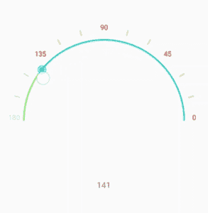

# 安卓中的量角器视图

> 原文:[https://www.geeksforgeeks.org/protractorview-in-android/](https://www.geeksforgeeks.org/protractorview-in-android/)

本文在安卓中增加了**量角器视图**。**量角器视图**是一个半圆形的 [**Seekbar**](https://www.geeksforgeeks.org/seekbar-in-kotlin/) 视图，用于选择 0 到 180°的角度。Seekbar 是一种进度条。将光标从 0 更改为 180，以选择角度。下图是**量角器视图**的图片。



### 方法:

**步骤 1:** 在你的根[中添加支持库**build.gradle**T5】文件(不是你的模块 build . gradle 文件)。这个库 **jitpack** 是一个新颖的包存储库。它是为 JVM 而做的，这样在](https://www.geeksforgeeks.org/android-build-gradle/) [github](https://www.geeksforgeeks.org/ultimate-guide-git-github/) 和 [bigbucket](https://www.geeksforgeeks.org/bitbucket-vs-github-vs-gitlab/) 中存在的任何库都可以直接在应用程序中使用。

## 可扩展标记语言

```java

allprojects {         
   repositories {         
      maven { url 'https://jitpack.io' }         
  }
}         
```

**第二步:**在 [**build.gradle**](https://www.geeksforgeeks.org/android-build-gradle/) 文件中添加支持库，并在依赖项部分添加依赖项。它帮助开发人员直接在 XML 文件中添加量角器视图。

## 可扩展标记语言

```java

dependencies {         
        implementation 'com.github.GoodieBag:ProtractorView:v1.2'
}
```

**第三步:**在 **activity_main.xml** 文件中添加以下代码。在该文件中，将**量角器视图**和**文本视图**添加到布局中。

## activity_main.xml

```java

<?xml version="1.0" encoding="utf-8"?>
<androidx.constraintlayout.widget.ConstraintLayout
    xmlns:android="http://schemas.android.com/apk/res/android"
    xmlns:app="http://schemas.android.com/apk/res-auto"
    xmlns:tools="http://schemas.android.com/tools"
    android:layout_width="match_parent"
    android:layout_height="match_parent"
    tools:context=".MainActivity">

    <com.goodiebag.protractorview.ProtractorView
        android:id="@+id/protractorview"
        android:layout_width="wrap_content"
        android:layout_height="wrap_content"
        app:textProgressColor="#FF00"
        app:tickProgressColor="#abe6"
        app:layout_constraintBottom_toBottomOf="parent"
        app:layout_constraintLeft_toLeftOf="parent"
        app:layout_constraintRight_toRightOf="parent"
        app:layout_constraintTop_toTopOf="parent"/>

    <TextView
        android:id="@+id/textView"
        android:layout_width="wrap_content"
        android:layout_height="wrap_content"
        android:layout_marginBottom="136dp"
        app:layout_constraintBottom_toBottomOf="parent"
        app:layout_constraintEnd_toEndOf="parent"
        app:layout_constraintHorizontal_bias="0.498"
        app:layout_constraintStart_toStartOf="parent" />

</androidx.constraintlayout.widget.ConstraintLayout>
```

**第 4 步:**在**MainActivity.java**文件中添加以下代码。在此文件中，向我们的**量角器视图**添加间隔、颜色和**设置。每当进度改变时**setnprotlacerviewchangeelistener**被自动调用。这里，改变的角度值显示在文本视图中。**

## MainActivity.java

```java

package org.geeksforgeeks.protractorview

import androidx.annotation.RequiresApi;
import androidx.appcompat.app.AppCompatActivity;
import android.os.Build;
import android.os.Bundle;
import android.widget.TextView;
import android.widget.Toast;

import com.goodiebag.protractorview.ProtractorView;

public class MainActivity extends AppCompatActivity {

    TextView textView;

    @RequiresApi(api = Build.VERSION_CODES.M)
    @Override
    protected void onCreate(Bundle savedInstanceState) {
        super.onCreate(savedInstanceState);
        setContentView(R.layout.activity_main);

        ProtractorView protractorView = (ProtractorView) 
                       findViewById(R.id.protractorview);
        textView  = findViewById(R.id.textView);

        protractorView.setTickIntervals(15);
        protractorView.setArcColor(getColor(R.color.colorAccent));
        protractorView.setProgressColor(getColor(R.color.myColor));

        protractorView.setOnProtractorViewChangeListener(new 
               ProtractorView.OnProtractorViewChangeListener() {
            @Override
            public void onProgressChanged(ProtractorView pv,
                        int progress, boolean b) {
               textView.setText(""+progress);
            }

            @Override
            public void onStartTrackingTouch(ProtractorView pv) {

            }

            @Override
            public void onStopTrackingTouch(ProtractorView pv) {

            }
        });
    }

}
```

**输出:**

<video class="wp-video-shortcode" id="video-455190-1" width="640" height="360" preload="metadata" controls=""><source type="video/mp4" src="https://media.geeksforgeeks.org/wp-content/uploads/20200715022730/Record_2020-07-15-02-25-21_cc6551a6f21889984886581ad2f4e9ef1.mp4?_=1">[https://media.geeksforgeeks.org/wp-content/uploads/20200715022730/Record_2020-07-15-02-25-21_cc6551a6f21889984886581ad2f4e9ef1.mp4](https://media.geeksforgeeks.org/wp-content/uploads/20200715022730/Record_2020-07-15-02-25-21_cc6551a6f21889984886581ad2f4e9ef1.mp4)</video>

更多信息请参考官方[文件](https://github.com/GoodieBag/ProtractorView)