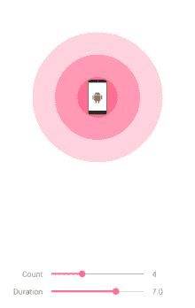

# 安卓中脉搏动画视图

> 原文:[https://www . geesforgeks . org/pulse-animation-view-in-Android/](https://www.geeksforgeeks.org/pulse-animation-view-in-android/)

在本文中，我们将看到脉搏动画功能。如果我们从服务器下载一些东西，可以使用这个功能。那么在下载之前，我们可以添加这个功能。下面给出了一个示例 GIF，以了解我们将在本文中做什么。注意，我们将使用 **Java** 语言来实现这个项目。



### **分步实施**

**第一步:创建新项目**

要在安卓工作室创建新项目，请参考[如何在安卓工作室创建/启动新项目](https://www.geeksforgeeks.org/android-how-to-create-start-a-new-project-in-android-studio/)。注意选择 **Java** 作为编程语言。

**第二步:添加依赖关系**

导航到**渐变脚本>构建.渐变(模块:应用)**，并在依赖项部分添加以下依赖项。

> 实现' pl . bclogic:pump or 4 droid:1 . 0 . 3 '

**步骤 3:使用 activity_main.xml 文件**

以下是更改布局参数的属性

*   **脉冲计数**:代表脉冲圈数
*   **脉冲 _ 持续时间**:代表单个脉冲的持续时间，单位为毫秒
*   **脉冲重复**:代表脉冲重复次数。零表示**无限**
*   **脉冲颜色**:代表 ARGB 脉冲颜色
*   **pulse _ startfromcraw**:如果动画应该从头开始，则设置为 true
*   **pulse _ 插值器**:设置动画使用的插值器类型。接受值为“**线性**”、“**加速**”、“**减速**”、“**加速减速**

导航到 **app > res >布局> activity_main.xml** 并将下面的代码添加到该文件中。下面是**activity _ main . XML**文件的代码。

## 可扩展标记语言

```
<?xml version="1.0" encoding="utf-8"?>
<RelativeLayout 
    xmlns:android="http://schemas.android.com/apk/res/android"
    xmlns:app="http://schemas.android.com/apk/res-auto"
    xmlns:tools="http://schemas.android.com/tools"
    android:layout_width="match_parent"
    android:layout_height="match_parent"
    android:layout_gravity="center"
    android:gravity="center"
    android:orientation="vertical"
    android:padding="16sp"
    tools:context=".MainActivity">

    <pl.bclogic.pulsator4droid.library.PulsatorLayout
        android:id="@+id/pulsator"
        android:layout_width="326dp"
        android:layout_height="446dp"
        android:layout_alignParentTop="true"
        android:layout_centerHorizontal="true"
        android:layout_marginTop="89dp"
        app:pulse_color="#CA3D3D"
        app:pulse_count="1"
        app:pulse_duration="1800"
        app:pulse_interpolator="Linear"
        app:pulse_repeat="0"
        app:pulse_startFromScratch="false">

        <ImageView
            android:layout_width="wrap_content"
            android:layout_height="wrap_content"
            android:layout_centerInParent="true"
            android:src="@mipmap/ic_launcher_round" />
    </pl.bclogic.pulsator4droid.library.PulsatorLayout>

    <LinearLayout
        android:id="@+id/kl"
        android:layout_width="match_parent"
        android:layout_height="wrap_content"
        android:layout_below="@id/pulsator"
        android:orientation="horizontal">

        <TextView
            android:layout_width="wrap_content"
            android:layout_height="wrap_content"
            android:text="Count" />

        <SeekBar
            android:id="@+id/count"
            android:layout_width="match_parent"
            android:layout_height="wrap_content"
            android:max="4"
            android:min="1" />
    </LinearLayout>

    <LinearLayout
        android:layout_width="match_parent"
        android:layout_height="wrap_content"
        android:layout_below="@+id/kl"
        android:orientation="horizontal">

        <TextView
            android:layout_width="wrap_content"
            android:layout_height="wrap_content"
            android:text="Duration" />

        <SeekBar
            android:id="@+id/duration"
            android:layout_width="match_parent"
            android:layout_height="wrap_content"
            android:layout_below="@id/count"
            android:max="7"
            android:min="1" />
    </LinearLayout>

</RelativeLayout>
```

**第四步:使用****MainActivity.java 文件**

转到**MainActivity.java**文件，参考以下代码。以下是**MainActivity.java**文件的代码。代码中添加了注释，以更详细地理解代码。

## Java 语言(一种计算机语言，尤用于创建网站)

```
import android.os.Bundle;
import android.widget.SeekBar;

import androidx.appcompat.app.AppCompatActivity;

import pl.bclogic.pulsator4droid.library.PulsatorLayout;

public class MainActivity extends AppCompatActivity {

    SeekBar count, duration;

    @Override
    protected void onCreate(Bundle savedInstanceState) {
        super.onCreate(savedInstanceState);
        setContentView(R.layout.activity_main);

        // initialise tha layout
        PulsatorLayout pulsator = (PulsatorLayout) findViewById(R.id.pulsator);
        pulsator.start();
        count = findViewById(R.id.count);
        duration = findViewById(R.id.duration);

        // on change in seekbar value
        count.setOnSeekBarChangeListener(new SeekBar.OnSeekBarChangeListener() {
            @Override
            public void onProgressChanged(SeekBar seekBar, int i, boolean b) {
                // change the count
                pulsator.setCount(i);
            }

            @Override
            public void onStartTrackingTouch(SeekBar seekBar) {

            }

            @Override
            public void onStopTrackingTouch(SeekBar seekBar) {

            }
        });

        // on change in seekbar value
        duration.setOnSeekBarChangeListener(new SeekBar.OnSeekBarChangeListener() {
            @Override
            public void onProgressChanged(SeekBar seekBar, int i, boolean b) {
                // change the duration
                pulsator.setDuration(i);
            }

            @Override
            public void onStartTrackingTouch(SeekBar seekBar) {

            }

            @Override
            public void onStopTrackingTouch(SeekBar seekBar) {

            }
        });
    }

    @Override
    protected void onStart() {
        super.onStart();

    }
}
```

**输出:**

<video class="wp-video-shortcode" id="video-619384-1" width="640" height="360" preload="metadata" controls=""><source type="video/mp4" src="https://media.geeksforgeeks.org/wp-content/uploads/20210608000050/pulse.mp4?_=1">[https://media.geeksforgeeks.org/wp-content/uploads/20210608000050/pulse.mp4](https://media.geeksforgeeks.org/wp-content/uploads/20210608000050/pulse.mp4)</video>