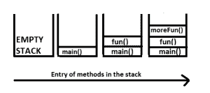
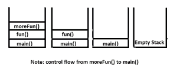

# Java 中的运行时堆栈机制

> 原文:[https://www . geesforgeks . org/run-time-stack-mechanism-Java/](https://www.geeksforgeeks.org/run-time-stack-mechanism-java/)

**先决条件:**[Java 中的异常](https://www.geeksforgeeks.org/exceptions-in-java/)

对于每个线程，JVM (Java 虚拟机)都会创建一个运行时堆栈。

*   线程中执行的每个调用都存储在堆栈中。
*   运行时堆栈中的每个条目都被称为激活记录或堆栈帧。
*   完成线程的每个方法调用后，都会从堆栈的相应条目中移除。
*   完成所有方法后，堆栈将为空，并且在终止线程之前，该运行时堆栈将被 JVM 销毁。

让我们来看看下面的程序，以了解运行时堆栈的工作原理。

**情况 1:正常(正常终止)**

*   **Construction of run-time Stack :**
    1\. Firstly, the main thread will call main() method and the corresponding entry will be in the stack.
    2\. After that main() method is calling fun() method, which will store in the stack.
    3\. In the fun() method, moreFun() method is called. Therefore at last moreFun() will be stored in stack.
    4\. Finally, moreFun() is not calling any method and it will print **Hello Geeks!**

    ```
    // Java program to illustrate run time
    // Run-time stack mechanism in
    // normal flow of Exception handling
    class Geeks {
        public static void main(String[] args)
        {
            fun();
        }
        public static void fun()
        {
            moreFun();
        }
        public static void moreFun()
        {
            System.out.println("Hello Geeks!");
        }
    }
    ```

    输出:

    ```
    Hello Geeks!

    ```

    

*   **Destruction of run-time stack** : After printing **Hello Geeks!**, its corresponding entry will be removed from the stack and it will go to fun() method and there is nothing for execution that’s why the entry of fun() method is removed from the stack and so on.When the stack is empty then the run-time stack is destroyed by the JVM.

    

**病例 2:异常(异常终止)**

*   **Construction of run-time Stack :**
    1\. The example below have ArithmeticException at method moreFun() location, the JVM will check any exception handling code is there. If not, then method moreFun() will be responsible to create exception object because of exception are raised on method moreFun() and corresponding entry from the stack will be removed and the control goes to method fun().
    2\. JVM again go to the caller method to check if it is having any exception handling code are not. If not JVM terminates the method abnormally and deleted the corresponding entry from the stack.
    3\. The above process continues until main thread. If the main thread(main method) does’t have any exception handling code the JVM also terminates the main method abnormally and default exception handler is responsible to print the exception message to the output screen which is the part of JVM.

    ```
    // Java program to illustrate run time
    // Run-time stack mechanism in
    // normal flow of Exception handling
    public class ExceptionHandling {
        public static void main(String[] args)
        {
            fun();
        }
        public static void fun()
        {
            moreFun();
            System.out.println("Method fun");
        }
        public static void moreFun()
        {
            System.out.println(10 / 0);
            System.out.println("Method moreFun");
        }
    }
    ```

    运行时错误:

    ```
    Exception in thread "main" java.lang.ArithmeticException: / by zero
        at ExceptionHandling.moreFun(ExceptionHandling.java:16)
        at ExceptionHandling.fun(ExceptionHandling.java:11)
        at ExceptionHandling.main(ExceptionHandling.java:7)
    ```

    

*   **运行时堆栈的破坏**

    

本文由**比沙尔·库马尔·杜贝**供稿。如果你喜欢 GeeksforGeeks 并想投稿，你也可以使用[contribute.geeksforgeeks.org](http://www.contribute.geeksforgeeks.org)写一篇文章或者把你的文章邮寄到 contribute@geeksforgeeks.org。看到你的文章出现在极客博客主页上，帮助其他极客。

如果你发现任何不正确的地方，或者你想分享更多关于上面讨论的话题的信息，请写评论。