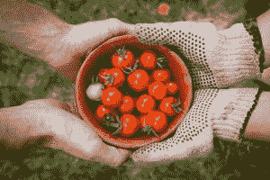

# 在 Java 中使用 OpenCV 缩放图像

> 原文:[https://www . geesforgeks . org/scaling-images-using-opencv-in-Java/](https://www.geeksforgeeks.org/scaling-images-using-opencv-in-java/)

图像缩放是指调整图像的大小。它在机器学习应用中的图像处理和操作中很有用，因为它可以减少训练时间，因为像素数量越少，模型的复杂性越低。OpenCV 库的 Imgproc 模块为调整图像大小提供了足够的插值方法。

OpenCV 的 Imgproc 模块的 [*Imgproc.resize 方法*](https://www.geeksforgeeks.org/image-resizing-using-opencv-python/) 可以用来调整图像的大小。该函数将图像 src 的大小调整到指定的大小。它提供了调整图像大小的所有功能，即缩小或缩放图像以满足尺寸要求。

**语法:**

```
resize(
                src: &Mat, 
                dst: &mut Mat, 
                  dsize: Size, 
                     fx: f64, 
                     fy: f64, 
              interpolation: i32
    )
```

**参数:**

<figure class="table">

| 名字 | 定义 |
| --- | --- |
| 科学研究委员会 | 它是MAT 类型的输入图像。 |
| dst | 它是 MAT 类型的输出图像 |
| dsize | 它是大小类型的输出图像的大小 |
| 外汇（foreign exchange 的缩写） | 双型沿 X 轴的比例因子 |
| 财政年度 | 双类型沿 Y 轴的比例因子 |
| 插入文字 | 这是图像抽取的方法。默认插值为 I[NTER _ 线性插值](https://www.geeksforgeeks.org/image-processing-without-opencv-python/)

*   [INTER_AREA](https://www.geeksforgeeks.org/image-resizing-using-opencv-python/) 插值最适合缩小图像
*   [INTER_LINEAR 插值](https://www.geeksforgeeks.org/image-resizing-using-opencv-python/)最适合放大图像

 |

</figure>

**算法:**

1.  加载 OpenCV 模块。
2.  从目录中读取图像(2D 矩阵)。
3.  将图像/2D 矩阵存储为 Mat 对象。
4.  使用对象创建图像/2D 矩阵。
5.  使用上面创建的对象进行缩放和写入。

**样品:**

假设用户想要调整 src 的大小，使其适合预先创建的目标文件，那么调用函数的语法如下

```
resize(src, dst, dst.size(), 0, 0, interpolation);
```

假设用户想要在每个方向上将图像缩小 2 倍，那么调用函数的语法如下

```
resize(src, dst, Size(), 0.5, 0.5, interpolation);
```

**实现:**将下面的图像视为输入图像，该输入图像应该被缩放以产生新的输出图像。这里，假设输入图像被缩小，这借助于一个例子来说明。



输入图像

## Java 语言(一种计算机语言，尤用于创建网站)

```
// Importing openCV modules
import org.opencv.core.Core;
import org.opencv.core.Mat;
import org.opencv.core.Size;
import org.opencv.imgcodecs.Imgcodecs;
import org.opencv.imgproc.Imgproc;

public class GFG {

    // Main driver code
    public static void main(String args[])
    {

        // Load OpenCV library
        System.loadLibrary(Core.NATIVE_LIBRARY_NAME);

        // Reading the Image from the file/ directory
        String image_location
            = "C:\\Users\\user\\Downloads\\InputImage.jpg";

        // Storing the image in a Matrix object
        // of Mat type
        Mat src = Imgcodecs.imread(image_location);

        // New matrix to store the final image
        // where the input image is supposed to be written
        Mat dst = new Mat();

        // Scaling the Image using Resize function
        Imgproc.resize(src, dst, new Size(0, 0), 0.1, 0.1,
                       Imgproc.INTER_AREA);

        // Writing the image from src to destination
        Imgcodecs.imwrite("D:/resized_image.jpg", dst);

        // Display message to show that
        // image has been scaled
        System.out.println("Image Processed");
    }
}
```

**输出:**


最终图像