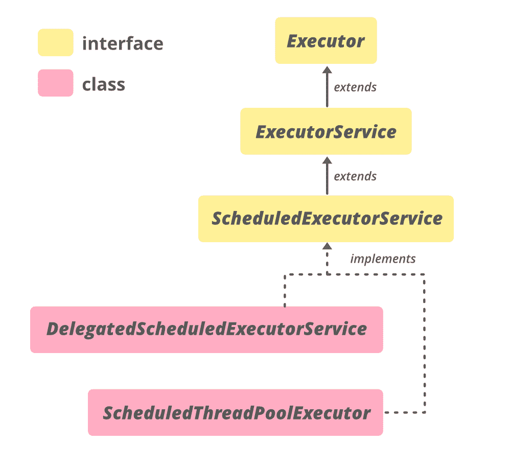

# 用 Java 调度 ExecutorService 接口

> 原文:[https://www . geeksforgeeks . org/scheduledexecutorservice-in-interface-in-Java/](https://www.geeksforgeeks.org/scheduledexecutorservice-interface-in-java/)

Java 中的 **ScheduledExecutorService** 接口是 **java.util.concurrent** 包中定义的 [ExecutorService](https://www.geeksforgeeks.org/java-util-concurrent-executorservice-interface-with-examples/) 接口的子接口。该接口用于定期或在给定延迟后运行给定任务。ScheduledExecutorService 接口已经声明了一些有用的方法来调度给定的任务。这些方法由[ScheduledThreadPoolExecutor](https://www.geeksforgeeks.org/scheduledthreadpoolexecutor-class-in-java/)类实现。

**申报**

```
public interface ScheduledExecutorService extends ExecutorService

```

**调度执行服务的层次结构**



**实现类**

ScheduledExecutorService 的实现类是[ScheduledThreadPoolExecutor](https://www.geeksforgeeks.org/scheduledthreadpoolexecutor-class-in-java/)。

**创建调度执行服务对象**

因为 ScheduledExecutorService 是一个接口，所以它不能被实例化。但是 **java.util.concurrent** 包中定义的**执行器**类提供了一些返回 ScheduledExecutorService 对象(其实现类的对象)的工厂方法

*   **公共静态 ScheduledExecutorService newScheduledThreadPool(int corePoolSize)**:创建一个具有给定核心池大小的新计划线程池( **corePoolSize** )，并返回一个 ScheduledExecutorService 对象，该对象可以降级为 ScheduledThreadPoolExecutor 对象。该对象可用于在给定延迟后运行任务或定期执行任务。

*   **公共静态 ScheduledExecutorService newScheduledThreadPool(int corePoolSize，ThreadFactory threadFactory)** :用给定的核心池大小(corePoolSize)创建一个新的调度线程池，并返回一个 ScheduledExecutorService 对象，该对象可以降级为 ScheduledThreadPoolExecutor 对象。第二个参数是创建新线程时使用的[线程工厂](https://practice.geeksforgeeks.org/problems/what-is-threadfactory-in-java)对象。

**调度执行服务界面示例**:

## Java 语言(一种计算机语言，尤用于创建网站)

```
// Java Program to demonstrate
// SchedulerExecutorService

import java.util.concurrent.*;
import java.util.*;
import java.io.*;

class SchedulerExecutorServiceExample {

    public static void main(String[] args)
    {
        System.out.println(
            "A count-down-clock program that counts from 10 to 0");

        // creating a ScheduledExecutorService object
        ScheduledExecutorService scheduler
            = Executors.newScheduledThreadPool(11);

        // printing the current time
        System.out.println(
            "Current time : "
            + Calendar.getInstance().get(Calendar.SECOND));

        // Scheduling the tasks
        for (int i = 10; i >= 0; i--) {
            scheduler.schedule(new Task(i), 10 - i,
                               TimeUnit.SECONDS);
        }

        // remember to shutdown the scheduler
        // so that it no longer accepts
          // any new tasks
        scheduler.shutdown();
    }
}

class Task implements Runnable {
    private int num;
    public Task(int num) { this.num = num; }
    public void run()
    {
        System.out.println(
            "Number " + num + " Current time : "
            + Calendar.getInstance().get(Calendar.SECOND));
    }
}
```

**输出:**

```
A count-down-clock program that counts from 10 to 0
Current time : 28
Number 10 Current time : 28
Number 9 Current time : 29
Number 8 Current time : 30
Number 7 Current time : 31
Number 6 Current time : 32
Number 5 Current time : 33
Number 4 Current time : 34
Number 3 Current time : 35
Number 2 Current time : 36
Number 1 Current time : 37
Number 0 Current time : 38

```

这是一个从 10 数到 0 的倒计时钟。ScheduledExexutorService 对象，即；**调度程序**是使用**执行器.新调度的线程池(int corePoolSize)** 方法创建的。

**注意:**从调用 **schedule()** 方法延迟**(10–I)**秒后执行的所有任务。当前时间的值可能会因执行时间的不同而不同。

### 调度执行服务的方法

<figure class="table">

| 

方法

 | 

描述

 |
| --- | --- |
| 时间表([可运行](https://www.google.com/url?client=internal-element-cse&cx=009682134359037907028:tj6eafkv_be&q=https://www.geeksforgeeks.org/runnable-interface-in-java/&sa=U&ved=2ahUKEwiAgIXgybPsAhVuxTgGHaHLD8sQFjAAegQIABAC&usg=AOvVaw1FJl1_4A0AFrPTNSDq6Jpc)命令，长延迟，**时间单位**单位) | 提交一次性任务，该任务在给定延迟后启用。 |
| 时间表(**可调用** < V >可调用，长延迟，**时间单位**单位) | 提交一个返回值的一次性任务，该任务在给定延迟后被启用。 |
| 调度固定日期([可运行](https://www.google.com/url?client=internal-element-cse&cx=009682134359037907028:tj6eafkv_be&q=https://www.geeksforgeeks.org/runnable-interface-in-java/&sa=U&ved=2ahUKEwiAgIXgybPsAhVuxTgGHaHLD8sQFjAAegQIABAC&usg=AOvVaw1FJl1_4A0AFrPTNSDq6Jpc)命令，长初始延迟，长周期，**时间单位**单位) | 提交一个周期性动作，该动作在给定的初始延迟后首先被启用，随后在给定的周期内被启用；也就是说，执行将在 initialDelay 之后开始，然后是 initialDelay + period，然后是 initialDelay + 2 * period，依此类推。 |
| 计划时间固定延迟([可运行](https://www.google.com/url?client=internal-element-cse&cx=009682134359037907028:tj6eafkv_be&q=https://www.geeksforgeeks.org/runnable-interface-in-java/&sa=U&ved=2ahUKEwiAgIXgybPsAhVuxTgGHaHLD8sQFjAAegQIABAC&usg=AOvVaw1FJl1_4A0AFrPTNSDq6Jpc)命令，长初始延迟，长延迟，**时间单位**单位) | 提交一个周期性动作，该动作在给定的初始延迟之后首先被启用，随后在一个执行的终止和下一个执行的开始之间具有给定的延迟。 |

</figure>

### 接口 java.util.concurrent.Executor 中声明的方法

<figure class="table">

| 

方法

 | 

描述

 |
| --- | --- |
| 执行(可运行命令) | 在将来的某个时间执行给定的命令。 |

</figure>

### 在接口 Java . util . concurrent . executorservice 中声明的方法

<figure class="table">

| 

方法

 | 

描述

 |
| --- | --- |
| 唤醒终止(长超时，时间单位单位) | 阻塞，直到所有任务在关闭请求后完成执行，或者超时发生，或者当前线程中断，以先发生的为准。 |
| 调用所有(收集 extends Callable<t>>任务)</t> | 执行给定的任务，当所有任务完成时，返回一个保存状态和结果的期货列表。 |
| 调用所有(收集 extends Callable<t>>任务，长超时，时间单位单位)</t> | 执行给定的任务，当所有任务完成或超时到期时，返回一个保存其状态和结果的期货列表，以先发生的为准。 |
| 调用任何 | 执行给定的任务，返回已成功完成的任务的结果(即，不抛出异常)，如果有的话。 |
| 调用任何 | 执行给定的任务，返回已经成功完成的任务的结果(即，不抛出异常)，如果在给定的超时过去之前有任何异常的话。 |
| isShutdown() | 如果此执行器已关闭，则返回 true。 |
| isTerminated() | 如果关闭后所有任务都已完成，则返回 true。 |
| 关机() | 启动有序关闭，执行以前提交的任务，但不接受新任务。 |
| shutdownNow() | 尝试停止所有正在执行的任务，停止处理等待的任务，并返回等待执行的任务列表。 |
| 提交(可运行任务) | 提交可运行的任务以供执行，并返回代表该任务的未来。 |
| 提交(可运行任务，测试结果) | 提交可运行的任务以供执行，并返回代表该任务的未来。 |
| 提交(可调用<t>任务)</t> | 提交一个返回值任务以供执行，并返回一个代表该任务待定结果的未来值。 |

</figure>