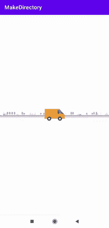

# 在安卓中滚动 ImageView

> 原文:[https://www.geeksforgeeks.org/scroll-imageview-in-android/](https://www.geeksforgeeks.org/scroll-imageview-in-android/)

在本文中，我们将实现一个与 ImageView 相关的非常重要的特性。图像会自己继续水平滚动。当我们点击图像时，它将停止滚动，当我们再次点击时，它将继续滚动。我们可以使用此功能在应用程序中显示动画。这个功能可以在网购 App 中使用。当物品交付时，他们可以使用此功能显示目的地。下面给出了一个 GIF 示例，来了解一下我们将在本文中做什么。注意，我们将使用 **Java** 语言来实现这个项目。



### **分步实施**

**第一步:创建新项目**

要在安卓工作室创建新项目，请参考[如何在安卓工作室创建/启动新项目](https://www.geeksforgeeks.org/android-how-to-create-start-a-new-project-in-android-studio/)。注意选择 **Java** 作为编程语言。

**第二步:添加依赖和 JitPack 存储库**

导航到**渐变脚本>构建.渐变(模块:应用)**，并在依赖项部分添加以下依赖项。

> 实现' com . github . q42:AndroidScrollingImageView:1 . 3 . 4 '

将 JitPack 存储库添加到构建文件中。将其添加到 allprojects{ }部分内存储库末尾的 root build.gradle 中。

> *所有项目{*
> 
> *存储库{*
> 
> *……*
> 
> *maven { URL " https://jitpack . io " }*
> 
> *}*
> 
> *}*

添加这个依赖项后，同步您的项目，现在我们将开始实现它。

**步骤 3:使用 activity_main.xml 文件**

导航到**应用程序> res >布局> activity_main.xml** ，并将下面的代码添加到该文件中。下面是 **activity_main.xml** 文件的代码。**滚动图像视图**有三个属性:

*   **速度**是每秒移动可拉伸物的 dp 数
*   **来源**可画可画。可以指可绘制的数组
*   **连续的**当源是可绘制的数组时，连续的确定它们的顺序。

## 可扩展标记语言

```java
<?xml version="1.0" encoding="utf-8"?>
<RelativeLayout 
    xmlns:android="http://schemas.android.com/apk/res/android"
    xmlns:scrolling_image_view="http://schemas.android.com/apk/res-auto"
    xmlns:tools="http://schemas.android.com/tools"
    android:layout_width="match_parent"
    android:layout_height="match_parent"
    android:orientation="vertical"
    android:padding="0dp"
    tools:context=".MainActivity">

    <FrameLayout
        android:layout_width="match_parent"
        android:layout_height="wrap_content"
        android:layout_centerInParent="true">

        <com.q42.android.scrollingimageview.ScrollingImageView
            android:id="@+id/scrolling_background"
            android:layout_width="match_parent"
            android:layout_height="wrap_content"
            scrolling_image_view:source="@drawable/scrolling_background"
            scrolling_image_view:speed="60dp" />

        <com.q42.android.scrollingimageview.ScrollingImageView
            android:id="@+id/scrolling_foreground"
            android:layout_width="match_parent"
            android:layout_height="wrap_content"
            scrolling_image_view:source="@drawable/scrolling_foreground"
            scrolling_image_view:speed="150dp" />

    </FrameLayout>

    <ImageView
        android:id="@+id/scr"
        android:layout_width="match_parent"
        android:layout_height="wrap_content"
        android:layout_centerInParent="true"
        android:scaleType="centerInside"
        android:src="@drawable/van" />

</RelativeLayout>
```

> **注**:可抽档可以在[这里](https://github.com/Anni1123/Android-Projects/tree/main/ScrollImageView/app/src/main/res/drawable)找到。

**第四步:使用****MainActivity.java 文件**

转到**MainActivity.java**文件，参考以下代码。以下是**MainActivity.java**文件的代码。代码中添加了注释，以更详细地理解代码。

## Java 语言(一种计算机语言，尤用于创建网站)

```java
import android.os.Bundle;

import androidx.appcompat.app.AppCompatActivity;

import com.q42.android.scrollingimageview.ScrollingImageView;

public class MainActivity extends AppCompatActivity {

    boolean moving1 = true, moving2 = true;

    @Override
    protected void onCreate(Bundle savedInstanceState) {
        super.onCreate(savedInstanceState);
        setContentView(R.layout.activity_main);
        final ScrollingImageView scrollingBackground = (ScrollingImageView) findViewById(R.id.scrolling_background);

        scrollingBackground.start();
    }
}
```

**输出:**

<video class="wp-video-shortcode" id="video-619057-1" width="640" height="360" preload="metadata" controls=""><source type="video/mp4" src="https://media.geeksforgeeks.org/wp-content/uploads/20210607233739/scroll.mp4?_=1">[https://media.geeksforgeeks.org/wp-content/uploads/20210607233739/scroll.mp4](https://media.geeksforgeeks.org/wp-content/uploads/20210607233739/scroll.mp4)</video>