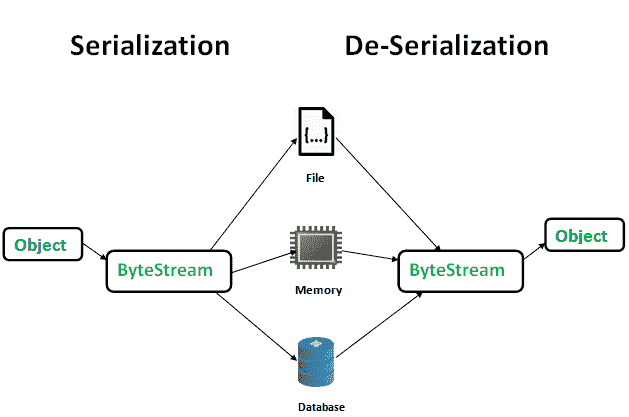

# Java 中的可序列化接口

> 原文:[https://www . geesforgeks . org/serializable-interface-in-Java/](https://www.geeksforgeeks.org/serializable-interface-in-java/)

**java.io** 包中有 **Serializable** 接口。这是一个[标记界面](https://www.geeksforgeeks.org/marker-interface-java/)。标记接口没有任何方法和字段。因此，实现它的类不必实现任何方法。如果类希望其实例被序列化或反序列化，则实现它。序列化是一种将对象状态转换为字节流的机制。序列化使用[对象输出流](https://www.geeksforgeeks.org/java-io-objectoutputstream-class-java-set-1/)完成。反序列化是相反的过程，字节流用于在内存中重新创建实际的 Java 对象。这种机制用于持久化对象。反序列化使用 [ObjectInputStream](https://www.geeksforgeeks.org/java-io-objectinputstream-class-java-set-2/) 完成。因此，它可以用来使一个合格的保存其状态到一个文件。

**申报**

```
public interface Serializable

```



**示例:**下面的示例显示了一个实现 Serializable Interface 的类。

## Java 语言(一种计算机语言，尤用于创建网站)

```
// Java Program to demonstrate a class
// implementing Serializable interface

import java.io.Serializable;

public static class Student implements Serializable {
    public String name = null;
    public String dept = null;
    public int id = 0;
}
```

在这里，您可以看到 Student 类实现了 Serializable，但是没有任何可从 Serializable 实现的方法。

**示例:**下面的示例代码解释了**序列化和反序列化对象**。

## Java 语言(一种计算机语言，尤用于创建网站)

```
// Java program to illustrate Serializable interface
import java.io.*;

// By implementing Serializable interface
// we make sure that state of instances of class A
// can be saved in a file.
class A implements Serializable {
    int i;
    String s;

    // A class constructor
    public A(int i, String s)
    {
        this.i = i;
        this.s = s;
    }
}

public class Test {
    public static void main(String[] args)
        throws IOException, ClassNotFoundException
    {
        A a = new A(20, "GeeksForGeeks");

        // Serializing 'a'
        FileOutputStream fos
            = new FileOutputStream("xyz.txt");
        ObjectOutputStream oos
            = new ObjectOutputStream(fos);
        oos.writeObject(a);

        // De-serializing 'a'
        FileInputStream fis
            = new FileInputStream("xyz.txt");
        ObjectInputStream ois = new ObjectInputStream(fis);
        A b = (A)ois.readObject(); // down-casting object

        System.out.println(b.i + " " + b.s);

        // closing streams
        oos.close();
        ois.close();
    }
}
```

**输出:**

```
20 GeeksForGeeks

```

**必读:**[Java 中的序列化和反序列化](https://www.geeksforgeeks.org/serialization-in-java/)