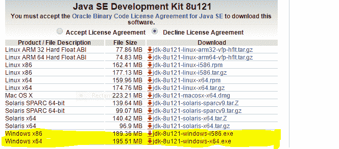
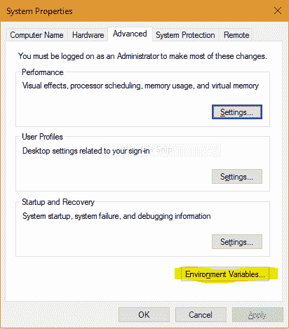
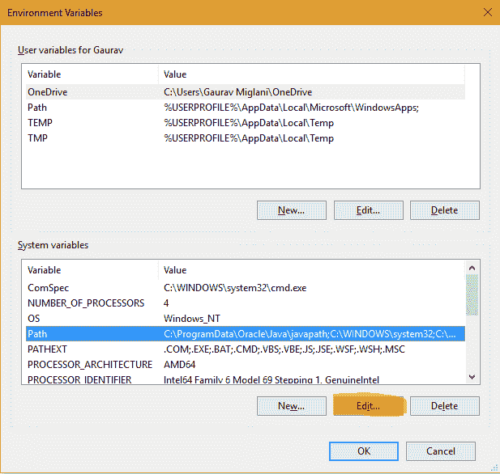
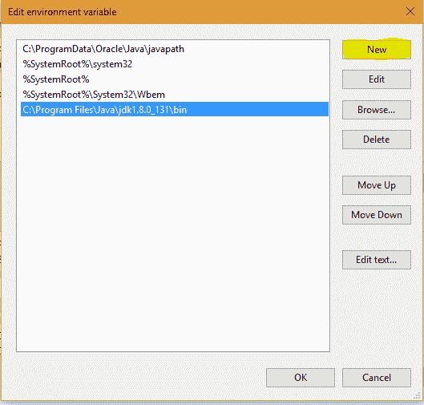
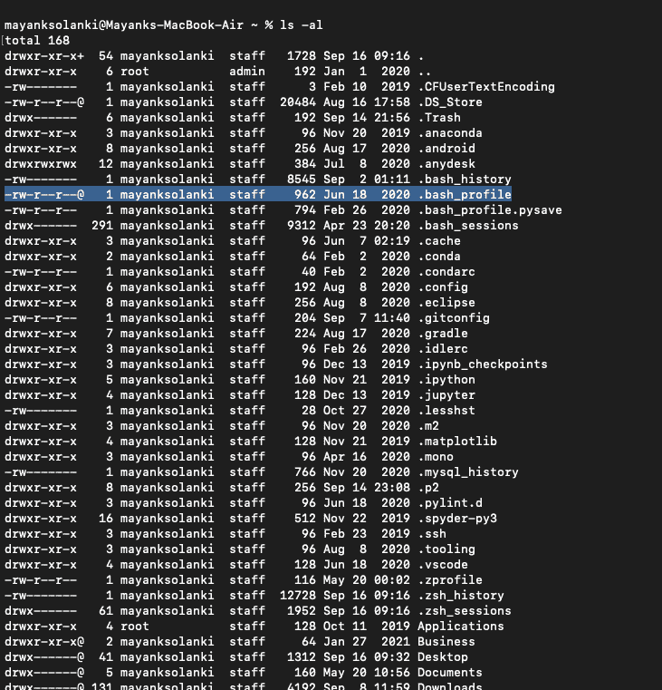

# 在 Java 中设置环境

> 原文:[https://www.geeksforgeeks.org/setting-environment-java/](https://www.geeksforgeeks.org/setting-environment-java/)

Java 是一种通用的计算机编程语言，具有并发性、基于类、面向对象等特点。Java 应用程序通常被编译成[字节码](https://www.geeksforgeeks.org/difference-between-byte-code-and-machine-code/)，该字节码可以在任何 Java 虚拟机(JVM)上运行，而不管计算机架构如何。最新版本是 **Java 17** 。下面是 Linux 和 Windows 的环境设置。JVM、JRE 和 JDK 三者都依赖于平台，因为每个操作系统的配置都不同。但是，Java 是独立于平台的。在设置环境之前，很少有事情必须弄清楚，从下面提供的图片中可以更好地了解环境，如下所示:


*   **JDK** (Java 开发工具包):JDK 面向软件开发人员，包括 Java 编译器、Javadoc、Jar 和调试器等开发工具。
*   **JRE** (Java 运行时环境):JRE 包含运行 Java 程序所需的部分 Java 库，面向最终用户。可将 JRE 视为 JDK 一个子集。
*   **JVM:** JVM (Java 虚拟机)是抽象机。它是一个规范，提供了一个运行时环境，java 字节码可以在其中执行。JVM 可用于许多硬件和软件平台。

现在，让我们讨论用可视化辅助工具设置 Java 环境的步骤。让操作系统成为窗口来说明视觉辅助。

**步骤:**这里我们将为两个不同的操作系统提出如下步骤:

1.  windows 操作系统
2.  Linux 操作系统
3.  macOS 操作系统

### A.Windows 操作系统

在 Windows 操作系统中设置环境的步骤如下:

**第一步:** Java8 JDK 可在[下载 Java 8](http://www.oracle.com/technetwork/java/javase/downloads/jdk8-downloads-2133151.html) 。单击窗口的第二个最后一个链接(32 位)和窗口的最后一个链接(64 位)，如下所示。



**第二步:**下载后，运行*。exe* 文件，并按照说明在您的机器上安装 Java。一旦在机器上安装了 Java，就必须设置环境变量。

**第三步:**转到**控制面板- >系统和安全- >系统。**在高级系统设置选项下，点击**环境变量**，如下图所示。



**步骤 4:** 现在，您必须更改 System 变量下的“Path”变量，使其也包含 Java 环境的路径。选择“路径”变量，点击编辑按钮，如下图所示。



**第五步:**你会看到不同路径的列表，点击新建按钮，然后添加安装 java 的路径。默认情况下，java 安装在“C:\程序文件\Java\jdk\bin”文件夹或“C:\程序文件(x86)\Java\jdk\bin”文件夹中。在这种情况下，您已经在任何其他位置安装了 java，然后添加该路径。



**第六步:**点击确定，保存设置，就完成了！！现在检查安装是否正确，打开命令提示符，输入 *javac -version* 。您将看到 java 正在您的机器上运行。

> **注意:**要确定编译器是否设置好，在命令提示符下键入 *javac* 。您将看到一个与 javac 相关的列表。

### B.Linux 操作系统

在 Linux 中，有几种方法可以安装 java。但是我们将参考使用终端安装 java 的最简单易行的方法。对于 Linux，我们将安装 OpenJDK。OpenJDK 是 Java 编程语言的免费开源实现。在 Linux 操作系统中设置环境的步骤如下:

**第一步:**转到**应用- >配件- >终端**。

**第 2 步:**键入如下命令:

```
sudo apt-get install openjdk-8-jdk
```

**步骤 3:** 对于如下所示的“JAVA_HOME”(环境变量)类型命令，在“Terminal”中使用您的安装路径……(注意:默认路径如图所示，但是如果您必须在另一个位置安装 OpenJDK，那么请设置该路径。)

```
export JAVA_HOME = /usr/lib/jvm/java-8-openjdk
```

**第 4 步:**对于“PATH”(环境值)键入如下所示的命令，在“Terminal”中使用您的安装路径……注意:默认路径如图所示，但是如果您必须在另一个位置安装 OpenJDK，则设置该路径。)

```
export PATH = $PATH:/usr/lib/jvm/java-8-openjdk/bin
```

注意:我们已经完成了用 Java 为 Linux 操作系统设置环境。

> **注意:**现在检查安装是否正确，在终端中输入 *java 版*。您将看到 java 正在您的机器上运行。
> 
> *   **记事本/gedit** :它们是编写 java 程序的简单文本编辑器。记事本在 Windows 上可用，gedit 在 Linux 上可用。
> *   **Eclipse IDE** :是用 java 开发软件应用最广泛的 IDE(集成开发环境)。你可以[下载 Eclipse](https://www.eclipse.org/downloads/) 。

### C.苹果操作系统

**第一步:**从应用程序文件夹打开终端，或者简单地同时按下“command”和“shilft”键，并在按下回车键时写下终端的首字母。

> 将软件包管理器(如 [hombrew](https://brew.sh/) )安装在您的机器上是很愚蠢的，因为我们只需使用终端命令就可以从这里安装任何软件。

**步骤 2:** 现在，为了进行配置，首先编写命令“Java–version ”,下面的消息会弹出，说明没有

```
java --version
javac --version 
```

> **注意:**如果它已经设置好了，那么您将会看到屏幕上显示的版本，如下图所示，该版本已经在机器中设置好了。因此，一旦在您的机器中成功设置，请记住交叉检查您的机器。
> 
> 

**第 2 步:**安装完 JDK 之后，现在让我们继续设置 java home 环境变量，为此，您必须使用下面的命令查看名为“bash_profie”的内容

```
ls -al
```

您会注意到，在您的终端中没有 bash_profile 设置，但是它显示在下面，所以在这台机器中它已经设置好了。为了设置如果不在那里，我们必须创建它，让我们事先寻找到 java home 变量，无论它是否设置。



**步骤 3:** 设置 home java 变量。使用以下命令检查或设置终端上是否安装了以下软件:

```
echo $JAVA_HOME
```


如果它显示为空白，那么 java home 变量就不会像上图中看到的那样设置。

**步骤 4:** 安装 bash_profile

确保转到终端中的根文件夹，并编写命令“touch”。/bash_profile '


现在，您将看到在您的机器中创建了 bash-profile，如步骤 2 所示，hone 可以通过编写如下命令来验证:

```
ls -al 
```

**第 5 步:**编辑。bash_profile 已创建，对于 java，您只需编写在下面的介质中标记的命令，如下所示:

```
export JAVA_HOME=$(/usr/libexec/java_home)
// No need to remember this command  
```


保存此文件，并通过关闭它来重新启动终端。

**步骤 5:** 通过输入以下两个命令验证是否安装

```
source .bash_profile
echo $JAVA_HOME
```


现在从上面的媒体中，我们可以看到 java 变量已经设置好了，因为前面上面的媒体中有一个空白。