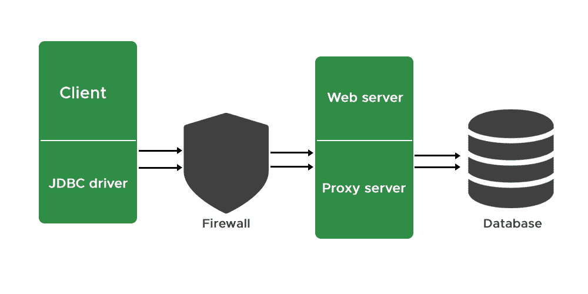

# 在 Java 中设置到系统的代理连接

> 原文:[https://www . geesforgeks . org/setting-proxy-connection-to-a-system-in-Java/](https://www.geeksforgeeks.org/setting-up-proxy-connection-to-a-system-in-java/)

在当今的网络环境中，尤其是公司网络环境中，应用程序开发人员必须像系统管理员一样频繁地处理代理。在某些情况下，应用程序应该使用系统默认设置，在其他情况下，对通过哪个代理进行什么进行非常严格的控制将是额外的，并且，在中间的某个地方，大多数应用程序会欣喜若狂地通过向用户提供设置代理设置的图形用户界面来将决定委托给他们的用户，就像大多数浏览器中的情况一样。

代理服务器充当客户端应用程序和其他服务器之间的接口。在企业环境中，我们经常使用它们来帮助控制用户消费的内容，通常是跨越网络边界。



**接近:**

我们将找出两种在 java 中跨代理服务器连接的方法，如下所示:

1.  JVM 范围内的传统方法，配置有系统属性。
2.  使用代理类，通过允许基于每个连接的配置来提供更多的控制。

**方法 1:** 使用全局设置

Java 展示了一组可用于设置 JVM 范围行为的系统属性。如果这种“通用”方法适合用例，那么它通常是最容易实现的。我们可以在 JVM 调用期间从命令行设置所需的属性。或者，我们也可以在运行时使用 System.setProperty()来定义它们。下面是如何使用命令行定义它们，如下所示:

**2.1。**通过命令行参数设置

我们可以在命令行中绕过参数定义代理作为系统属性:

> Java-Dhttp . proxy host = 127 . 0 . 0 . 1-Dhttp . proxy port = 8080 com . geeksforgeeks . networking . proxy . commandlineproxydemo

当以这种方式开始一个过程时，我们可以只在网址上使用 *openConnection()* ，而不需要额外的工作:

> url =新 URL(RESOURCE_URL)：
> 
> URL connection with = URL . open connection()；

**2.3** 使用 System.setProperty()方法设置代理

如果在使用命令行时出现问题，有另一种方法可以使用 System.setProperty()方法来实现。设置代理。

> System.setProperty（"http.proxyHost"， "127.0.0.1"）;
> 
> system . setproperty(" http . proxy port "，" 8080 ")；
> 
> url =新 URL(RESOURCE_URL)：
> 
> URL connection with = URL . open connection()；
> 
> // …

如果我们手动禁用相关的系统属性，则代理将不再使用:

> System.setProperty（"http.proxyHost"， null）;

现在，这确实带来了全局配置的限制，这将在下面进一步描述。

*   全局配置方法是定义代理最简单的方法，但是这种方法有一定的局限性。
*   这种方法提供了 JVM 范围内的实现，因此为特定协议定义的设置在 JVM 的生命周期内是活动的，或者直到我们手动取消它们。

**注意:**为了克服这个限制，如果需要，打开和关闭设置可能会很有吸引力。但是，有必要确保在多线程程序中防止并发问题的措施。

因此，作为替代方案，代理应用编程接口效率更高，并提供对代理配置的更多控制。作为替代方案，代理应用编程接口对代理配置提供了更精细的控制。这产生了另一种方法，通过代理应用编程接口

**方法 2:** 使用代理 API

代理类为我们提供了一种基于每个连接配置代理的灵活方法。如果存在任何现有的 JVM 范围的代理设置，使用代理类的基于连接的代理设置将覆盖它们。以下是我们可以通过代理类型定义的三种代理类型:

1.  **HTTP** 是一个使用 HTTP 协议的代理
2.  **SOCKS** 是使用 SOCKS 协议的代理
3.  **DIRECT** 是没有代理的显式配置的直接连接

**(A)** 使用 HTTP 代理

为了使用一个 HTTP 代理，我们首先用一个代理和类型为 Proxy.Type.HTTP 包装一个 SocketAddress 实例。

> weburl =新 URL(URL_STRING)：
> 
> 代理网络代理=新代理(代理。键入. HTTP，新的 InetSocketAddress("127.0.0.1 "，8080))；
> 
> httpurlconnection web proxy connection =(httpurlconnection)web URL . open connection(web proxy)；

现在，我们将连接到 URL_STRING，但然后通过托管在 127.0.0.1:8080 的代理服务器路由该连接。

使用直接代理

我们可能需要直接连接到主机。在这种情况下，我们可以使用静态代理显式绕过可能全局配置的代理。无代理实例。在幕后，应用编程接口使用代理为我们构建了一个新的代理实例。类型。直接作为类型:

> httpurlconnection direct connection =(httpurlconnection)weburl . open connection(代理服务器)。NO_PROXY：

**(C)** 使用袜子代理

在处理 URLConnection 时，Socks 代理的工作方式类似于 HTTP 变体。在 Socks 代理中，首先，我们使用代理用一个代理包装一个 SocketAddress 实例。类型。SOCKS 类型。之后，代理实例被传递给 URLConnection.openConnection。

> 代理 socksProxy =新代理(代理。Type.SOCKS，新 InetSocketAddress("127.0.0.1 "，1080))；
> 
> httpurlconnection sock connection =(httpurlconnection)weburl . open connection(sock proxy)；

当连接到 TCP 套接字时，也可以使用 SOCKS 代理。首先，我们使用代理实例来构造一个套接字。之后，我们将目标 SocketAddress 实例传递给 Socket.connect()，如下所示:

> 通讯端 Proxy 套件=新通讯端：
> 
> inetsocket address socket host = new inetsocket address(socket _ server _ host，socket _ server _ port)；
> 
> proxySocket.connect(套接字主机)：

**示例:**

## Java 语言(一种计算机语言，尤用于创建网站)

```java
// Java Program to Create a Simple Proxy Server

// Importing input output classes
import java.io.*;
// Importing
import java.net.*;

public class SimpleProxyServer {
    public static void main(String[] args)
        throws IOException
    {
        try {
            String host = "your Proxy Server";
            int remoteport = 100;
            int localport = 111;
            // Print a start-up message
            System.out.println("Starting proxy for " + host
                               + ":" + remoteport
                               + " on port " + localport);
            // And start running the server
            runServer(host, remoteport,
                      localport); // never returns
        }
        catch (Exception e) {
            System.err.println(e);
        }
    }

    /**
     * runs a single-threaded proxy server on
     * the specified local port. It never returns.
     */
    public static void
    runServer(String host, int remoteport, int localport)
        throws IOException
    {
        // Create a ServerSocket to listen for connections
        // with
        ServerSocket ss = new ServerSocket(localport);

        final byte[] request = new byte[1024];
        byte[] reply = new byte[4096];

        while (true) {
            Socket client = null, server = null;
            try {
                // Wait for a connection on the local port
                client = ss.accept();

                final InputStream streamFromClient
                    = client.getInputStream();
                final OutputStream streamToClient
                    = client.getOutputStream();

                // Make a connection to the real server.
                // If we cannot connect to the server, send
                // an error to the client, disconnect, and
                // continue waiting for connections.
                try {
                    server = new Socket(host, remoteport);
                }
                catch (IOException e) {
                    PrintWriter out
                        = new PrintWriter(streamToClient);
                    out.print(
                        "Proxy server cannot connect to "
                        + host + ":" + remoteport + ":\n"
                        + e + "\n");
                    out.flush();
                    client.close();
                    continue;
                }

                // Get server streams.
                final InputStream streamFromServer
                    = server.getInputStream();
                final OutputStream streamToServer
                    = server.getOutputStream();

                // a thread to read the client's requests
                // and pass them to the server. A separate
                // thread for asynchronous.
                Thread t = new Thread() {
                    public void run()
                    {
                        int bytesRead;
                        try {
                            while ((bytesRead
                                    = streamFromClient.read(
                                        request))
                                   != -1) {
                                streamToServer.write(
                                    request, 0, bytesRead);
                                streamToServer.flush();
                            }
                        }
                        catch (IOException e) {
                        }

                        // the client closed the connection
                        // to us, so close our connection to
                        // the server.
                        try {
                            streamToServer.close();
                        }
                        catch (IOException e) {
                        }
                    }
                };

                // Start the client-to-server request thread
                // running
                t.start();

                // Read the server's responses
                // and pass them back to the client.
                int bytesRead;
                try {
                    while ((bytesRead
                            = streamFromServer.read(reply))
                           != -1) {
                        streamToClient.write(reply, 0,
                                             bytesRead);
                        streamToClient.flush();
                    }
                }
                catch (IOException e) {
                }

                // The server closed its connection to us,
                // so we close our connection to our client.
                streamToClient.close();
            }
            catch (IOException e) {
                System.err.println(e);
            }
            finally {
                try {
                    if (server != null)
                        server.close();
                    if (client != null)
                        client.close();
                }
                catch (IOException e) {
                }
            }
        }
    }
}
```

**输出:**


**结论:**根据输出，我们可以看到如何在核心 Java 中使用代理服务器。首先，我们研究了使用系统属性通过代理服务器进行连接的更古老、更全球化的方式。然后，我们看到了如何使用 Proxy 类，它在通过代理服务器连接时提供了细粒度的控制。