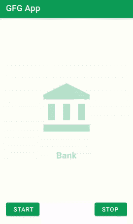

# 安卓中图像的微光效果

> 原文:[https://www . geesforgeks . org/shimmer-effect-to-image in Android/](https://www.geeksforgeeks.org/shimmer-effect-to-image-in-android/)

**微光效果**是我们在大多数安卓应用中看到的最受欢迎的功能之一。我们可以在以动画形式加载屏幕时看到这种微光效果。在安卓应用中使用微光效果会带来良好的用户体验。在本文中，我们将看到如何在安卓应用程序中实现微光效果。下面给出了一个 GIF 示例，来了解一下我们将在本文中做什么。注意，我们将使用 **Java** 语言来实现这个项目。



### 微光效应的应用

*   匀场效果主要用于以吸引人的形式加载屏幕。
*   微光效果为安卓应用中的图像提供了良好的外观。
*   在我们的应用程序中使用微光效果给出了图像的动画视图。

### **分步实施**

**第一步:创建新项目**

要在安卓工作室创建新项目，请参考[如何在安卓工作室创建/启动新项目](https://www.geeksforgeeks.org/android-how-to-create-start-a-new-project-in-android-studio/)。注意选择 **Java** 作为编程语言。

**第二步:在 build.gradle 文件**中添加微光效果库的依赖关系

然后导航到梯度脚本，然后导航到**构建.梯度(模块)**级别。在 dependencies 部分的 build.gradle 文件中添加以下行。

> 实现' com . Facebook . shimmer:shimmer:0 . 5 . 0 '

现在点击**立即同步**它将同步你在 **build.gradle()中的所有文件。**

**第三步:在你的 activity_main.xml 文件中创建一个新的微光效果**

导航到 **app > res >布局> activity_main.xml** 并将下面的代码添加到该文件中。下面是**activity _ main . XML**文件的代码。

## 可扩展标记语言

```java
<?xml version="1.0" encoding="utf-8"?>
<RelativeLayout 
    xmlns:android="http://schemas.android.com/apk/res/android"
    xmlns:tools="http://schemas.android.com/tools"
    android:layout_width="match_parent"
    android:layout_height="match_parent"
    android:background="@color/black"
    android:paddingLeft="16dp"
    android:paddingTop="16dp"
    android:paddingRight="16dp"
    android:paddingBottom="16dp"
    tools:context=".MainActivity">

    <!--Shimmer Effect-->
    <com.facebook.shimmer.ShimmerFrameLayout
        android:id="@+id/shimmer_view_container"
        android:layout_width="wrap_content"
        android:layout_height="wrap_content"
        android:layout_centerInParent="true">

        <LinearLayout
            android:layout_width="wrap_content"
            android:layout_height="wrap_content"
            android:gravity="center"
            android:orientation="vertical">

            <!--Image-->
            <ImageView
                android:layout_width="150dp"
                android:layout_height="150dp"
                android:src="@drawable/ic_baseline_account_balance_24" />

            <!--Text given to Image-->
            <TextView
                android:layout_width="wrap_content"
                android:layout_height="wrap_content"
                android:layout_marginTop="35dp"
                android:text="Bank"
                android:textColor="@color/purple_200"
                android:textSize="24dp"
                android:textStyle="bold" />

        </LinearLayout>

    </com.facebook.shimmer.ShimmerFrameLayout>

    <!--Button1 to start Shimmer Effect-->
    <Button
        android:id="@+id/button"
        android:layout_width="wrap_content"
        android:layout_height="wrap_content"
        android:layout_alignParentStart="true"
        android:layout_alignParentLeft="true"
        android:layout_alignParentBottom="true"
        android:paddingLeft="20dp"
        android:text="Start" />

    <!--Button2 to stop Shimmer Effect-->
    <Button
        android:id="@+id/button2"
        android:layout_width="wrap_content"
        android:layout_height="wrap_content"
        android:layout_alignParentEnd="true"
        android:layout_alignParentRight="true"
        android:layout_alignParentBottom="true"
        android:paddingRight="20dp"
        android:text="Stop" />

</RelativeLayout>
```

**第四步:使用****MainActivity.java 文件**

转到**MainActivity.java**文件，参考以下代码。以下是**MainActivity.java**文件的代码。代码中添加了注释，以更详细地理解代码。

## Java 语言(一种计算机语言，尤用于创建网站)

```java
import android.os.Bundle;
import android.view.View;
import android.widget.Button;

import androidx.appcompat.app.AppCompatActivity;

import com.facebook.shimmer.ShimmerFrameLayout;

public class MainActivity extends AppCompatActivity {

    // Variables created for buttons and Shimmer
    Button button1, button2;
    ShimmerFrameLayout container;

    @Override
    protected void onCreate(Bundle savedInstanceState) {
        super.onCreate(savedInstanceState);
        setContentView(R.layout.activity_main);

        button1 = findViewById(R.id.button);
        button2 = findViewById(R.id.button2);

        // Button 1 to start Shimmer Effect
        button1.setOnClickListener(new View.OnClickListener() {
            @Override
            public void onClick(View v) {
                // If auto-start is set to false
                container.startShimmer(); 
            }
        });

        // Button 2 to stop Shimmer Effect
        button2.setOnClickListener(new View.OnClickListener() {
            @Override
            public void onClick(View v) {
                // If auto-start is set to false
                container.stopShimmer(); 
            }
        });

        // Shimmer effect
        container = (ShimmerFrameLayout) findViewById(R.id.shimmer_view_container);
    }
}
```

现在点击**运行**选项**构建梯度**需要一些时间。之后，您将获得如下所示的设备输出。

### **输出:**

<video class="wp-video-shortcode" id="video-553302-1" width="640" height="360" preload="metadata" controls=""><source type="video/mp4" src="https://media.geeksforgeeks.org/wp-content/uploads/20210128132541/Screenrecorder-2021-01-28-13-23-56-543.mp4?_=1">[https://media.geeksforgeeks.org/wp-content/uploads/20210128132541/Screenrecorder-2021-01-28-13-23-56-543.mp4](https://media.geeksforgeeks.org/wp-content/uploads/20210128132541/Screenrecorder-2021-01-28-13-23-56-543.mp4)</video>