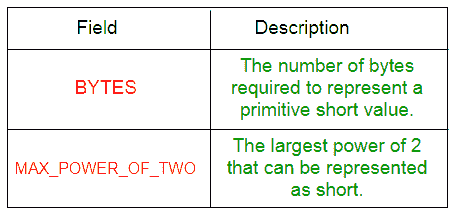
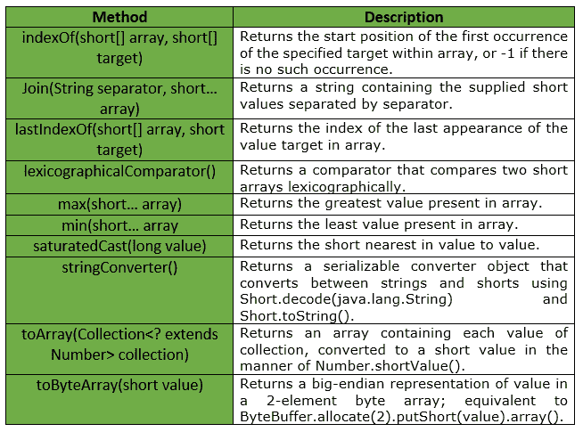

# 短裤类|番石榴|爪哇

> 原文:[https://www.geeksforgeeks.org/shorts-class-guava-java/](https://www.geeksforgeeks.org/shorts-class-guava-java/)

**shots**是一个用于原语类型 short 的实用类。它提供了属于短原语的**静态实用方法，这些方法在短原语或数组中都找不到。**

****申报:****

```java
@GwtCompatible(emulated=true)
public final class Shorts
extends Object 
```

**下表显示了番石榴短裤等级的现场总结:**

**
番石榴短裤类提供的一些方法有:

**例外:****

*   ****如果值大于 Short，则勾选 cast:***IllegalArgumentException*。最大值或小于短值。最小值**
*   ****min:***IllegalArgumentException*若阵为空。**
*   ****max:***IllegalArgumentException*如果数组为空。**
*   ****from bytearray:***IllegalArgumentException*如果字节少于 2 个元素。**
*   ****确保容量:** *如果最小长度或填充值为负，则显示“异常”。***
*   ****to array:***NullPointerException*如果集合或其任何元素为空。**

**下表显示了番石榴短裤类提供的一些其他方法:

下面给出了一些示例，显示了番石榴短裤类方法的实现:
**示例 1 :****

```java
// Java code to show implementation
// of Guava Shorts.asList() method

import com.google.common.primitives.Shorts;
import java.util.*;

class GFG {
    // Driver method
    public static void main(String[] args)
    {
        short arr[] = { 3, 4, 5, 6, 7 };

        // Using Shorts.asList() method which convert
        // array of primitives to array of objects
        List<Short> myList = Shorts.asList(arr);

        // Displaying the elements
        System.out.println(myList);
    }
}
```

**输出:**

```java
[3, 4, 5, 6, 7] 
```

****例 2 :****

```java
// Java code to show implementation
// of Guava Shorts.indexOf() method

import com.google.common.primitives.Shorts;
import java.util.*;

class GFG {
    // Driver method
    public static void main(String[] args)
    {
        short[] arr = { 3, 4, 5, 6, 7 };

        // Displaying the index for
        // first occurrence of given target
        System.out.println(Shorts.indexOf(arr, (short)5));
    }
}
```

**输出:**

```java
2 
```

****例 3 :****

```java
// Java code to show implementation
// of Guava Shorts.concat() method

import com.google.common.primitives.Shorts;
import java.util.*;

class GFG {
    // Driver method
    public static void main(String[] args)
    {
        short[] arr1 = { 3, 4, 5 };
        short[] arr2 = { 6, 7 };

        // Using Shorts.concat() method which
        // combines arrays from specified
        // arrays into a single array
        short[] arr = Shorts.concat(arr1, arr2);

        // Displaying the elements
        System.out.println(Arrays.toString(arr));
    }
}
```

**输出:**

```java
[3, 4, 5, 6, 7] 
```

****例 4 :****

```java
// Java code to show implementation
// of Guava Shorts.contains() method

import com.google.common.primitives.Shorts;

class GFG {
    // Driver method
    public static void main(String[] args)
    {
        short[] arr = { 3, 4, 5, 6, 7 };

        // Using Shorts.contains() method which
        // checks if element is present in array
        // or not
        System.out.println(Shorts.contains(arr, (short)8));
        System.out.println(Shorts.contains(arr, (short)7));
    }
}
```

**输出:**

```java
false
true 
```

****例 5 :****

```java
// Java code to show implementation
// of Guava Shorts.min() method

import com.google.common.primitives.Shorts;

class GFG {
    // Driver method
    public static void main(String[] args)
    {
        short[] arr = { 3, 4, 5, 6, 7 };

        // Using Shorts.min() method
        System.out.println(Shorts.min(arr));
    }
}
```

**输出:**

```java
3 
```

****例 6 :****

```java
// Java code to show implementation
// of Guava Shorts.max() method

import com.google.common.primitives.Shorts;

class GFG {
    // Driver method
    public static void main(String[] args)
    {
        short[] arr = { 3, 4, 5, 6, 7 };

        // Using Shorts.max() method
        System.out.println(Shorts.max(arr));
    }
}
```

**输出:**

```java
7 
```