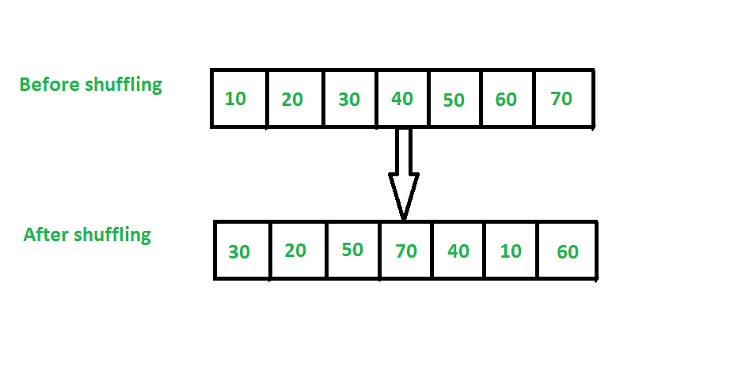

# 在 Java 中洗牌数组列表的元素

> 原文:[https://www . geesforgeks . org/shuffle-elements-of-ArrayList-in-Java/](https://www.geeksforgeeks.org/shuffle-elements-of-arraylist-in-java/)

洗牌意味着随机改变[数组列表](https://www.geeksforgeeks.org/arraylist-in-java/)元素的位置。洗牌后，它们的顺序会不同。

下面是洗牌数组列表元素的例子。



**数组列表元素的混洗方式:**

1.  使用随机类
2.  使用 Collections.shuffle()

**方法一:使用** [**随机类**](https://www.geeksforgeeks.org/java-util-random-class-java/)

*   在这个方法中，我们将使用随机类来洗牌数组列表元素，以生成随机索引。
*   和 java [collections.swap()](https://www.geeksforgeeks.org/collections-swap-method-in-java-with-examples/) 方法来交换 ArrayList 元素。
*   我们将使用的另一个算法是 [**费希尔-耶茨洗牌。**T3】](https://www.geeksforgeeks.org/shuffle-a-given-array-using-fisher-yates-shuffle-algorithm/)

**代码:**

## Java 语言(一种计算机语言，尤用于创建网站)

```
// Java program to demonstrate shuffling of arraylist
// elements Using Random class

import java.util.*;
class ArraylistShuffle {
    public static void main(String args[])
    {
        // creating
        // ArrayList
        ArrayList<Integer> al = new ArrayList<Integer>();

        // adding object in ArrayList
        al.add(10);
        al.add(20);
        al.add(30);
        al.add(40);
        al.add(50);
        al.add(60);
        al.add(70);
        al.add(80);

        System.out.println("Before shuffling Arraylist:");

        // getting Iterator
        // from arraylist to
        // traverse elements
        Iterator itr = al.iterator();

        while (itr.hasNext()) {
            System.out.print(itr.next() + " ");
        }

        System.out.println("");

        Random r1 = new Random();

        for (int i = al.size() - 1; i >= 1; i--) {
            // swapping current index value
            // with random index value
            Collections.swap(al, i, r1.nextInt(i + 1));
        }

        System.out.println("After shuffling Arraylist:");

        itr = al.iterator();

        while (itr.hasNext()) {
            System.out.print(itr.next() + " ");
        }
    }
}
```

**Output**

```
Before shuffling Arraylist:
10 20 30 40 50 60 70 80 
After shuffling Arraylist:
10 60 30 20 50 80 40 70 
```

**方法二:使用**[**collections . shuffle()**](https://www.geeksforgeeks.org/collections-shuffle-java-examples/)

使用 Collections.shuffle()对数组列表元素进行洗牌。

## Java 语言(一种计算机语言，尤用于创建网站)

```
// Java program to demonstrate shuffling
// ArrayList elements using Collections.shuffle()

import java.util.*;
class ArraylistShuffle {
    public static void main(String args[])
    {
        // creating ArrayList
        ArrayList<String> al = new ArrayList<String>();

        // adding object in ArrayList
        al.add("C");
        al.add("C++");
        al.add("Java");
        al.add("Python");
        al.add("PHP");
        al.add("Javascript");

        System.out.println("Before shuffling Arraylist:");

        // getting Iterator
        // from arraylist to
        // traverse elements
        Iterator itr = al.iterator();

        while (itr.hasNext()) {
            System.out.print(itr.next() + " ");
        }

        System.out.println("");

        Collections.shuffle(al);

        System.out.println("After shuffling Arraylist:");

        itr = al.iterator();

        while (itr.hasNext()) {
            System.out.print(itr.next() + " ");
        }
    }
}
```

**Output**

```
Before shuffling Arraylist:
C C++ Java Python PHP Javascript 
After shuffling Arraylist:
PHP Java C++ C Javascript Python 
```