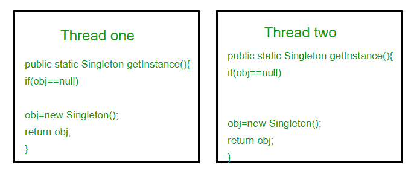

# 单体设计模式|实现

> 原文:[https://www.geeksforgeeks.org/singleton-design-pattern/](https://www.geeksforgeeks.org/singleton-design-pattern/)

[单体设计模式|简介](https://www.geeksforgeeks.org/singleton-design-pattern-introduction/)
单体模式是最简单的设计模式之一。有时我们只需要有一个类的实例，例如一个由多个对象共享的数据库连接，因为为每个对象创建一个单独的数据库连接可能成本很高。同样，应用程序中可以有一个配置管理器或错误管理器来处理所有问题，而不是创建多个管理器。
**定义:**
*单例模式是一种将一个类的实例化限制为一个对象的设计模式。*
我们来看看实现这样一个类的各种设计选项。如果你能很好地处理静态类变量和访问修饰符，这应该不是一件难事。

**方法一:经典实现**

## Java 语言(一种计算机语言，尤用于创建网站)

```java
// Classical Java implementation of singleton
// design pattern
class Singleton
{
    private static Singleton obj;

    // private constructor to force use of
    // getInstance() to create Singleton object
    private Singleton() {}

    public static Singleton getInstance()
    {
        if (obj==null)
            obj = new Singleton();
        return obj;
    }
}
```

这里我们已经将 getInstance()声明为静态的，这样我们就可以在不实例化类的情况下调用它。第一次调用 getInstance()时，它会创建一个新的单例对象，之后它只返回同一个对象。请注意，在我们需要 Singleton obj 并调用 getInstance()方法之前，不会创建 Singleton obj。这被称为惰性实例化。
上述方法的主要问题是它不是线程安全的。考虑以下执行顺序。



这个执行序列为 singleton 创建了两个对象。因此，这个经典的实现不是线程安全的。

**方法二:使**与
同步

## Java 语言(一种计算机语言，尤用于创建网站)

```java
// Thread Synchronized Java implementation of
// singleton design pattern
class Singleton
{
    private static Singleton obj;

    private Singleton() {}

    // Only one thread can execute this at a time
    public static synchronized Singleton getInstance()
    {
        if (obj==null)
            obj = new Singleton();
        return obj;
    }
}
```

这里使用 synchronized 可以确保一次只有一个线程可以执行 getInstance()。
这种 is 方法的主要缺点是每次在创建 singleton 对象时使用 synchronized 很昂贵，可能会降低程序的性能。但是，如果 getInstance()的性能对于您的应用程序来说并不重要，那么这个方法提供了一个简单明了的解决方案。

**方法三:急切实例化**

## Java 语言(一种计算机语言，尤用于创建网站)

```java
// Static initializer based Java implementation of
// singleton design pattern
class Singleton
{
    private static Singleton obj = new Singleton();

    private Singleton() {}

    public static Singleton getInstance()
    {
        return obj;
    }
}
```

这里我们已经在静态初始化器中创建了 singleton 的实例。当类被加载时，JVM 执行静态初始化器，因此这保证是线程安全的。仅当您的 singleton 类很轻并且在整个程序执行过程中使用时，才使用此方法。

**方法 4(最佳):使用“** [**【双重检查锁定】**](https://en.wikipedia.org/wiki/Double-checked_locking) **如果你仔细注意一旦一个对象被创建，同步就不再有用了，因为现在 obj 不会为空，任何操作序列都会导致一致的结果。
所以我们只会在对象为空时获取 getInstance()上的锁一次。这种方式我们只同步第一路通过，正是我们想要的。** 

## **Java 语言(一种计算机语言，尤用于创建网站)**

```java
// Double Checked Locking based Java implementation of
// singleton design pattern
class Singleton
{
    private static volatile Singleton obj  = null;

    private Singleton() {}

    public static Singleton getInstance()
    {
        if (obj == null)
        {
            // To make thread safe
            synchronized (Singleton.class)
            {
                // check again as multiple threads
                // can reach above step
                if (obj==null)
                    obj = new Singleton();
            }
        }
        return obj;
    }
}
```

**我们已经声明了 obj [可变的](https://www.geeksforgeeks.org/volatile-keyword-in-java/)，这确保了当 obj 变量被初始化为 Singleton 实例时，多个线程能够正确地提供它。这个方法大大减少了每次调用同步方法的开销。**