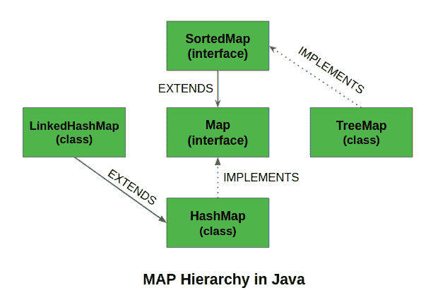

# 用示例排序 Java 中的 Map 接口

> 原文:[https://www.geeksforgeeks.org/sortedmap-java-examples/](https://www.geeksforgeeks.org/sortedmap-java-examples/)

SortedMap 是[集合框架](https://www.geeksforgeeks.org/collections-in-java-2/)中的一个接口。该界面扩展了[地图界面](https://www.geeksforgeeks.org/map-interface-java-examples/)，并提供了其元素的总排序(元素可以按键的排序顺序遍历)。实现这个接口的类是[树形图](https://www.geeksforgeeks.org/hashmap-treemap-java/)。



SortedMap 的主要特点是，它根据键的自然顺序或指定的比较器对键进行排序。因此，当您想要满足以下标准的地图时，请考虑使用[树状图](https://www.geeksforgeeks.org/hashmap-treemap-java/):

*   不允许空键或空值。
*   这些关键字或者按自然顺序排序，或者按指定的比较器排序。

**类型参数:**

*   k–此地图维护的按键类型
*   v–映射值的类型

SortedMap 的父界面是[地图< K，V >。](https://www.geeksforgeeks.org/map-interface-java-examples/)

SortedMap 的子接口是 concurrentnavigatablemap<k v="">，[navigatablemap<K，V >。](https://www.geeksforgeeks.org/navigablemap-interface-in-java-with-example/#:~:text=NavigableMap%20is%20an%20extension%20of,than%20specified%20key%2C%20tailMap%20whose)</k>

SortedMap 由 ConcurrentSkipListMap 实现， [TreeMap。](https://www.geeksforgeeks.org/treemap-in-java/#:~:text=The%20TreeMap%20in%20Java%20is,on%20which%20constructor%20is%20used.)

**申报:**

```java
public interface SortedMap<K, V> extends Map<K, V>
{
    Comparator comparator();
    SortedMap subMap(K fromKey, K toKey);
    SortedMap headMap(K toKey);
    SortedMap tailMap(K fromKey);
    K firstKey();
    K lastKey();
}

```

**示例:**

## Java 语言(一种计算机语言，尤用于创建网站)

```java
// Java code to demonstrate SortedMap Interface
import java.util.Iterator;
import java.util.Map;
import java.util.Set;
import java.util.SortedMap;
import java.util.TreeMap;

public class SortedMapExample {
    public static void main(String[] args)
    {
        SortedMap<Integer, String> sm
            = new TreeMap<Integer, String>();
        sm.put(new Integer(2), "practice");
        sm.put(new Integer(3), "quiz");
        sm.put(new Integer(5), "code");
        sm.put(new Integer(4), "contribute");
        sm.put(new Integer(1), "geeksforgeeks");
        Set s = sm.entrySet();

        // Using iterator in SortedMap
        Iterator i = s.iterator();

        // Traversing map. Note that the traversal
        // produced sorted (by keys) output .
        while (i.hasNext()) {
            Map.Entry m = (Map.Entry)i.next();

            int key = (Integer)m.getKey();
            String value = (String)m.getValue();

            System.out.println("Key : " + key
                               + "  value : " + value);
        }
    }
}
```

**输出:**

```java
Key : 1  value : geeksforgeeks
Key : 2  value : practice
Key : 3  value : quiz
Key : 4  value : contribute
Key : 5  value : code

```

**创建排序地图对象**

由于 SortedMap 是一个[接口](https://www.geeksforgeeks.org/interfaces-in-java/)，因此不能创建 SortedMap 类型的对象。我们总是需要一个扩展这个列表的类来创建一个对象。此外，在 Java 1.5 中引入泛型之后，可以限制可以存储在 SortedMap 中的对象类型。这种类型安全映射可以定义为:

> // Obj1、Obj2 是要存储在 SortedMap 中的对象类型
> 
> SortedMap <obj1 obj2="">set =新建树形图<obj1 obj2="">()；</obj1></obj1>

### 在排序地图上执行各种操作

由于 SortedMap 是一个接口，它只能与实现该接口的类一起使用。 [**树形图**](https://www.geeksforgeeks.org/treemap-in-java/) 是实现 SortedMap 接口的类。现在，让我们看看如何在 TreeMap 上执行一些常用的操作。

**1。添加元素:**为了给 SortedMap 添加一个元素，我们可以使用 [**put()**](https://www.geeksforgeeks.org/treemap-put-method-in-java/?ref=rp) 方法。但是，插入顺序不会保留在树形图中。在内部，对于每个元素，键都是按升序进行比较和排序的。

## Java 语言(一种计算机语言，尤用于创建网站)

```java
// Java program add the elements in the SortedMap
import java.io.*;
import java.util.*;
class GFG {

    // Main Method
    public static void main(String args[])
    {
        // Default Initialization of a
        // SortedMap
        SortedMap tm1 = new TreeMap();

        // Initialization of a SortedMap
        // using Generics
        SortedMap<Integer, String> tm2
            = new TreeMap<Integer, String>();

        // Inserting the Elements
        tm1.put(3, "Geeks");
        tm1.put(2, "For");
        tm1.put(1, "Geeks");

        tm2.put(new Integer(3), "Geeks");
        tm2.put(new Integer(2), "For");
        tm2.put(new Integer(1), "Geeks");

        System.out.println(tm1);
        System.out.println(tm2);
    }
}
```

**输出:**

```java
{1=Geeks, 2=For, 3=Geeks}
{1=Geeks, 2=For, 3=Geeks}

```

**2。更改元素:**添加元素后如果我们想更改元素，可以通过 [put()](https://www.geeksforgeeks.org/treemap-put-method-in-java/?ref=rp) 方法再次添加元素来完成。由于 SortedMap 中的元素是使用键进行索引的，因此可以通过简单地插入我们想要更改的键的更新值来更改键的值。

## Java 语言(一种计算机语言，尤用于创建网站)

```java
// Java program to change
// the elements in SortedMap
import java.io.*;
import java.util.*;
class GFG {

      // Main Method
    public static void main(String args[])
    {
        // Initialization of a SortedMap
        // using Generics
        SortedMap<Integer, String> tm
            = new TreeMap<Integer, String>();

        // Inserting the Elements
        tm.put(3, "Geeks");
        tm.put(2, "Geeks");
        tm.put(1, "Geeks");

        System.out.println(tm);

        tm.put(2, "For");

        System.out.println(tm);
    }
}
```

**输出:**

```java
{1=Geeks, 2=Geeks, 3=Geeks}
{1=Geeks, 2=For, 3=Geeks}
```

**3。移除元素:**为了从 SortedMap 中移除元素，我们可以使用 [**移除()**](https://www.geeksforgeeks.org/treemap-remove-method-in-java/?ref=rp) 方法。此方法获取键值，并从该 SortedMap 中移除键值的映射(如果映射中存在)。

## Java 语言(一种计算机语言，尤用于创建网站)

```java
// Java program to remove the 
// elements from SortedMap
import java.io.*;
import java.util.*;

class GFG {

      // Main Method
    public static void main(String args[])
    {
        // Initialization of a SortedMap
        // using Generics
        SortedMap<Integer, String> tm
            = new TreeMap<Integer, String>();

        // Inserting the Elements
        tm.put(3, "Geeks");
        tm.put(2, "Geeks");
        tm.put(1, "Geeks");
        tm.put(4, "For");

        System.out.println(tm);

        tm.remove(4);

        System.out.println(tm);
    }
}
```

**输出:**

```java
{1=Geeks, 2=Geeks, 3=Geeks, 4=For}
{1=Geeks, 2=Geeks, 3=Geeks}
```

**4。迭代排序地图:**有多种方法迭代地图。最著名的方法是使用[增强循环](https://www.geeksforgeeks.org/for-each-loop-in-java/)并获得钥匙。使用 getValue()方法可以找到该键的值。

## Java 语言(一种计算机语言，尤用于创建网站)

```java
// Java program to iterate through SortedMap
import java.util.*;

class GFG {

      // Main Method
    public static void main(String args[])
    {
        // Initialization of a SortedMap
        // using Generics
        SortedMap<Integer, String> tm
            = new TreeMap<Integer, String>();

        // Inserting the Elements
        tm.put(3, "Geeks");
        tm.put(2, "For");
        tm.put(1, "Geeks");

        for (Map.Entry mapElement : tm.entrySet()) {
            int key = (int)mapElement.getKey();

            // Finding the value
            String value = (String)mapElement.getValue();

            System.out.println(key + " : " + value);
        }
    }
}
```

**输出:**

```java
1 : Geeks
2 : For
3 : Geeks
```

**实现 SortedMap 接口的类是 TreeMap。**

在集合框架中实现的 TreeMap 类是 SortedMap 接口的实现，SortedMap 扩展了 Map 接口。它的行为就像一个简单的地图，只是它以排序的格式存储关键字。TreeMap 使用树形数据结构进行存储。对象以排序的升序存储。但是我们也可以通过一个比较器以降序存储。让我们看看如何使用这个类创建一个 SortedMap 对象。

## Java 语言(一种计算机语言，尤用于创建网站)

```java
// Java program to demonstrate the
// creation of SortedMap object using
// the TreeMap class

import java.util.*;

class GFG {

    public static void main(String[] args)
    {
        SortedMap<String, String> tm
            = new TreeMap<String, String>(new Comparator<String>() {
                  public int compare(String a, String b)
                  {
                      return b.compareTo(a);
                  }
              });

        // Adding elements into the TreeMap
        // using put()
        tm.put("India", "1");
        tm.put("Australia", "2");
        tm.put("South Africa", "3");

        // Displaying the TreeMap
        System.out.println(tm);

        // Removing items from TreeMap
        // using remove()
        tm.remove("Australia");
        System.out.println("Map after removing "
                           + "Australia:" + tm);
    }
}
```

**输出:**

```java
{South Africa=3, India=1, Australia=2}
Map after removing Australia:{South Africa=3, India=1}
```

### 排序地图界面的方法

<figure class="table">

| 方法 | 描述 |
| --- | --- |
| [比较器()](https://www.geeksforgeeks.org/sortedmap-comparator-method-in-java-with-examples/) | 返回用于对该映射中的键进行排序的比较器，如果该映射使用其键的自然排序，则返回 null。 |
| [输入 ySet()](https://www.geeksforgeeks.org/sortedmap-entryset-method-in-java-with-examples/) | 返回此映射中包含的映射的集合视图。 |
| [firstKey()](https://www.geeksforgeeks.org/sortedmap-firstkey-method-in-java/) | 返回当前地图中的第一个(最低的)键。 |
| [头帽(K toKey)](https://www.geeksforgeeks.org/sortedmap-headmap-method-in-java/) | 返回该地图关键点严格小于 toKey 的部分的视图。 |
| [键集()](https://www.geeksforgeeks.org/sortedmap-keyset-method-in-java-with-examples/) | 返回此地图中包含的键的集合视图。 |
| [负载力()](https://www.geeksforgeeks.org/sortedmap-lastkey-method-in-java/) | 返回当前地图中的最后一个(最高的)键。 |
| [subMap(K fromKey，K toKey)](https://www.geeksforgeeks.org/sortedmap-submap-method-in-java/) | 返回此地图的一部分的视图，其键的范围从“从键(包含)”到“到键(不包含)”。 |
| [尺寸图(K fromKey)](https://www.geeksforgeeks.org/sortedmap-tailmap-method-in-java/) | 返回该映射中键大于或等于 fromKey 的部分的视图。 |
| [值()](https://www.geeksforgeeks.org/sortedmap-values-method-in-java-with-examples/) | 返回此地图中包含的值的集合视图。 |

</figure>

### 从接口 java.util.Map 继承的方法

<figure class="table">

| 方法 | 描述 |
| --- | --- |
| [晴()](https://www.geeksforgeeks.org/map-clear-method-in-java-with-example/) | 此方法用于清除和移除指定地图集合中的所有元素或映射。 |
| [包含键(对象)](https://www.geeksforgeeks.org/map-containskey-method-in-java-with-examples/) | 此方法用于检查特定键是否映射到映射中。它将关键元素作为参数，如果该元素在映射中被映射，则返回 True。 |
| [包含值(对象)](https://www.geeksforgeeks.org/map-containsvalue-method-in-java-with-examples/) | 此方法用于检查特定值是由映射中的单个键映射还是由多个键映射。它将该值作为参数，如果该值由映射中的任何键映射，则返回 True。 |
| [输入 ySet()](https://www.geeksforgeeks.org/map-entryset-method-in-java-with-examples/) | 此方法用于创建地图中包含的相同元素的集合。它基本上返回地图的集合视图，或者我们可以创建一个新的集合并将地图元素存储到其中。 |
| [等于(对象)](https://www.geeksforgeeks.org/map-equals-method-in-java-with-examples/) | 此方法用于检查两个地图之间的相等性。它验证作为参数传递的一个映射的元素是否等于这个映射的元素。 |
| [获取(对象)](https://www.geeksforgeeks.org/map-get-method-in-java-with-examples/) | 此方法用于检索或获取由参数中提到的特定键映射的值。当映射不包含键的这种映射时，它返回空值。 |
| [hashCode()](https://www.geeksforgeeks.org/map-hashcode-method-in-java-with-examples/) | 该方法用于为包含键和值的给定映射生成哈希代码。 |
| [【isempty()](https://www.geeksforgeeks.org/map-isempty-method-in-java-with-examples/) | 此方法用于检查映射是否有任何键和值对的条目。如果不存在映射，则返回 true。 |
| [键集()](https://www.geeksforgeeks.org/map-keyset-method-in-java-with-examples/) | 此方法用于返回此地图中包含的键的集合视图。集合由地图支持，因此对地图的更改会反映在集合中，反之亦然。 |
| [put(Object，Object)](https://www.geeksforgeeks.org/map-put-method-in-java-with-examples/) | 此方法用于将指定值与此映射中的指定键相关联。 |
| putall(地图) | 此方法用于将指定映射中的所有映射复制到此映射。 |
| [移除(对象)](https://www.geeksforgeeks.org/map-remove-method-in-java-with-examples/) | 如果某个键存在于地图中，则此方法用于从此地图中移除该键的映射。 |
| 大小() | 此方法用于返回映射中可用的键/值对的数量。 |
| 值() | 此方法用于根据地图的值创建集合。它基本上返回哈希表中值的集合视图。 |

</figure>

本文由 [**Pratik Agarwal**](https://www.facebook.com/Pratik.Agarwal01) 供稿。如果你喜欢 GeeksforGeeks 并想投稿，你也可以使用[contribute.geeksforgeeks.org](http://www.contribute.geeksforgeeks.org)写一篇文章或者把你的文章邮寄到 contribute@geeksforgeeks.org。看到你的文章出现在极客博客主页上，帮助其他极客。
如果发现有不正确的地方，或者想分享更多关于上述话题的信息，请写评论。