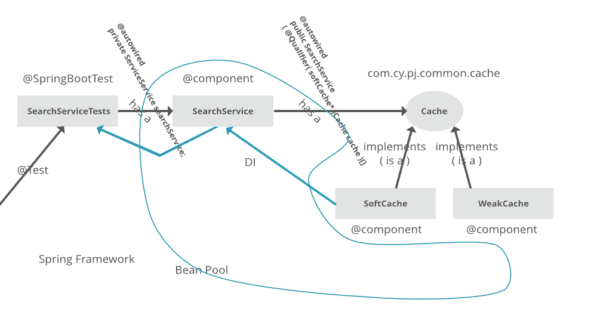

# 弹簧@自动连线标注

> 原文:[https://www.geeksforgeeks.org/spring-autowired-annotation/](https://www.geeksforgeeks.org/spring-autowired-annotation/)

@Autowired 注释将一个构造函数、Setter 方法、Properties 和 Config()方法标记为自动连接，即通过 Spring Dependency Injection 机制在运行时“注入 beans”(对象)，如下图所示:



**启用@自动连线标注**

Spring beans 可以通过 Java 配置或 XML 配置来声明。通过声明 beans，您可以向 Spring 容器提供元数据，以便在运行时返回所需的依赖对象。这叫做春豆自动布线。在基于 java 的配置中，所有的 bean 方法都是用 **@configuration** 注释在类中定义的。在运行时，Spring 将通过读取这些方法来提供 bean 定义。使用**@自动连线**，正确的依赖关系由弹簧容器分配。

```
@Configuration
public class AppConfig {

// bean methods
}
```

在基于 XML 的配置中，如果使用 **@Autowired 注释连接 beans，**则 **<上下文:注释-配置/ >** 必须添加到 XML 文件中。否则，您可以在 XML 配置文件中包含**autowiredannotationbeanstreactor**bean。

```
<bean class="org.springframework.beans.factory.annotation.AutowiredAnnotationBeanPostProcessor"/>
```

由@Configuration、@EnableAutoConfiguration 和@ ComponentScan 组合而成的 **@SpringBootAnnotation** 会扫描基础包和子包中包含的所有组件或服务以及其他配置文件。这将在 Spring Context 中注册它们，并在运行时使用@Autowired 注入 beans。

```
@SpringBootApplication
public class DemoApplication {

    public static void main(String[] args) {
        SpringApplication.run(DemoApplication.class, args);
    }
}
```

**使用@自动连线**

**XML 配置文件**

如果使用 XML 配置来连接 beans，那么配置文件如下所示:

```
<?xml version="1.0" encoding="UTF-8"?>
<beans xmlns="http://www.springframework.org/schema/beans"
        xmlns:xsi="http://www.w3.org/2001/XMLSchema-instance"
        xsi:schemaLocation="http://www.springframework.org/schema/beans
        https://www.springframework.org/schema/beans/spring-beans.xsd
        http://www.springframework.org/schema/context
        http://www.springframework.org/schema/context/spring-context.xsd"
        xmlns:context="http://www.springframework.org/schema/context"
        >

    <context:annotation-config/>
    <bean id="customer" class="com.gfg.demo.domain.Customer">
        <property name="type" value="1" />
    </bean>

    <bean id="person" class="com.gfg.demo.domain.Person">
        <property name="name" value="ganesh" />
        <property name="age" value="21" />
    </bean>
</beans>
```

**Java 配置类**

如果使用 Java 配置来连接 beans，那么配置类如下所示:

```
package com.gfg.demo.config;

import com.gfg.demo.domain.Customer;
import com.gfg.demo.domain.Person;
import org.springframework.context.annotation.Bean;
import org.springframework.context.annotation.Configuration;

@Configuration
public class AppConfig {
    @Bean
    public Person person(){
        Person person = new Person();
        person.setName("ganesh");
        person.setAge("21");
        return person;
    }
}
```

在启用@Autowired 注释并决定使用何种配置后。beans 可以通过构造函数、属性或 setter 方法进行连接。例如，有两个 POJO 类客户和个人。客户类依赖于人员。

**Customer.java**

```
@Component
public class Customer {

    private int type;
    private Person person;

    // Constructors
    // getters and setter
}
```

**Person.java**

```
public class Person {
    private String name;
    private String age;

    // Constructors
    // getters and setters
}
```

**基于构造器的自动布线**

**@Autowired** 注释对于基于构造函数的注入是可选的。这里，容器中的 person 对象在创建 Customer 对象时被传递给构造函数。

```
@Component
public class Customer {

    private int type;
    private Person person;

    public Customer() {
    }

    @Autowired
    public Customer(Person person) {
        this.person = person;
    }
}
```

**基于属性的自动布线**

人员对象将在运行时使用**@自动连线**注释注入到属性人员中

```
@Component
public class Customer {

    private int type;

    @Autowired
    private Person person;
}
```

**基于设置器的自动布线**

容器将在运行时使用 Person 对象调用 setter 方法。

```
@Autowired
public void setPerson(Person person) {
    this.person = person;
}
```

**可选依赖关系**

如果没有定义类型为**人**的 bean，那么 Spring 将抛出**no suchbeandinitionexception**。它通过抛出以下异常来阻止弹簧容器**成功启动**。

```
org.springframework.beans.factory.NoSuchBeanDefinitionException: No qualifying bean of type 
'com.gfg.demo.Person' available: expected at least 1 bean which qualifies as 
autowire candidate. Dependency annotations: {@org.springframework.beans.factory.annotation.Autowired(required=true)}
```

要解决这个问题，我们可以将@Autowired 的**必需的**属性设置为 **false** ，

```
@Autowired(required = false)
private Person person;
```