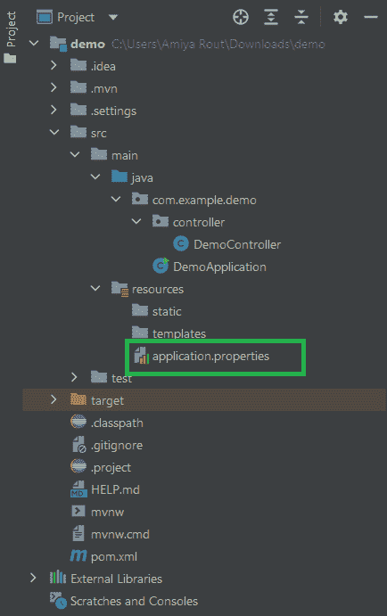

# Spring Boot–应用属性

> 原文:[https://www . geesforgeks . org/spring-boot-application-properties/](https://www.geeksforgeeks.org/spring-boot-application-properties/)

正如我们已经知道的，Spring Boot 建在春天的顶端，包含了春天的所有特征。现在正成为开发人员的最爱，因为这是一个快速生产就绪的环境，使开发人员能够直接专注于逻辑，而不是在配置和设置上挣扎。在 Spring Boot，每当您在 spring starter 中创建新的 Spring Boot 应用程序时，或者在 IDE (Eclipse 或 STS)中，都会有一个文件位于名为 **application.properties** 文件的***src/main/resources***文件夹中，如下图所示:



极客们，现在你们一定想知道这个文件是做什么的？该文件在开发过程中的主要作用是什么？因此，在 spring boot 应用程序中， **application.properties** 文件用于将应用程序相关的属性写入该文件。该文件包含在不同环境中运行应用程序所需的不同配置，每个环境都有一个由其定义的不同属性。在应用程序属性文件中，我们定义了每种类型的属性，如更改端口、数据库连接、与 eureka 服务器的连接等等。现在让我们看一些例子，以便更好地理解。

**示例 1:** 更改端口号

有时，当您运行 spring 应用程序时，您可能会遇到以下类型的错误


错误是端口 8989 已经被使用。因此，在这种情况下，您可能会终止在此端口号上运行的进程，或者您可能会更改端口号并重新运行应用程序。那么你需要在哪里更改你的端口号呢？例如在**应用程序属性文件**中。


因此，如上面的截图所示，您可以通过下面的行来更改端口号

```
server.port=8989
```

**示例 2:** 定义我们的应用程序的名称

要定义我们应用程序的名称，您可以这样编写属性

```
spring.application.name = userservice
```

因此，您可以看到这里将属性表示为键-值对，每个键也与一个值相关联。

**示例 3:** 连接 MySQL 数据库

要连接到 MySQL 数据库，你必须写一堆行。您可以这样编写属性

```
spring.jpa.hibernate.ddl-auto=update
spring.datasource.url=jdbc:mysql://${MYSQL_HOST:localhost}:3306/db_example
spring.datasource.username=springuser
spring.datasource.password=ThePassword
spring.datasource.driver-class-name =com.mysql.jdbc.Driver
```

**示例 4:** 连接 H2 数据库

H2 是一个嵌入式、开源和内存数据库。这是一个用 Java 编写的关系数据库管理系统。它是一个客户端/服务器应用程序。它通常用于单元测试。它将数据存储在内存中，而不是将数据保存在磁盘上。要连接到 H2 数据库，你必须写一堆行。您可以这样编写属性

```
spring.h2.console.enabled=true
spring.datasource.url=jdbc:h2:mem:dcbapp
spring.datasource.driverClassName=org.h2.Driver
spring.datasource.username=sa
spring.datasource.password=password
spring.jpa.database-platform=org.hibernate.dialect.H2Dialect
```

**示例 5:** 连接 MongoDB 数据库

要连接蒙古数据库，你必须写一堆行。您可以这样编写属性

```
spring.data.mongodb.host=localhost
spring.data.mongodb.port=27017
spring.data.mongodb.database=BookStore
```

**示例 6:** 连接尤里卡服务器

尤里卡服务器是一个保存所有客户服务应用程序信息的应用程序。每个微服务都将注册到尤里卡服务器，尤里卡服务器知道每个端口和 IP 地址上运行的所有客户端应用程序。尤里卡服务器也被称为发现服务器。您可以这样编写属性

```
eureka.client.register-with-eureka=true
eureka.client.fetch-registry=true
eureka.client.service-url.defaultZone=http://localhost:9096/eureka/
eureka.instance.hostname=localhost
```

> **注**:这里写的数值是样本数据。请根据您的要求填写数值。但是钥匙没变。

### application . yml/application . YAML 文件

application.properties 文件不是那么可读。所以大多数时候开发人员选择 application.yml 文件而不是 application.properties 文件。YAML 是 JSON 的超集，因此是指定分层配置数据的非常方便的格式。YAML 更易读，对开发者来说读/写配置文件是很好的。例如，让我们选择上面已经解释过的一些属性文件，并以 YAML 格式编写它们。

**案例 1:** 让我们选择上例 3 中我们连接到 MySQL 数据库的地方**，**对应的属性如下:

```
spring:
  datasource:
    url: jdbc:mysql://${MYSQL_HOST:localhost}:3306/db_example
    username: springuser
    password: ThePassword
    driver-class-name: com.mysql.jdbc.Driver
  jpa:
    hibernate:
      ddl-auto: update
```

**案例 2:** 让我们选择上面的例子 6，在那里我们连接到尤里卡服务器，相应的属性如下:

```
eureka:
  client:
    register-with-eureka: true
    fetch-registry: true
    service-url:
      defaultZone: http://localhost:9096/eureka/
  instance:
    hostname: localhost
```