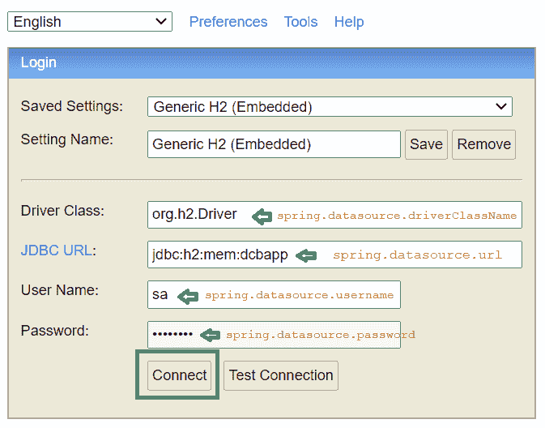
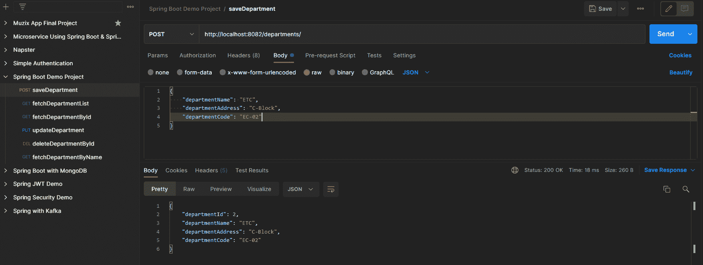
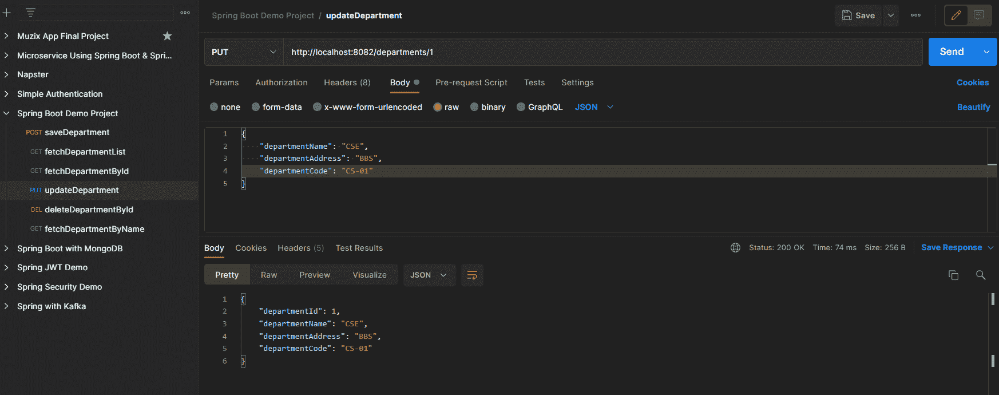

# Spring Boot-H2 数据库

> 原文:[https://www.geeksforgeeks.org/spring-boot-h2-database/](https://www.geeksforgeeks.org/spring-boot-h2-database/)

H2 是一个嵌入式、开源和内存数据库。这是一个用 Java 编写的关系数据库管理系统。它是一个客户端/服务器应用程序。它将数据存储在内存中，而不是将数据保存在磁盘上。在这里，我们将讨论如何使用 H2 数据库在 Spring Boot 配置和执行一些基本操作。

H2 数据库的一些主要特点是:

*   非常快，开源，JDBC 应用编程接口
*   嵌入式和服务器模式；基于磁盘或内存中的数据库
*   事务支持，多版本并发
*   基于浏览器的控制台应用程序
*   加密数据库
*   全文搜索
*   占用空间小的纯 Java:大约 2.5 MB 的 jar 文件大小
*   ODBC 驱动程序

**在 Spring Boot 应用中配置 H2 数据库**

**步骤 1:** 添加依赖项

为了在 spring boot 应用程序中使用 H2 数据库，我们必须在 **pom.xml** 文件中添加以下依赖项:

```
dependency>
      <groupId>com.h2database</groupId>
      <artifactId>h2</artifactId>
      <scope>runtime</scope>
 </dependency>
```

**步骤 2:** 在 application.properties 文件中写入一些属性

```
# H2 Database
spring.h2.console.enabled=true
spring.datasource.url=jdbc:h2:mem:dcbapp
spring.datasource.driverClassName=org.h2.Driver
spring.datasource.username=sa
spring.datasource.password=password
spring.jpa.database-platform=org.hibernate.dialect.H2Dialect
```

让我们通过打开 H2 数据库控制台来了解这些属性是什么。

**H2 控制台:**默认情况下，H2 数据库的控制台视图处于禁用状态。在访问 H2 数据库之前，我们必须使用以下属性启用它。

```
spring.h2.console.enabled=true
```

一旦我们启用了 H2 控制台，现在我们可以通过调用 URL***http://localhost:8082/H2-console***在浏览器中访问 H2 控制台。

> **注意**:提供运行 spring 应用程序的端口号

下图显示了 H2 数据库的控制台视图。



**示例:**

我们将通过创建一个 Spring Boot 应用程序和使用 H2 数据库来执行一些基本的 CRUD 操作。

**第一步:**参考本文[如何用 IntelliJ IDEA](https://www.geeksforgeeks.org/how-to-create-a-spring-boot-project-with-intellij-idea/) 创建 Spring Boot 项目，创建 Spring Boot 项目。

**步骤 2:** 添加以下依赖项

*   弹簧网
*   H2 数据库
*   龙目岛
*   春季数据

下面是 **pom.xml** 文件的完整代码。请检查你是否遗漏了什么。

## 可扩展标记语言

```
<?xml version="1.0" encoding="UTF-8"?>

<project xmlns="http://maven.apache.org/POM/4.0.0" xmlns:xsi="http://www.w3.org/2001/XMLSchema-instance"
    xsi:schemaLocation="http://maven.apache.org/POM/4.0.0 https://maven.apache.org/xsd/maven-4.0.0.xsd">
    <modelVersion>4.0.0</modelVersion>
    <parent>
        <groupId>org.springframework.boot</groupId>
        <artifactId>spring-boot-starter-parent</artifactId>
        <version>2.5.5</version>
        <relativePath/> <!-- lookup parent from repository -->
    </parent>
    <groupId>com.amiya</groupId>
    <artifactId>Spring-Boot-Demo-Project</artifactId>
    <version>1.0.0-SNAPSHOT</version>
    <name>Spring-Boot-Demo-Project</name>
    <description>Demo project for Spring Boot</description>
    <properties>
        <java.version>11</java.version>
    </properties>
    <dependencies>
        <dependency>
            <groupId>org.springframework.boot</groupId>
            <artifactId>spring-boot-starter-web</artifactId>
        </dependency>

        <dependency>
            <groupId>com.h2database</groupId>
            <artifactId>h2</artifactId>
            <scope>runtime</scope>
        </dependency>

        <dependency>
            <groupId>org.springframework.boot</groupId>
            <artifactId>spring-boot-devtools</artifactId>
            <scope>runtime</scope>
            <optional>true</optional>
        </dependency>

        <dependency>
            <groupId>org.springframework.boot</groupId>
            <artifactId>spring-boot-starter-data-jpa</artifactId>
        </dependency>

        <dependency>
            <groupId>org.springframework.boot</groupId>
            <artifactId>spring-boot-starter-test</artifactId>
            <scope>test</scope>
        </dependency>

        <dependency>
            <groupId>org.projectlombok</groupId>
            <artifactId>lombok</artifactId>
            <optional>true</optional>
        </dependency>

    </dependencies>

    <build>
        <plugins>
            <plugin>
                <groupId>org.springframework.boot</groupId>
                <artifactId>spring-boot-maven-plugin</artifactId>
                <configuration>
                    <excludes>
                        <exclude>
                            <groupId>org.projectlombok</groupId>
                            <artifactId>lombok</artifactId>
                        </exclude>
                    </excludes>
                </configuration>
            </plugin>
        </plugins>
    </build>

</project>
```

**第三步**:创建 4 个包，然后在这些包里面创建一些类和接口，如下图所示

*   实体
*   仓库
*   服务
*   控制器


> **注**:
> 
> *   绿色圆形图标“我”按钮是界面
> *   蓝色圆形图标“C”按钮是类

**步骤 4:** 在实体包内部

在 Department.java 文件中创建一个简单的 [POJO 类](https://www.geeksforgeeks.org/pojo-vs-java-beans/)。

**示例:**

## Java 语言(一种计算机语言，尤用于创建网站)

```
// Java Program to Demonstrate Department File

// Importing required package modules
package com.amiya.springbootdemoproject.entity;

// Importing required classes
import javax.persistence.Entity;
import javax.persistence.GeneratedValue;
import javax.persistence.GenerationType;
import javax.persistence.Id;
import lombok.AllArgsConstructor;
import lombok.Builder;
import lombok.Data;
import lombok.NoArgsConstructor;

@Entity
@Data
@NoArgsConstructor
@AllArgsConstructor
@Builder

// Class
public class Department {

    @Id
    @GeneratedValue(strategy = GenerationType.AUTO)
    private Long departmentId;
    private String departmentName;
    private String departmentAddress;
    private String departmentCode;
}
```

**第五步:**在仓库包内

创建一个简单的接口，并将该接口命名为 DepartmentRepository。这个接口将扩展我们在上面讨论过的 CrudRepository。

**示例**下面是**DepartmentRepository.java**文件的代码

## Java 语言(一种计算机语言，尤用于创建网站)

```
package com.amiya.springbootdemoproject.repository;

import com.amiya.springbootdemoproject.entity.Department;
import org.springframework.data.repository.CrudRepository;
import org.springframework.stereotype.Repository;

// Annotation
@Repository

// Interface extending CrudRepository
public interface DepartmentRepository
    extends CrudRepository<Department, Long> {
}
```

**第六步:**服务包内

在包内创建一个名为**部门服务**的接口和一个名为**部门服务 Impl** 的类。

**实施例 1-A**

## Java 语言(一种计算机语言，尤用于创建网站)

```
// Java Program to Demonstrate DepartmentService File

// Importing required package modules
package com.amiya.springbootdemoproject.service;
import com.amiya.springbootdemoproject.entity.Department;
// Importing required classes
import java.util.List;

// Interface
public interface DepartmentService {

    // Save operation
    Department saveDepartment(Department department);

    // Read operation
    List<Department> fetchDepartmentList();

    // Update operation
    Department updateDepartment(Department department,
                                Long departmentId);

    // Delete operation
    void deleteDepartmentById(Long departmentId);
}
```

**例 1-B**

## Java 语言(一种计算机语言，尤用于创建网站)

```
// Java Program to Demonstrate DepartmentServiceImpl.java
// File

// Importing required package modules
package com.amiya.springbootdemoproject.service;

import com.amiya.springbootdemoproject.entity.Department;
import com.amiya.springbootdemoproject.repository.DepartmentRepository;
import java.util.List;
import java.util.Objects;
import org.springframework.beans.factory.annotation.Autowired;
import org.springframework.stereotype.Service;

// Annotation
@Service

// Class
public class DepartmentServiceImpl
    implements DepartmentService {

    @Autowired
    private DepartmentRepository departmentRepository;

    // Save operation
    @Override
    public Department saveDepartment(Department department)
    {
        return departmentRepository.save(department);
    }

    // Read operation
    @Override public List<Department> fetchDepartmentList()
    {
        return (List<Department>)
            departmentRepository.findAll();
    }

    // Update operation
    @Override
    public Department
    updateDepartment(Department department,
                     Long departmentId)
    {
        Department depDB
            = departmentRepository.findById(departmentId)
                  .get();

        if (Objects.nonNull(department.getDepartmentName())
            && !"".equalsIgnoreCase(
                department.getDepartmentName())) {
            depDB.setDepartmentName(
                department.getDepartmentName());
        }

        if (Objects.nonNull(
                department.getDepartmentAddress())
            && !"".equalsIgnoreCase(
                department.getDepartmentAddress())) {
            depDB.setDepartmentAddress(
                department.getDepartmentAddress());
        }

        if (Objects.nonNull(department.getDepartmentCode())
            && !"".equalsIgnoreCase(
                department.getDepartmentCode())) {
            depDB.setDepartmentCode(
                department.getDepartmentCode());
        }

        return departmentRepository.save(depDB);
    }

    // Delete operation
    @Override
    public void deleteDepartmentById(Long departmentId)
    {
        departmentRepository.deleteById(departmentId);
    }
}
```

**第七步:**控制器包内

在包内创建一个名为**部门控制器**的类。

**例**

## Java 语言(一种计算机语言，尤用于创建网站)

```
// java Program to Illustrate DepartmentController File

// mporting required packages modules
package com.amiya.springbootdemoproject.controller;

import com.amiya.springbootdemoproject.entity.Department;
import com.amiya.springbootdemoproject.service.DepartmentService;
import java.util.List;
// Importing required classes
import javax.validation.Valid;
import org.springframework.beans.factory.annotation.Autowired;
import org.springframework.web.bind.annotation.*;

// Annotation
@RestController

// Class
public class DepartmentController {

    @Autowired private DepartmentService departmentService;

    // Save operation
    @PostMapping("/departments")
    public Department saveDepartment(
        @Valid @RequestBody Department department)
    {
        return departmentService.saveDepartment(department);
    }

    // Read operation
    @GetMapping("/departments")
    public List<Department> fetchDepartmentList()
    {
        return departmentService.fetchDepartmentList();
    }

    // Update operation
    @PutMapping("/departments/{id}")
    public Department
    updateDepartment(@RequestBody Department department,
                     @PathVariable("id") Long departmentId)
    {
        return departmentService.updateDepartment(
            department, departmentId);
    }

    // Delete operation
    @DeleteMapping("/departments/{id}")
    public String deleteDepartmentById(@PathVariable("id")
                                       Long departmentId)
    {
        departmentService.deleteDepartmentById(
            departmentId);
        return "Deleted Successfully";
    }
}
```

**第 8 步:**下面是应用程序属性文件的代码

```
server.port = 8082

# H2 Database
spring.h2.console.enabled=true
spring.datasource.url=jdbc:h2:mem:dcbapp
spring.datasource.driverClassName=org.h2.Driver
spring.datasource.username=sa
spring.datasource.password=password
spring.jpa.database-platform=org.hibernate.dialect.H2Dialect
```

现在运行您的应用程序，让我们在 Postman 中测试端点，并参考我们的 H2 数据库。

### 在邮递员中测试端点

**端点 1:**POST–http://localhost:8082/departments/



**端点 2:**GET–http://localhost:8082/departments/


**端点 3:**PUT–http://localhost:8082/departments/1



**端点 4:**DELETE–http://localhost:8082/departments/1


最后，H2 数据库如下图所示:

