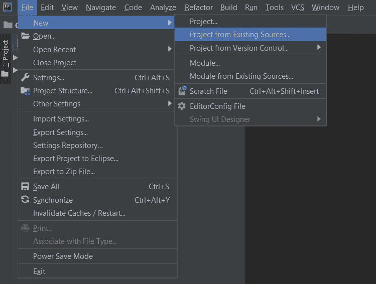

# 弹簧-静止控制器

> 原文:[https://www.geeksforgeeks.org/spring-rest-controller/](https://www.geeksforgeeks.org/spring-rest-controller/)

Spring Boot 建在春天的顶端，包含了春天的所有特征。由于其快速的生产就绪环境，开发人员能够直接专注于逻辑，而不是纠结于配置和设置，因此正成为开发人员的最爱。Spring Boot 是一个基于微服务的框架，在其中制作一个生产就绪的应用程序只需要很少的时间。在本文中，我们将讨论什么是 REST 控制器是在春季开机。弹簧主要用两个控制器，控制器第二个是 RestController 借助 **@controller** 和 **@restcontroller** 标注。@restcontroller 和@controller 之间的主要区别在于@controller 和@ResponseBody 注释的@restcontroller 组合。

> **rest controller:**rest controller 用于借助@RestController 注释制作 restful web 服务。此注释在类级别使用，允许类处理客户端发出的请求。让我们用一个例子来理解@RestController 注释。RestController 允许处理所有 REST APIs，如 [GET](https://www.geeksforgeeks.org/how-to-make-get-method-request-in-java-spring/) 、 [POST](https://www.geeksforgeeks.org/how-to-make-post-request-in-java-spring/) 、 [Delete、](https://www.geeksforgeeks.org/how-to-make-delete-request-in-spring/)T8】PUT 请求。

[Spring Initializr](https://www.geeksforgeeks.org/spring-initializr/) 是一个基于 web 的工具，使用它我们可以很容易地生成 Spring Boot 项目的结构。它还为元数据模型中表达的项目提供了各种不同的特性。这个模型允许我们配置 JVM 支持的依赖列表。在这里，我们将使用 spring 初始化器创建应用程序的结构，然后使用 IDE 创建一个示例 GET 路由。因此，要做到这一点，按顺序遵循以下步骤。

### 逐步实施

**第一步:转到弹簧初始化器**

按照要求填写细节。对于此应用:

```java
Project: Maven
Language: Java
Spring Boot: 2.2.8
Packaging: JAR
Java: 8
Dependencies: Spring Web
```

**第 2 步:**点击生成，将下载启动项目

**第三步:**提取 zip 文件。现在打开一个合适的 IDE，然后转到文件>从现有资源>新建>项目【Spring-boot-app】并选择 pom.xml。在提示符下单击导入更改并等待项目同步，如下图所示:



> **注意:**在 Maven 的导入项目窗口中，确保选择了与创建项目时选择的 JDK 相同的版本。

**第四步:** 转到 src >主>java>com . gfg . spring . boot . app，创建一个名为 Controller 的 Java 类，并添加注释@RestController 和其他名为 Details 的类。

**详情:**

## Java 语言(一种计算机语言，尤用于创建网站)

```java
public class Details {

    // Creating an object of ArrayList
    static ArrayList<Details> Data = new ArrayList<Details>();
    int number;
    String name;
    Details(int number, String name)
    {
        // This keyword refers 
          // to parent instance itself
        this.number = number;
        this.name = name;
    }
}
```