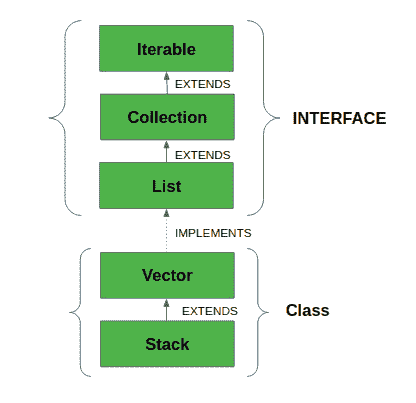

# Java 中的栈类

> 原文:[https://www.geeksforgeeks.org/stack-class-in-java/](https://www.geeksforgeeks.org/stack-class-in-java/)

Java [收集框架](https://www.geeksforgeeks.org/collections-in-java-2/)提供了一个 Stack 类，该类建模并实现了一个 [**堆栈数据结构**](https://www.geeksforgeeks.org/stack-data-structure/) 。该课程基于后进先出的基本原则。除了基本的推送和弹出操作之外，该类还提供了三个功能:清空、搜索和查看。该类也可以说是对 Vector 的扩展，并将该类视为具有上述五个函数的堆栈。这个类也可以称为 Vector 的子类。下图显示了堆栈类的**层次结构:**



该类支持一个*默认构造函数* **栈()**，用于*创建一个空栈*。

**申报:**

```
public class Stack<E> extends Vector<E>
```

**所有实现的接口:**

*   **Serializable:** 如果类要被序列化和反序列化，它是类必须实现的标记接口。
*   **可克隆:**这是 Java 中的一个接口，需要由一个类来实现，以允许其对象被克隆。
*   **可迭代的< E > :** 这个接口代表了一个可迭代的对象集合——意思是可以迭代的。
*   **集合< E > :** 集合代表一组被称为其元素的对象。集合接口用于在需要最大通用性的地方传递对象集合。
*   [**列表<E>:**T3【列表】界面提供了一种存储已订购收藏的方式。它是集合的子接口。](https://www.geeksforgeeks.org/list-interface-java-examples/)
*   **随机访问:**这是 List 实现使用的标记接口，表示它们支持快速(通常是恒定时间)随机访问。

### 如何创建堆栈？

为了创建堆栈，我们必须导入 **java.util.stack** 包，并使用这个类的 stack()构造函数。下面的示例创建了一个空堆栈。

> 栈<e>栈=新栈<e>()；</e></e>

这里 E 是对象的类型。

**示例:**

## Java 语言(一种计算机语言，尤用于创建网站)

```
// Java code for stack implementation

import java.io.*;
import java.util.*;

class Test
{  
    // Pushing element on the top of the stack
    static void stack_push(Stack<Integer> stack)
    {
        for(int i = 0; i < 5; i++)
        {
            stack.push(i);
        }
    }

    // Popping element from the top of the stack
    static void stack_pop(Stack<Integer> stack)
    {
        System.out.println("Pop Operation:");

        for(int i = 0; i < 5; i++)
        {
            Integer y = (Integer) stack.pop();
            System.out.println(y);
        }
    }

    // Displaying element on the top of the stack
    static void stack_peek(Stack<Integer> stack)
    {
        Integer element = (Integer) stack.peek();
        System.out.println("Element on stack top: " + element);
    }

    // Searching element in the stack
    static void stack_search(Stack<Integer> stack, int element)
    {
        Integer pos = (Integer) stack.search(element);

        if(pos == -1)
            System.out.println("Element not found");
        else
            System.out.println("Element is found at position: " + pos);
    }

    public static void main (String[] args)
    {
        Stack<Integer> stack = new Stack<Integer>();

        stack_push(stack);
        stack_pop(stack);
        stack_push(stack);
        stack_peek(stack);
        stack_search(stack, 2);
        stack_search(stack, 6);
    }
}
```

**输出:**

```
Pop Operation:
4
3
2
1
0
Element on stack top: 4
Element is found at position: 3
Element not found
```

### 对堆栈类执行各种操作

**1。添加元素:**为了给堆栈添加一个元素，我们可以使用 *push()方法*。此 [**推()**](https://www.geeksforgeeks.org/stack-push-method-in-java/) 操作将元素放置在堆栈顶部。

## Java 语言(一种计算机语言，尤用于创建网站)

```
// Java program to add the
// elements in the stack
import java.io.*;
import java.util.*;

class StackDemo {

      // Main Method
    public static void main(String[] args)
    {

        // Default initialization of Stack
        Stack stack1 = new Stack();

        // Initialization of Stack
        // using Generics
        Stack<String> stack2 = new Stack<String>();

        // pushing the elements
        stack1.push(4);
        stack1.push("All");
        stack1.push("Geeks");

        stack2.push("Geeks");
        stack2.push("For");
        stack2.push("Geeks");

          // Printing the Stack Elements
        System.out.println(stack1);
        System.out.println(stack2);
    }
}
```

**输出:**

```
[4, All, Geeks]
[Geeks, For, Geeks]
```

**2。访问元素:**要检索或获取堆栈的第一个元素或堆栈顶部的元素，我们可以使用 [**peek()**](https://www.geeksforgeeks.org/stack-peek-method-in-java/) 方法。检索到的元素不会被删除或从堆栈中移除。

## Java 语言(一种计算机语言，尤用于创建网站)

```
// Java program to demonstrate the accessing
// of the elements from the stack
import java.util.*;
import java.io.*;

public class StackDemo {

      // Main Method
    public static void main(String args[])
    {
        // Creating an empty Stack
        Stack<String> stack = new Stack<String>();

        // Use push() to add elements into the Stack
        stack.push("Welcome");
        stack.push("To");
        stack.push("Geeks");
        stack.push("For");
        stack.push("Geeks");

        // Displaying the Stack
        System.out.println("Initial Stack: " + stack);

        // Fetching the element at the head of the Stack
        System.out.println("The element at the top of the"
                           + " stack is: " + stack.peek());

        // Displaying the Stack after the Operation
        System.out.println("Final Stack: " + stack);
    }
}
```

**输出:**

```
Initial Stack: [Welcome, To, Geeks, For, Geeks]
The element at the top of the stack is: Geeks
Final Stack: [Welcome, To, Geeks, For, Geeks]
```

**3。移除元素:**要从堆栈中弹出元素，我们可以使用 [**弹出()**](https://www.geeksforgeeks.org/stack-pop-method-in-java/) 方法。元素从堆栈顶部弹出，并从堆栈中移除。

## Java 语言(一种计算机语言，尤用于创建网站)

```
// Java program to demonstrate the removing
// of the elements from the stack
import java.util.*;
import java.io.*;

public class StackDemo {
    public static void main(String args[])
    {
        // Creating an empty Stack
        Stack<Integer> stack = new Stack<Integer>();

        // Use add() method to add elements
        stack.push(10);
        stack.push(15);
        stack.push(30);
        stack.push(20);
        stack.push(5);

        // Displaying the Stack
        System.out.println("Initial Stack: " + stack);

        // Removing elements using pop() method
        System.out.println("Popped element: "
                           + stack.pop());
        System.out.println("Popped element: "
                           + stack.pop());

        // Displaying the Stack after pop operation
        System.out.println("Stack after pop operation "
                           + stack);
    }
}
```

**输出:**

```
Initial Stack: [10, 15, 30, 20, 5]
Popped element: 5
Popped element: 20
Stack after pop operation [10, 15, 30]
```

### **堆栈类中的方法**

<figure class="table">

| 

方法

 | 

描述

 |
| --- | --- |
| [空()](https://www.geeksforgeeks.org/stack-empty-method-in-java/) | 如果堆栈顶部没有任何内容，则返回 true。否则，返回 false。

 |
| [peek()](https://www.geeksforgeeks.org/stack-peek-method-in-java/) | 返回堆栈顶部的元素，但不移除它。 |
| [pop()](https://www.geeksforgeeks.org/stack-pop-method-in-java/) | 移除并返回堆栈的顶部元素。“EmptyStackException”当调用堆栈为空时，如果我们调用 pop()，则会引发异常。 |
| [推动(对象元素)](https://www.geeksforgeeks.org/stack-push-method-in-java/) | 将元素推到堆栈顶部。 |
| [搜索(对象元素)](https://www.geeksforgeeks.org/stack-search-method-in-java/) | 它确定堆栈中是否存在对象。如果找到了元素，它从堆栈顶部返回元素的位置。否则，它返回-1。 |

</figure>

### 从 java.util.Vector 类继承的方法

<figure class="table">

| 

方法

 | 

描述

 |
| --- | --- |
| [添加(对象对象)](https://www.geeksforgeeks.org/vector-add-method-in-java/) | 将指定的元素追加到该向量的末尾。 |
| [添加(int 索引，Object obj)](https://www.geeksforgeeks.org/vector-add-method-in-java/) | 在该向量的指定位置插入指定元素。 |
| [addAll(集合 c)](https://www.geeksforgeeks.org/vector-addall-method-in-java/) | 将指定集合中的所有元素追加到该向量的末尾，按照指定集合的迭代器返回它们的顺序。 |
| [addAll(int index，Collection c)](https://www.geeksforgeeks.org/vector-addall-method-in-java/) | 将指定集合中的所有元素插入到该向量的指定位置。 |
| [添加元素(对象 o)](https://www.geeksforgeeks.org/vector-addelement-method-in-java/#:~:text=addElement()%20method%20is%20used,()%20method%20of%20Vector%20class.) | 将指定的分量添加到该向量的末尾，将其大小增加一。 |
| [容量()](https://www.geeksforgeeks.org/vector-capacity-method-in-java/) | 返回该向量的当前容量。 |
| [晴()](https://www.geeksforgeeks.org/vector-clear-method-in-java/) | 从该向量中移除所有元素。 |
| [克隆()](https://www.geeksforgeeks.org/vector-clone-method-in-java-with-examples/) | 返回该向量的克隆。 |
| [包含(对象 o)](https://www.geeksforgeeks.org/vector-contains-method-in-java/) | 如果该向量包含指定的元素，则返回 true。 |
| [包含所有(集合 c)](https://www.geeksforgeeks.org/vector-containsall-method-in-java/?ref=rp) | 如果此向量包含指定集合中的所有元素，则返回 true。 |
| [复制到(对象[]数组)](https://www.geeksforgeeks.org/vector-copyinto-method-in-java/#:~:text=copyInto()%20method%20is%20used,the%20elements%20of%20the%20vector.) | 将该向量的分量复制到指定的数组中。 |
| 元素(int 指数) | 返回指定索引处的组件。 |
| [元素()](https://www.geeksforgeeks.org/vector-elements-method-in-java/#:~:text=elements()%20method%20of%20Vector,values%20present%20in%20the%20Vector.&text=Parameters%3A%20The%20method%20does%20not,the%20values%20of%20the%20Vector.) | 返回此向量的分量的枚举。 |
| [保证容量(int minCapacity)](https://www.geeksforgeeks.org/vector-ensurecapacity-method-in-java-with-example/) | 如有必要，增加该向量的容量，以确保其能够容纳至少是最小容量参数指定的组件数量。 |
| [等于()](https://www.geeksforgeeks.org/vector-equals-method-in-java/) | 将指定的对象与该向量进行比较，看是否相等。 |
| [第一元素()](https://www.geeksforgeeks.org/vector-firstelement-method-in-java/) | 返回该向量的第一个分量(索引 0 处的项)。 |
| [get(int index)](https://www.geeksforgeeks.org/vector-get-method-in-java/) | 返回该向量中指定位置的元素。 |
| [hashCode()](https://www.geeksforgeeks.org/vector-hashcode-method-in-java/#:~:text=hashCode()%20method%20in%20Java%20is%20used%20to,hashcode%20value%20of%20this%20vector.&text=Parameters%3A%20The%20method%20does%20not,which%20is%20of%20Integer%20type.) | 返回此向量的哈希代码值。 |
| [索引（对象 o）](https://www.geeksforgeeks.org/vector-indexof-method-in-java/#:~:text=util.,does%20not%20contain%20the%20element.) | 返回此向量中指定元素的第一个匹配项的索引，或-1如果这个向量不包含元素。 |
| [索引 Of(对象 o，int 索引)](https://www.geeksforgeeks.org/vector-indexof-method-in-java/#:~:text=util.,does%20not%20contain%20the%20element.) | 返回该向量中指定元素第一次出现的索引，从索引向前搜索，如果找不到该元素，则返回-1。 |
| [插入元素(对象 o，int 索引)](https://www.geeksforgeeks.org/vector-insertelementat-method-in-java/#:~:text=insertElementAt(element%2C%20index)%20method,is%20passed%20as%20the%20parameters.) | 将指定的对象作为组件插入到指定索引处的向量中。 |
| [【isempty()](https://www.geeksforgeeks.org/vector-isempty-method-in-java/) | 测试这个向量是否没有分量。 |
| [迭代器()](https://www.geeksforgeeks.org/vector-iterator-method-in-java-with-examples/) | 以适当的顺序返回列表中元素的迭代器。 |
| 负荷() | 返回向量的最后一个分量。 |
| [最后索引（对象 o）](https://www.geeksforgeeks.org/vector-lastindexof-method-in-java/) | 返回此向量中指定元素最后一次出现的索引，或-1如果这个向量不包含元素。

 |
| [最后索引(对象 o，int 索引)](https://www.geeksforgeeks.org/vector-lastindexof-method-in-java/) | 返回该向量中指定元素最后一次出现的索引，从索引向后搜索，如果找不到元素，则返回-1。 |
| [列表迭代器()](https://www.geeksforgeeks.org/vector-listiterator-method-in-java-with-examples/#:~:text=java.util.Vector.listIterator,()%20and%20previous()%20respectively.) | 返回列表中元素的列表迭代器(按正确的顺序)。 |
| [列表迭代器(int index)](https://www.geeksforgeeks.org/vector-listiterator-method-in-java-with-examples/#:~:text=java.util.Vector.listIterator,()%20and%20previous()%20respectively.) | 返回列表中元素的列表迭代器(按正确的顺序)，从列表中的指定位置开始。 |
| [移除(int index)](https://www.geeksforgeeks.org/vector-remove-method-in-java/) | 移除此向量中指定位置的元素。 |
| [移除(物体 o)](https://www.geeksforgeeks.org/vector-remove-method-in-java/) | 删除该向量中指定元素的第一个匹配项。如果向量不包含该元素，则该元素保持不变。 |
| [移除所有(集合 c)](https://www.geeksforgeeks.org/vector-removeall-method-in-java/) | 从此向量中移除指定集合中包含的所有元素。 |
| [移除元件()](https://www.geeksforgeeks.org/vector-removeallelements-method-in-java-with-example/) | 从该向量中移除所有分量，并将其大小设置为零。 |
| [移除元素(对象 o)](https://www.geeksforgeeks.org/vector-removeelement-method-in-java-with-example/) | 从此向量中移除参数的第一个(索引最低的)匹配项。 |
| [删除元素(int index)](https://www.geeksforgeeks.org/vector-removeelementat-method-in-java/) | 删除指定索引处的组件。 |
| [移除范围(int fromIndex，int toIndex)](https://www.geeksforgeeks.org/vector-removerange-method-in-java-with-example/) | 从该列表中删除其索引介于 fromIndex(包含)和 toIndex(不包含)之间的所有元素。 |
| [零售商品(集合 c)](https://www.geeksforgeeks.org/vector-retainall-method-in-java-with-examples/) | 仅保留该矢量中包含在指定集合中的元素。 |
| [设置(整数索引，对象 o)](https://www.geeksforgeeks.org/vector-set-method-in-java/) | 用指定的元素替换该向量中指定位置的元素。 |
| [集合元素(对象 o，int 索引)](https://www.geeksforgeeks.org/vector-setelementat-method-in-java-with-example/) | 将该向量指定索引处的组件设置为指定对象。 |
| [setSize(int newSize)](https://www.geeksforgeeks.org/vector-setsize-method-in-java-with-example/) | 设置该向量的大小。 |
| [尺寸()](https://www.geeksforgeeks.org/vector-size-method-in-java/#:~:text=size()%20method%20in%20Java%20is%20used%20to%20get%20the,elements%20present%20in%20the%20Vector.&text=Parameters%3A%20The%20method%20does%20not,elements%20present%20in%20the%20Vector.) | 返回该向量中的分量数。 |
| [子列表（int fromIndex， int toIndex）](https://www.geeksforgeeks.org/vector-sublist-method-in-java/) | 返回此列表中从索引(包括)到索引(不包括)之间的部分的视图。 |
| [toaarray()](https://www.geeksforgeeks.org/vector-toarray-method-in-java-with-examples/) | 以正确的顺序返回包含该向量中所有元素的数组。 |
| [到数组(对象[]数组)](https://www.geeksforgeeks.org/vector-toarray-method-in-java-with-examples/) | 以正确的顺序返回包含该向量中所有元素的数组；运行时返回数组的类型是指定数组的类型。 |
| [toString()](https://www.geeksforgeeks.org/vector-tostring-method-in-java-with-example/#:~:text=The%20java.-,util.,elements%20of%20Vector%20into%20String.) | 返回此向量的字符串表示形式，包含每个元素的字符串表示形式。 |
| [trimToSize()](https://www.geeksforgeeks.org/vector-trimtosize-method-in-java-with-example/) | 将该向量的容量修剪为向量的当前大小。 |

</figure>

**注意:**请注意，Java 中的 Stack 类是遗留类，继承了 Java 中[**Vector**](https://www.geeksforgeeks.org/java-util-vector-class-java/)。它是一个线程安全的类，因此当我们不需要线程安全时会产生开销。建议使用[**ArrayDeque**](https://www.geeksforgeeks.org/arraydeque-in-java/)**进行栈实现，因为在单线程环境下效率更高。**

## **Java 语言(一种计算机语言，尤用于创建网站)**

```
// A Java Program to show implementation
// of Stack using ArrayDeque

import java.util.*;

class GFG {
    public static void main (String[] args) {
        Deque<Character> stack = new ArrayDeque<Character>();
        stack.push('A');
        stack.push('B');
        System.out.println(stack.peek());
        System.out.println(stack.pop());
    }
}
```

****输出:****

```
B
B
```