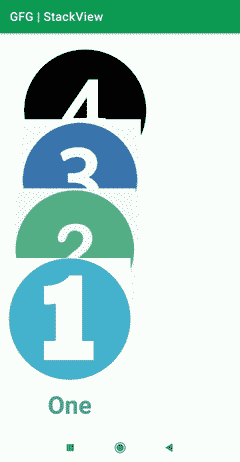

# Android 中的 stack view

> 原文:[https://www.geeksforgeeks.org/stackview-in-android/](https://www.geeksforgeeks.org/stackview-in-android/)

在本文中，我们将在**安卓工作室**中实现 **StackView** 。 **StackView** 是一个帮助以堆叠卡片的形式排列物品的小部件。每当我们翻转前面的项目时，后面的下一个项目就会出现在前面。下面给出了一个 GIF 示例，来了解一下 我们在本文中要做什么 。注意，我们将使用 **Java** 语言来实现这个项目。



### 逐步实施

**第一步:创建新项目**

在安卓工作室创建新项目请参考[如何在安卓工作室](https://www.geeksforgeeks.org/android-how-to-create-start-a-new-project-in-android-studio/)创建/启动新项目。请注意，您必须选择 **Java** 作为编程语言。

**步骤 2:使用 activity_main.xml 文件**

导航到**应用程序> res >布局> activity_main.xml** ，并将下面的代码添加到该文件中。下面是 **activity_main.xml** 文件的代码。该文件中增加了 **StackView** 。

## 可扩展标记语言

```java
<?xml version="1.0" encoding="utf-8"?>
<!--We have used RelativeLayout for layout-->
<RelativeLayout 
    xmlns:android="http://schemas.android.com/apk/res/android"
    xmlns:tools="http://schemas.android.com/tools"
    android:layout_width="match_parent"
    android:layout_height="match_parent"
    tools:context=".MainActivity">

    <!--Add StackView-->
    <StackView
        android:id="@+id/stack_view"
        android:layout_width="match_parent"
        android:layout_height="wrap_content" />

</RelativeLayout>
```

**第三步:添加图像**

将您想要添加到堆栈中的图像添加到 **res >可绘制**文件夹中。复制图像并将其粘贴到可绘制的文件夹中。

**步骤 4:创建堆栈视图项目的布局**

转到 **res >布局**并创建一个名为**项的新的 XML 文件。布局文件夹中的 XML** 。

**使用 item.xml 文件:**

导航至 **res >布局> item.xml** 和将下面给出的代码添加到该文件**中。**首先，我添加了 [ImageView](https://www.geeksforgeeks.org/imageview-in-android-with-example/) 在这里拍摄必须保留在前面的图像。此外，添加了[文本视图](https://www.geeksforgeeks.org/working-with-the-textview-in-android/)，我们将使用它在添加到堆栈的每个图像下方添加名称。为了更好地理解，我在下面的代码中添加了必要的注释。

## 可扩展标记语言

```java
<?xml version="1.0" encoding="utf-8"?>
<!--Linearlayout is used for layout-->
<LinearLayout 
    xmlns:android="http://schemas.android.com/apk/res/android"
    android:layout_width="match_parent"
    android:layout_height="match_parent"
    android:gravity="center"
    android:orientation="vertical"
    android:padding="10dp">

    <!--ImageView is added where I have used the image 
        that we are going to keep in front-->
    <ImageView
        android:id="@+id/image_view"
        android:layout_width="wrap_content"
        android:layout_height="wrap_content"
        android:src="@drawable/one" />

    <!--Add TextView to add the text below every image 
        added to the stack.-->
    <TextView
        android:id="@+id/text_view"
        android:layout_width="wrap_content"
        android:layout_height="wrap_content"
        android:textSize="40sp"
        android:textStyle="bold" />

</LinearLayout>
```

**步骤 5:使用 MainActivity.java 文件**

转到 MainActivity.java 文件，并将下面给出的代码添加到该文件中。两种方法 **numberWord()** 和 **numberImage()** 已经在这里实现**。**为了清晰理解概念，代码中增加了注释。

## Java 语言(一种计算机语言，尤用于创建网站)

```java
import androidx.appcompat.app.AppCompatActivity;

import android.os.Bundle;
import android.widget.StackView;

import java.util.ArrayList;
import java.util.List;

public class MainActivity extends AppCompatActivity {

    StackView stackView;

    @Override
    protected void onCreate(Bundle savedInstanceState) {
        super.onCreate(savedInstanceState);
        setContentView(R.layout.activity_main);
        stackView=(StackView)findViewById(R.id.stack_view);
    }

    // the method numberWord() is used 
    // to add the text below corresponding images.
    private List<String> numberWord()
    {
        List<String> word=new ArrayList<>();
        word.add("One");
        word.add("Two");
        word.add("Three");
        word.add("Four");
        word.add("Five");
         return word;
    }

    // the method numberWord() is used to call 
    // the images that are added to the stack.
    private List<Integer> numberImage()
    {
        List<Integer> image=new ArrayList<>();
        image.add(R.drawable.one);
        image.add(R.drawable.two);
        image.add(R.drawable.three);
        image.add(R.drawable.four);
        image.add(R.drawable.five);
        return image;
    }
}
```

**第 6 步:为 StackView 创建适配器**

转到我们的**MainActivity.java**文件所在的**文件夹。在**文件夹中创建一个名为**MainAdapter.java**的新 Java 类。****

**使用 MainAdapter.java 文件**

转到**MainAdapter.java**文件，并将下面给出的代码添加到该文件中。这里我们将实现 **getCount()** 和 **getView()** 方法。还会调用构造函数来初始化对象。为了更好地理解，代码中添加了注释。

## Java 语言(一种计算机语言，尤用于创建网站)

```java
import android.content.Context;
import android.view.LayoutInflater;
import android.view.View;
import android.view.ViewGroup;
import android.widget.ArrayAdapter;
import android.widget.ImageView;
import android.widget.TextView;

import androidx.annotation.NonNull;

import java.util.List;

public class MainAdapter extends ArrayAdapter {
    List<String> numberWord;
    List<Integer> numberImage;
    int itemLayout;
    Context c;

    // constructor is called to initialize the objects
    public MainAdapter(List<String> word, List<Integer> image, int resource, Context context) {
        super(context, resource, word);
        numberWord = word;
        numberImage = image;
        itemLayout = resource;
        c = context;
    }

    // getCount() is called to return
    // the total number of words to be used
    @Override
    public int getCount() {
        return numberWord.size();
    }

    // getView() is called to get position, 
    // parent and view of the images.
    @NonNull
    @Override
    public View getView(int position, View convertView, ViewGroup parent) {
        if (convertView == null) {
            convertView = LayoutInflater.from(parent.getContext()).inflate(itemLayout, parent, false);
        }

        String word = numberWord.get(position);
        Integer image = numberImage.get(position);

        TextView textView = convertView.findViewById(R.id.text_view);
        ImageView imageView = convertView.findViewById(R.id.image_view);
        textView.setText(word);
        imageView.setImageResource(image);
        return convertView;
    }
}
```