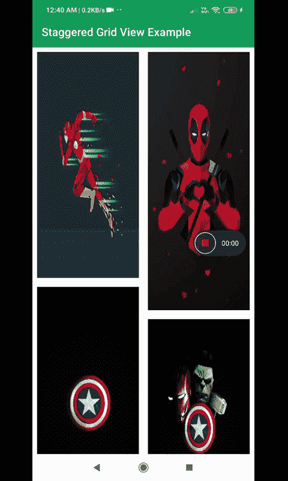

# 安卓交错网格视图，示例

> 原文:[https://www . geeksforgeeks . org/staggered-GridView-in-Android-with-example/](https://www.geeksforgeeks.org/staggered-gridview-in-android-with-example/)

**StaggeredGridLayout** 是安卓工作室中的一个 **LayoutManager** 类似于[**GridView**](https://www.geeksforgeeks.org/gridview-using-baseadapter-in-android-with-example/)**但是在 **StaggeredGridLayout** 中每个网格都有自己的高度和宽度。**

### **网格视图和交错网格视图的区别**

****StaggeredGridlayout****

1.  **孩子们的是交错网格格式。**
2.  **它支持水平和垂直布局**
3.  **例子:Pinterest，一个壁纸应用，状态应用等**

****

****GridView****

1.  **孩子们的是矩形网格格式**
2.  **它还支持水平和垂直布局**
3.  **例子:Flipkart、亚马逊、壁纸应用等**

****

### **例子**

**下面给出了一个 GIF 示例，来了解一下在本文中要做什么。请注意，我们将使用 **Java** 语言来实现这个项目。**

****

### **逐步实施**

****步骤 1:创建新项目****

**要在安卓工作室创建新项目，请参考[如何在安卓工作室创建/启动新项目](https://www.geeksforgeeks.org/android-how-to-create-start-a-new-project-in-android-studio/)。请注意，选择 Java 作为语言，尽管我们将使用 Java 语言实现这个项目。**

****第二步:去编码区之前先做一些前置任务****

**转到**渐变脚本>build . grade le(模块:app)** 部分，导入以下依赖项，点击上方弹出的**同步** **现在**。**

> **依赖关系** 
> 
>  **//添加回收器视图
> 
> 实现“androidx . recycle view:recycle view:1 . 1 . 0”
> 
> }**

****第三步:设计 UI****

**在 **activity_main.xml** 文件中添加一个[**recycle view**](https://www.geeksforgeeks.org/android-recyclerview/)如下图所示。**

## **可扩展标记语言**

```
<?xml version="1.0" encoding="utf-8"?>
<RelativeLayout 
    xmlns:android="http://schemas.android.com/apk/res/android"
    xmlns:tools="http://schemas.android.com/tools"
    android:layout_width="match_parent"
    android:layout_height="match_parent"
    tools:context=".MainActivity">

    <!-- Recycler view -->
    <androidx.recyclerview.widget.RecyclerView
        android:id="@+id/recycleViewStagged"
        android:layout_width="match_parent"
        android:layout_height="match_parent" />
</RelativeLayout>
```

**现在我们在其中创建一个新的布局资源文件(**recycle view _ row . XML**)我们在其中添加一个简单的 **ImageView** 并将其设置为**Android:scaleType = " fitXY "**完整的**recycle view _ row . XML**代码如下所示**

## **可扩展标记语言**

```
<?xml version="1.0" encoding="utf-8"?>
<RelativeLayout 
    xmlns:android="http://schemas.android.com/apk/res/android"
    android:layout_width="wrap_content"
    android:layout_height="wrap_content"
    android:layout_margin="8dp">

    <!-- simple image view -->
    <ImageView
        android:id="@+id/imgView"
        android:layout_width="wrap_content"
        android:layout_height="wrap_content"
        android:scaleType="fitXY"
        android:src="@drawable/k1" />
</RelativeLayout>
```

****第四步:编码部分****

**首先，我们创建一个**RecyclerViewAdapter.java**类，并将其扩展到**recycle view。适配器<再循环适配器。视图持有者>** 并实现其方法如下所示。以下是**RecyclerViewAdapter.java**文件的代码。代码中添加了注释，以更详细地理解代码。**

## **Java 语言(一种计算机语言，尤用于创建网站)**

```
import android.content.Context;
import android.view.LayoutInflater;
import android.view.View;
import android.view.ViewGroup;
import android.widget.ImageView;
import androidx.recyclerview.widget.RecyclerView;
import java.util.ArrayList;

public class RecyclerViewAdapter extends RecyclerView.Adapter<RecyclerViewAdapter.ViewHolder> {

    // ArrayList
    ArrayList<Integer> Image;
    Context context;

    // constructor
    public RecyclerViewAdapter(Context context, ArrayList<Integer> Image) {
        super();
        this.context = context;
        this.Image = Image;
    }

    @Override
    public ViewHolder onCreateViewHolder(ViewGroup viewGroup, int i) {
        View v = LayoutInflater.from(viewGroup.getContext()).inflate(R.layout.recyclerview_row, viewGroup, false);
        ViewHolder viewHolder = new ViewHolder(v);
        return viewHolder;
    }

    @Override
    public void onBindViewHolder(ViewHolder viewHolder, int i) {
        // setting image resource
        viewHolder.imgview.setImageResource(Image.get(i));
    }

    @Override
    public int getItemCount() {
        return Image.size();
    }

    public static class ViewHolder extends RecyclerView.ViewHolder {

        public ImageView imgview;
        public ViewHolder(View itemView) {
            super(itemView);

            // getting ImageView reference
            imgview = (ImageView) itemView.findViewById(R.id.imgView);
        }
    }
}
```

**现在打开类内的**MainActivity.java**文件，首先创建**recyclerviewater、RecyclerView** 类的对象，以及一个**数组列表**来存储图像的 id**

> **//正在创建 recyclerviewadapter 对象**
> 
> **recycle service 适配器 recycle service 适配器；**
> 
> **//创建数组列表**
> 
> **数组列表<integer>ImageList；</integer>**
> 
> **//创建回收视图对象**
> 
> **回收商查看回收商视图;**

**现在在 **onCreate()** 方法中，将这些对象与在 **activity_main.xml** 文件中给出的它们各自的标识链接起来。**

> **//向数组列表添加值**
> 
>  **ImageList =新数组列表<> (Arrays.asList(
> 
> 可拉伸 k1，可拉伸 k2，
> 
> 可拉伸的 k3，可拉伸的 k4，
> 
> 可拉伸 k5，可拉伸 k6，
> 
> 可拉伸的 k7，可拉伸的 k8，
> 
> R.drawable.k9)
> 
> );
> 
> recycle view = findwiewbyid(r . id . recycle viewstagged)；**

**现在在 **onCreate()** 方法中，我们创建一个**recycle view。布局管理器**(了解更多关于[staggeredgridlayout manager](https://developer.android.com/reference/androidx/recyclerview/widget/StaggeredGridLayoutManager))并将其设置为**回收视图****

> **//设置回收视图布局管理器**
> 
> **回收视图。LayoutManager layoutManager =新 StaggeredGridLayoutManager(2，StaggeredGridLayoutManager。垂直)；**
> 
> **recyclerView.setLayoutManager（layoutManager）;**

**现在我们初始化并**设置适配器()****

> **recyclerviewadapter =新的 recycle service adapter(this，image list)；**
> 
> **//设置循环视图适配器**
> 
> **recycle service . setadapter(recycle service adapter)；**

**以下是**【MainActivity.java】**文件的完整代码。代码中添加了注释，以更详细地理解代码。**

## **Java 语言(一种计算机语言，尤用于创建网站)**

```
import android.os.Bundle;
import androidx.appcompat.app.AppCompatActivity;
import androidx.recyclerview.widget.RecyclerView;
import androidx.recyclerview.widget.StaggeredGridLayoutManager;
import java.util.ArrayList;
import java.util.Arrays;

public class MainActivity extends AppCompatActivity {

    // creating recyclerviewadapter object
    RecyclerViewAdapter recyclerViewAdapter;

    // creating arrayList
    ArrayList<Integer> ImageList;

    // creating recycler view object
    RecyclerView recyclerView;

    @Override
    protected void onCreate(Bundle savedInstanceState) {
        super.onCreate(savedInstanceState);
        setContentView(R.layout.activity_main);

        // adding values to arrayList
        ImageList = new ArrayList<>(Arrays.asList(
                R.drawable.k1, R.drawable.k2,
                R.drawable.k3, R.drawable.k4,
                R.drawable.k5, R.drawable.k6,
                R.drawable.k7, R.drawable.k8,
                R.drawable.k9)
        );

        recyclerView = findViewById(R.id.recycleViewStagged);

        // setting recyclerView layoutManager
        RecyclerView.LayoutManager layoutManager = new StaggeredGridLayoutManager(2, StaggeredGridLayoutManager.VERTICAL);
        recyclerView.setLayoutManager(layoutManager);
        recyclerViewAdapter = new RecyclerViewAdapter(this, ImageList);

        // setting recycle view adapter
        recyclerView.setAdapter(recyclerViewAdapter);
    }
}
```

### ****输出:****

**<video class="wp-video-shortcode" id="video-515125-1" width="640" height="360" preload="metadata" controls=""><source type="video/mp4" src="https://media.geeksforgeeks.org/wp-content/uploads/20201115011437/Staggered-Grid-View-Example.mp4?_=1">[https://media.geeksforgeeks.org/wp-content/uploads/20201115011437/Staggered-Grid-View-Example.mp4](https://media.geeksforgeeks.org/wp-content/uploads/20201115011437/Staggered-Grid-View-Example.mp4)</video>**