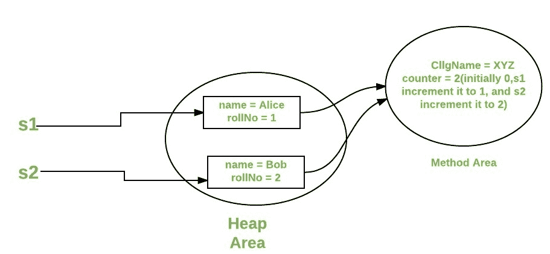

# Java 中的静态关键字

> 原文:[https://www.geeksforgeeks.org/static-keyword-java/](https://www.geeksforgeeks.org/static-keyword-java/)

Java 中的**静态关键字**主要用于内存管理。Java 中的 static 关键字用于共享给定类的相同变量或方法。用户可以将静态关键字应用于变量、方法、块和嵌套类。static 关键字属于类，而不是类的实例。static 关键字用于常量变量或方法，该变量或方法对于类的每个实例都是相同的。

*****静态*** **关键字是 Java 中的非访问修饰符，适用于以下情况:****

1.  **阻碍**
2.  **变量**
3.  **方法**
4.  **班级**

> ****注意:**要创建一个静态成员(块、变量、方法、嵌套类)，在其声明前加上关键字 *static* 。**

**当一个成员被声明为静态时，它可以在创建其类的任何对象之前被访问，并且不引用任何对象。例如，在下面的 java 程序中，我们正在访问静态方法 *m1()* ，而没有创建任何 *Test* 类的对象。**

## **Java 语言(一种计算机语言，尤用于创建网站)**

```
// Java program to demonstrate that a static member
// can be accessed before instantiating a class

class Test
{
    // static method
    static void m1()
    {
        System.out.println("from m1");
    }

    public static void main(String[] args)
    {
          // calling m1 without creating
          // any object of class Test
           m1();
    }
}
```

****Output**

```
from m1
```** 

### ****静态块****

**如果您需要进行计算来初始化您的**静态变量**，您可以声明一个静态块，当类第一次被加载时，它只被执行一次。**

**考虑下面演示静态块使用的 java 程序。**

## **Java 语言(一种计算机语言，尤用于创建网站)**

```
// Java program to demonstrate use of static blocks

class Test
{
    // static variable
    static int a = 10;
    static int b;

    // static block
    static {
        System.out.println("Static block initialized.");
        b = a * 4;
    }

    public static void main(String[] args)
    {
       System.out.println("from main");
       System.out.println("Value of a : "+a);
       System.out.println("Value of b : "+b);
    }
}
```

****Output**

```
Static block initialized.
from main
Value of a : 10
Value of b : 40
```** 

**有关静态块的详细文章，请参见[静态块](https://www.geeksforgeeks.org/static-blocks-in-java/)**

### **静态变量**

**当一个变量被声明为静态变量时，就会创建该变量的一个副本，并在类级别的所有对象之间共享。静态变量本质上是全局变量。该类的所有实例共享同一个静态变量。**

****静态变量的要点:****

*   **我们只能在类级别创建静态变量。见这里**
*   **静态块和静态变量按照它们在程序中出现的顺序执行。**

**下面是 Java 程序，演示了静态块和静态变量是按照它们在程序中出现的顺序执行的。**

## **Java 语言(一种计算机语言，尤用于创建网站)**

```
// Java program to demonstrate execution
// of static blocks and variables

class Test
{
    // static variable
    static int a = m1();

    // static block
    static {
        System.out.println("Inside static block");
    }

    // static method
    static int m1() {
        System.out.println("from m1");
        return 20;
    }

    // static method(main !!)
    public static void main(String[] args)
    {
       System.out.println("Value of a : "+a);
       System.out.println("from main");
    }
}
```

****Output**

```
from m1
Inside static block
Value of a : 20
from main
```** 

### **静态方法**

**当一个方法用 *static* 关键字声明时，称为静态方法。静态方法最常见的例子是 *main( )* 方法。如上所述，任何静态成员都可以在创建其类的任何对象之前被访问，并且不引用任何对象。声明为静态的方法有几个限制:**

*   **它们只能直接调用其他静态方法。**
*   **他们只能直接访问静态数据。**
*   **他们不能以任何方式引用[这个](https://www.geeksforgeeks.org/this-reference-in-java/)或者[超级](https://www.geeksforgeeks.org/super-keyword/)。**

**下面是演示静态方法限制的 java 程序。**

## **Java 语言(一种计算机语言，尤用于创建网站)**

```
// Java program to demonstrate restriction on static methods

class Test
{
    // static variable
    static int a = 10;

    // instance variable
    int b = 20;

    // static method
    static void m1()
    {
        a = 20;
        System.out.println("from m1");

         // Cannot make a static reference to the non-static field b
         b = 10; // compilation error

         // Cannot make a static reference to the 
                 // non-static method m2() from the type Test
         m2();  // compilation error

         //  Cannot use super in a static context
         System.out.println(super.a); // compiler error 
    }

    // instance method
    void m2()
    {    
        System.out.println("from m2");
    }

    public static void main(String[] args)
    {
        // main method 
    }
}
```

****输出:****

```
prog.java:18: error: non-static variable b cannot be referenced from a static context
         b = 10; // compilation error
         ^
prog.java:22: error: non-static method m2() cannot be referenced from a static context
         m2();  // compilation error
         ^
prog.java:25: error: non-static variable super cannot be referenced from a static context
         System.out.println(super.a); // compiler error 
                            ^
prog.java:25: error: cannot find symbol
         System.out.println(super.a); // compiler error 
                                 ^
  symbol: variable a
4 errors
```

### **何时使用静态变量和方法？**

**对所有对象共有的属性使用静态变量。例如，在学生课上，所有学生都使用相同的大学名称。使用静态方法更改静态变量。**

**考虑下面的 java 程序，它用变量和方法说明了*静态*关键字的使用。**

## **Java 语言(一种计算机语言，尤用于创建网站)**

```
// A java program to demonstrate use of
// static keyword with methods and variables

// Student class
class Student {
    String name;
    int rollNo;

    // static variable
    static String cllgName;

    // static counter to set unique roll no
    static int counter = 0;

    public Student(String name)
    {
        this.name = name;

        this.rollNo = setRollNo();
    }

    // getting unique rollNo
    // through static variable(counter)
    static int setRollNo()
    {
        counter++;
        return counter;
    }

    // static method
    static void setCllg(String name) { cllgName = name; }

    // instance method
    void getStudentInfo()
    {
        System.out.println("name : " + this.name);
        System.out.println("rollNo : " + this.rollNo);

        // accessing static variable
        System.out.println("cllgName : " + cllgName);
    }
}

// Driver class
public class StaticDemo {
    public static void main(String[] args)
    {
        // calling static method
        // without instantiating Student class
        Student.setCllg("XYZ");

        Student s1 = new Student("Alice");
        Student s2 = new Student("Bob");

        s1.getStudentInfo();
        s2.getStudentInfo();
    }
}
```

****Output**

```
name : Alice
rollNo : 1
cllgName : XYZ
name : Bob
rollNo : 2
cllgName : XYZ
```** 

****

### ****静态类****

**只有当一个类是嵌套类时，它才能成为**静态的**。我们不能用静态修饰符声明顶级类，但是可以将[嵌套类](https://www.geeksforgeeks.org/nested-classes-java/)声明为静态的。这种类型的类称为嵌套静态类。嵌套静态类不需要外部类的引用。在这种情况下，静态类不能访问外部类的非静态成员。**

> ****注意:**静态嵌套类，参见 java 中的一个[静态嵌套类](https://www.geeksforgeeks.org/static-class-in-java/)**

****实施:****

## **Java 语言(一种计算机语言，尤用于创建网站)**

```
// A java program to demonstrate use
// of static keyword with Classes

import java.io.*;

public class GFG {

    private static String str = "GeeksforGeeks";

    // Static class
    static class MyNestedClass {

        // non-static method
        public void disp(){ 
          System.out.println(str); 
        }
    }

    public static void main(String args[])
    {
        GFG.MyNestedClass obj
            = new GFG.MyNestedClass();
        obj.disp();
    }
}
```

****Output**

```
GeeksforGeeks
```** 

**本文由**高拉夫·米格拉尼**供稿。如果你喜欢 GeeksforGeeks 并想投稿，你也可以使用[write.geeksforgeeks.org](https://write.geeksforgeeks.org)写一篇文章或者把你的文章邮寄到 review-team@geeksforgeeks.org。看到你的文章出现在极客博客主页上，帮助其他极客。如果你发现任何不正确的地方，或者你想分享更多关于上面讨论的话题的信息，请写评论。**