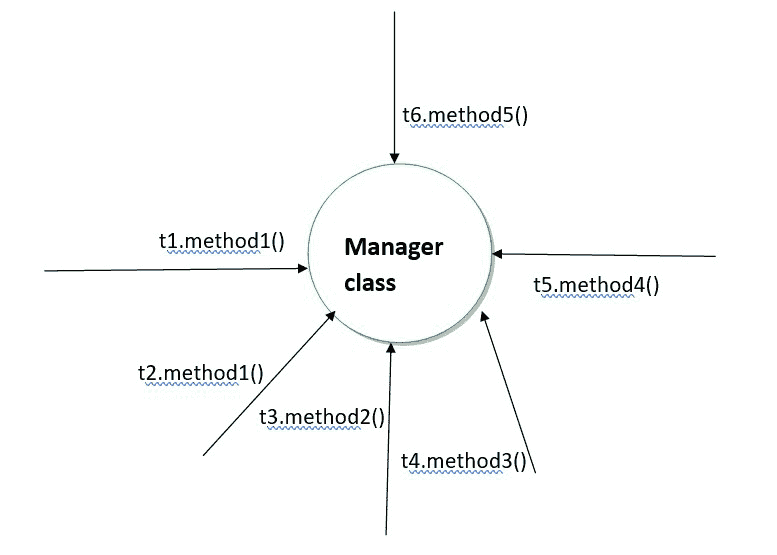

# Java 中的静态同步

> 原文:[https://www . geesforgeks . org/static-synchronization-in-Java/](https://www.geeksforgeeks.org/static-synchronization-in-java/)

同步有可能控制多个线程对任何共享资源的访问。[Java 中的同步](https://www.geeksforgeeks.org/synchronized-in-java/)对于线程之间的可靠通信至关重要。它是在 Java 中使用同步关键字实现的。

**关于同步的要点**

*   它只适用于对象级别的方法。
*   如果一个方法或块是同步的，那么它需要一个对象级锁来开始执行。
*   **同步**是 java 中**最危险的词，因为这是**陷入僵局的唯一原因。****
*   需要时使用同步关键字，并尝试使用同步块。

### **静态同步**

同步方法可能会失去获得有序输出的行为。当一个类有更多的对象时，它只获取特定实例的锁。为了维护同步行为，我们需要一个类级锁，而不是实例级锁，后者可以通过静态同步来实现。

静态同步方法也是一种在 java 中同步方法的方法，这样就不会有两个线程同时对同步的方法进行静态操作。唯一的区别是使用静态同步。我们正在获得一个类级别的锁，这样只有一个线程将对该方法进行操作。线程将获得一个 java 类的类级锁，这样只有一个线程可以作用于静态同步方法。

**语法:**

```
synchronized static return type class name{}
```

> **注意:**当一个类既有同步方法又有静态同步方法时，它们可以并行运行，因为这两种方法需要不同的锁。

让我们假设有 6 个线程。执行的顺序是



### 线程和类

这里 t1、t2… t6 是线程名

```
The complete declarations of  methods are:
method1: public static synchronized void method1()
method2: public static synchronized void method2()
method3: public static void method3()
method4: public synchronized int method4()
method5: public String method5()
```

1.  **t1.method1()** 在获得 Manager 类的类级锁时开始执行。
2.  **t2.method2()** 等待它的时间开始执行，由于它是一个静态同步的方法，它需要一个类级锁，由于 T1 已经获取了类级锁 t2 必须等到 T1 执行。
3.  **t3.method2()** 等待，因为它需要类级锁，所以它必须等到 T1 释放锁。
4.  **t4.method3()** 开始执行，因为它是静态方法，不需要锁定
5.  **t5.method4()** 开始执行，因为它是实例级或(正常)级同步方法，需要对象级锁定，所以它获得对象级锁定。
6.  t **6.method5()** 开始执行，因为它是实例方法或普通方法

**示例:**下面是一个带有**静态同步**的多线程示例程序

## Java 语言(一种计算机语言，尤用于创建网站)

```
// Java program of multithreading 
// with static synchronized

class Display
{
    public static synchronized void wish(String name)
    {
        for(int i=0;i<3;i++)
        {
            System.out.print("Good Morning: ");
            System.out.println(name);
            try{
                Thread.sleep(2000);
            }
            catch(InterruptedException e)
            {
            }
        }
    }
}

class MyThread extends Thread{
    Display d;
    String name;
    MyThread(Display d,String name)
    {
        this.d=d;
        this.name=name;
    }
    public void run()
    {
        d.wish(name);
    }
}

class Main{
    public static void main(String arg[])
    {
        Display d1=new Display();
        Display d2=new Display();
        MyThread t1=new MyThread(d1,"Dhoni");
        MyThread t2=new MyThread(d2,"Yuvaraj");
        t1.start();
        t2.start();
    }
}
```

> **注意:**每一个愿望会在 2000 ms 的间隙后打印出来。

**输出**

```
First time of execution:
Good Morning: Dhoni
Good Morning: Dhoni
Good Morning: Dhoni
Good Morning: Yuvaraj
Good Morning: Yuvaraj
Good Morning: Yuvaraj

Second time of execution:
Good Morning: Yuvaraj
Good Morning: Yuvaraj
Good Morning: Yuvaraj
Good Morning: Dhoni
Good Morning: Dhoni
Good Morning: Dhoni
```

**说明:**

在上面的程序中，定义了三个类，即显示类、神话读类和主类，其中每个类都有–

1.  **类显示:**子线程运行所需的代码
2.  **类 MyThread:** 这个类的目的是扩展类 Thread 和分配值名，调用类 Display 的 wish 方法
3.  **class Main:** 它是整个程序的主类，它创建了一个子线程

**控制流程:**

我们知道，程序的执行是从主方法开始的。首先，我们创建两个子线程，并将它们分配给线程的显示对象，在 t2.start()之后，将有三个线程，即(main，t1，t2)，执行过程如下。

子线程开始执行 t1，由于 wish 方法是静态同步的，线程 t1 获得 class Display 的类级锁，开始执行 wish 方法。如果下一个线程到来，它必须等到执行前一个线程才能获得类级锁。

> **注:**我们不能说输出的确切顺序。作为程序员，我们不能说哪个线程开始执行或执行的顺序，它们不在程序员手中，这是线程调度器的工作。

### Java 中同步和静态同步的区别

<figure class="table">

| 同步的 | 静态同步 |
| --- | --- |
| 它需要一个对象级锁。 | 它需要类级别的锁。 |
| 它的方法不需要声明为静态的。 | 它的方法需要声明为静态的。 |
| 经常使用。 | 不经常使用。 |
| 为每个对象创建一个不同的实例。 | 整个程序只有一个实例。 |

</figure>