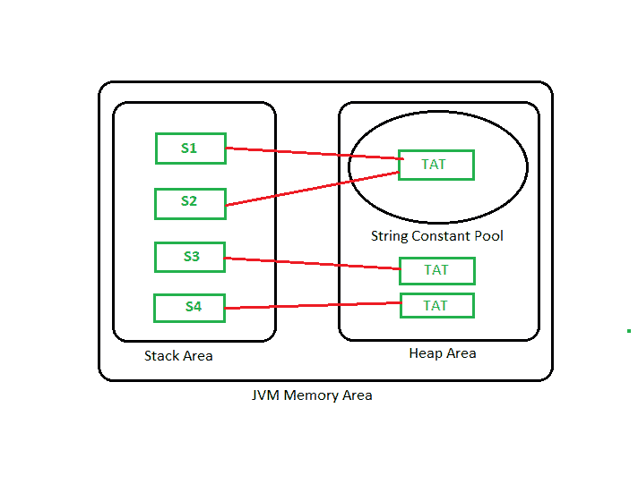

# Java 中字符串的存储

> 原文:[https://www.geeksforgeeks.org/storage-of-string-in-java/](https://www.geeksforgeeks.org/storage-of-string-in-java/)

**先决条件:**Java 中的[字符串](https://www.geeksforgeeks.org/strings-in-java/)

众所周知，堆栈和堆空间都是 [Java 虚拟机(JVM)](https://www.geeksforgeeks.org/jvm-works-jvm-architecture/) 的一部分。但是这些存储空间用于不同的目的。堆栈空间包含特定的短期值，而 Java 运行时使用堆空间来为对象和 JRE 类分配内存。在 Java 中，字符串存储在堆区域。

**为什么堆**、**中存储的 Java 字符串不在 Stack 中？**

字符串是一个类，在 java 中字符串被视为一个对象，因此字符串类的对象将存储在堆中，而不是堆栈区域。让我们深入这个话题。众所周知，我们可以通过两种方式创建字符串对象，即

**1)** 按字符串

**2)** 通过使用‘新’关键字

字符串文字是通过使用双引号创建的。例如:

> String s= "欢迎"；

在这里，JVM 检查字符串常量池。如果字符串不存在，则创建一个新的字符串实例并将其放入池中。如果字符串存在，则不会创建新的对象，而是返回对同一实例的引用。存储这些字符串实例的缓存称为字符串常量池或字符串池。在早期版本的 Java 中，直到 JDK 6，字符串池位于 **PermGen** (永久生成)空间中。但是在 JDK 7 中，它被移动到主堆区域。

**字符串池为什么从 PermGen 移动到正常堆区？**

PermGen 空间是有限的空间，默认大小仅为 64 MB。这是一个在 PermGen 空间中创建和存储太多字符串对象的问题。这就是为什么字符串池被移动到更大的堆区域。为了提高 java 的内存效率，使用了字符串的概念。

通过使用“new”关键字，JVM 将在正常堆区域中创建一个新的字符串对象，即使字符串池中存在相同的字符串对象。

> 例如:
> 
> 字符串 a =新字符串(“三叉戟”)；

让我们用一个 java 程序来看看这个概念，并可视化实际的 JVM 内存结构:

## Java 语言(一种计算机语言，尤用于创建网站)

```java
import java.io.*;

class GFG {
    public static void main(String[] args)
    {

          // String created using String literal
        String s1 = "TAT"; 
        String s2 = "TAT";

          // String created using 'new' keyword
        String s3 = new String("TAT"); 
        String s4 = new String("TAT");

        System.out.println(s1);
        System.out.println(s2);
        System.out.println(s3);
        System.out.println(s4);
    }
}
```

**输出:**

```java
TAT
TAT
TAT
TAT
```

下图说明了字符串的存储:



在上图中，字符串存储在字符串常量池中。字符串对象引用变量存储在方法 main()下的堆栈区域中。因为 main()在堆栈区域有一些空间。

**注:**

*   Java 中的所有对象都存储在堆中。对象的引用变量存储在堆栈区域中，或者它们可以包含在其他对象中，这也将它们放在堆区域中。
*   该字符串由 java 通过引用传递。
*   字符串引用变量本身不是引用。它是一个存储引用(内存地址)的变量。