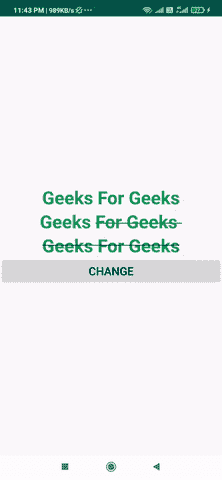

# 安卓中的删除线文字

> 原文:[https://www . geesforgeks . org/删除线-安卓文本/](https://www.geeksforgeeks.org/strikethrough-text-in-android/)

在本文中，我们将使用这种方法在我们的文本视图上实现穿透功能。当我们想要编辑我们的内容，但也想让用户看到以前的内容时，这可能会很有用。就像在亚马逊应用程序上一样，我们都看到，当商品有折扣时，价格会用删除线显示，而当前价格会并排显示。下面给出了一个示例 GIF，以了解我们将在本文中做什么。注意，我们将使用 **Java** 语言来实现这个项目。



### **方法 1**

创建一个带有删除线名称的可绘制文件，并将此可绘制文件添加到文本文件中

```java
<?xml version="1.0" encoding="utf-8"?>
<selector xmlns:android="http://schemas.android.com/apk/res/android">
    <item android:state_pressed="false">
        <shape android:shape="line">
            <stroke android:width="1dp" android:color="@android:color/black"/>
        </shape>
    </item>
</selector>
```

### **方法二**

**创建一个这样的字符串，并将这个字符串作为文本添加到文本视图**中

```java
<string name="strike"> Geeks <strike>For Geeks </strike> </string>
```

### **方法 3**

在**MainActivity.java**文件中输入以下一行。

```java
strike.setPaintFlags(strike.getPaintFlags() | Paint.STRIKE_THRU_TEXT_FLAG);
```

### 三种方法的实现

**第一步:创建新项目**

要在安卓工作室创建新项目，请参考[如何在安卓工作室创建/启动新项目](https://www.geeksforgeeks.org/android-how-to-create-start-a-new-project-in-android-studio/)。注意选择 **Java** 作为编程语言。

**步骤 2:使用 activity_main.xml 文件**

导航到**应用程序> res >布局> activity_main.xml** 并将下面的代码添加到该文件中。下面是 **activity_main.xml** 文件的代码。

## 可扩展标记语言

```java
<?xml version="1.0" encoding="utf-8"?>
<LinearLayout
    xmlns:android="http://schemas.android.com/apk/res/android"
    xmlns:tools="http://schemas.android.com/tools"
    android:layout_width="match_parent"
    android:layout_height="match_parent"
    android:gravity="center"
    android:orientation="vertical"
    tools:context=".MainActivity">

    <TextView
        android:id="@+id/striketext"
        android:layout_width="wrap_content"
        android:layout_height="wrap_content"
        android:text="Geeks For Geeks"
        android:textColor="@color/colorPrimary"
        android:textSize="32sp"
        android:textStyle="bold" />

    <TextView
        android:layout_width="wrap_content"
        android:layout_height="wrap_content"
        android:text="@string/strike"
        android:textColor="@color/colorPrimary"
        android:textSize="32sp"
        android:textStyle="bold" />

    <TextView
        android:layout_width="wrap_content"
        android:layout_height="wrap_content"
        android:foreground="@drawable/strikethrough"
        android:text="Geeks For Geeks"
        android:textColor="@color/colorPrimary"
        android:textSize="32sp"
        android:textStyle="bold" />

    <Button
        android:id="@+id/change"
        android:layout_width="match_parent"
        android:layout_height="wrap_content"
        android:text="Change"
        android:textColor="@color/black"
        android:textSize="20dp" />

</LinearLayout>
```

**第三步:使用****MainActivity.java 文件**

转到**MainActivity.java**文件，参考以下代码。以下是**MainActivity.java**文件的代码。代码中添加了注释，以更详细地理解代码。

## Java 语言(一种计算机语言，尤用于创建网站)

```java
import android.graphics.Paint;
import android.os.Bundle;
import android.view.View;
import android.widget.Button;
import android.widget.TextView;

import androidx.appcompat.app.AppCompatActivity;

public class MainActivity extends AppCompatActivity {

    TextView strike;
    Button change;

    @Override
    protected void onCreate(Bundle savedInstanceState) {
        super.onCreate(savedInstanceState);
        setContentView(R.layout.activity_main);

        // initialise the layout
        strike = findViewById(R.id.striketext);
        change = findViewById(R.id.change);

        // click on the button
        change.setOnClickListener(new View.OnClickListener() {
            @Override
            public void onClick(View v) {
                // if the text is not having strike then set strike else vice versa
                if (!strike.getPaint().isStrikeThruText()) {
                    strike.setPaintFlags(strike.getPaintFlags() | Paint.STRIKE_THRU_TEXT_FLAG);
                } else {
                    strike.setPaintFlags(strike.getPaintFlags() & ~Paint.STRIKE_THRU_TEXT_FLAG);
                }
            }
        });
    }
}
```

**输出:**

<video class="wp-video-shortcode" id="video-594985-1" width="640" height="360" preload="metadata" controls=""><source type="video/mp4" src="https://media.geeksforgeeks.org/wp-content/uploads/20210420234733/striket.mp4?_=1">[https://media.geeksforgeeks.org/wp-content/uploads/20210420234733/striket.mp4](https://media.geeksforgeeks.org/wp-content/uploads/20210420234733/striket.mp4)</video>