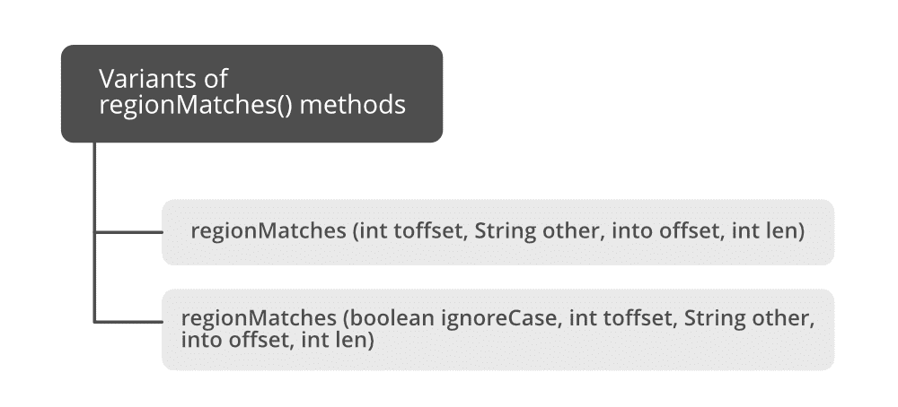

# Java 中字符串匹配()方法，示例

> 原文:[https://www . geesforgeks . org/string-matches-in-method-in-Java-with-examples/](https://www.geeksforgeeks.org/string-matches-method-in-java-with-examples/)

matches()方法的变体用于更精确地告诉不要测试给定的字符串是否匹配一个[正则表达式](https://www.geeksforgeeks.org/regular-expressions-in-java/)，因为每当这个方法本身作为 matches()或 be matches()被调用时，这里我们确实传递了两个参数，即我们的字符串和正则表达式，工作和输出保持不变。

存在多个变体***匹配()方法**T5】的三个***变体，如下所示:

## 变量 1:字符串匹配()

这个方法告诉这个字符串是否匹配给定的正则表达式。调用这种形式的方法***str . matches(regex)*会产生与表达式 [*Pattern.matches(regex，str)*](https://www.geeksforgeeks.org/java-lang-string-matches-java/) ***完全相同的结果。*****

****语法:****

```java
public boolean matches(String regex) 
```

****参数:**该字符串要匹配的正则表达式。**

****返回类型:**布尔值，当且仅当字符串与给定的正则表达式匹配时返回真，否则返回假。**

****示例:****

## **Java 语言(一种计算机语言，尤用于创建网站)**

```java
// Java Program to Demonstrate Working of matches() Method
// of String class

// Main class
public class GFG {

    // Main driver method
    public static void main(String args[])
    {

        // Declaring and initializing a string
        // Input string
        String Str = new String("Welcome to geeksforgeeks");

        // Display message for better readability
        System.out.print(
            "Does String contains regex (.*)geeks(.*) ? : ");
        // Testing if regex is present or not
        System.out.println(Str.matches("(.*)geeks(.*)"));

        // Display message for better readability
        System.out.print(
            "Does String contains regex geeks ? : ");

        // Testing if regex is present or not
        System.out.println(Str.matches("geeks"));
    }
}
```

****Output**

```java
Does String contains regex (.*)geeks(.*) ? : true
Does String contains regex geeks ? : false
```** 

## **变量 2:字符串区域匹配()**

****

**此方法有两种变体，可用于测试两个字符串区域是否相等。**

****语法:****

```java
public boolean regionMatches(int str_strt, String other, int other_strt,int len)
```

****参数:****

*   **该字符串中子区域的起始偏移量**
*   **字符串参数**
*   **字符串参数中子区域的起始偏移量**
*   **要比较的字符数**

****返回类型:**布尔值，如果该字符串的指定子区域与字符串参数的指定子区域匹配，则为 true 否则为假。**

****示例:****

## **Java 语言(一种计算机语言，尤用于创建网站)**

```java
// Java Program to Demonstrate Working of regionmatches()
// method of String class

// Main class
public class GFG {

    // Main driver method
    public static void main(String args[])
    {
        // Declaring and initializing a string
        String Str1
            = new String("Welcome to geeksforgeeks");

        // Initializing test string
        String Str2 = new String("GEEKS");

        // Tests whether GEEKS starts in geeksforgeeks
        // starting from pos 11 and
        // compares 5 characters of GEEKS
        System.out.print(
            "Checking if GEEKS is in geeksforgeeks( case sensitive ) : ");
        System.out.println(
            Str1.regionMatches(11, Str2, 0, 5));
    }
}
```

****Output**

```java
Checking if GEEKS is in geeksforgeeks( case sensitive ) : false
```** 

## **变量 3:字符串区域匹配()**

**此方法有两种变体，可用于测试两个字符串区域是否相等。**

****语法:****

```java
public boolean 
regionMatches(boolean ignoreCase, int str_strt, String other, int other_strt,int len)
```

****参数:****

*   **该字符串中子区域的起始偏移量**
*   **字符串参数**
*   **字符串参数中子区域的起始偏移量**
*   **要比较的字符数**
*   ****忽略:如果为真，比较字符时忽略大小写****

****返回类型:**如果该字符串的指定子区域与字符串参数的指定子区域匹配，则返回 true 否则为假。匹配是精确匹配还是不区分大小写取决于 ignoreCase 参数。**

****示例:****

## **Java 语言(一种计算机语言，尤用于创建网站)**

```java
// Java Program to Demonstrate Working of regionmatches()

// Main class 
public class GFG {

  // Main driver method 
   public static void main(String args[]) {

      // Declaring and initializing a string 
      String Str1 = new String("Welcome to geeksforgeeks");

      // Initializing a test string
      String Str2 = new String("GEEKS");

      // Tests whether GEEKS starts in geeksforgeeks starting from pos 11
      // and from 0 ( i.e starting in GEEKS) and ignores case
      // and compares 5 characters of GEEKS
      System.out.print("Checking if GEEKS is in geeksforgeeks( case insensitive ) : " );
      System.out.println(Str1.regionMatches(true, 11, Str2, 0, 5));

   }
}
```

****输出:****

```java
Checking if GEEKS is in geeksforgeeks( case insensitive ) : true
```

**本文由 **Astha Tyagi** 供稿。如果你喜欢 GeeksforGeeks 并想投稿，你也可以使用[write.geeksforgeeks.org](https://write.geeksforgeeks.org)写一篇文章或者把你的文章邮寄到 review-team@geeksforgeeks.org。看到你的文章出现在极客博客主页上，帮助其他极客。如果你发现任何不正确的地方，或者你想分享更多关于上面讨论的话题的信息，请写评论。**