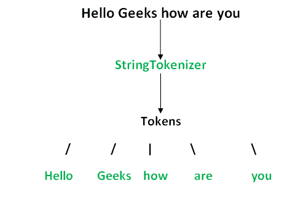

# Java 中的 StringTokenizer 类

> 原文:[https://www . geeksforgeeks . org/stringtokenizer-class-in-Java/](https://www.geeksforgeeks.org/stringtokenizer-class-in-java/)

Java 中的 StringTokenizer 类用于将字符串分解成标记。StringTokenizer 对象在内部维护要标记化的字符串中的当前位置。某些操作会将当前位置推进到已处理的字符之外。通过获取用于创建 StringTokenizer 对象的字符串的子字符串来返回标记。

插图:



**StringToken 的构造函数:**让我们考虑“str”是要标记化的字符串

1.  **StringTokenizer(字符串):**默认分隔符，如换行符、空格、制表符、回车符和换行符。
2.  **StringTokenizer(String str，String delim):** delim 是一组用于标记给定字符串的分隔符。
3.  **StringTokenizer(String str，String delim，布尔标志):**前两个参数具有相同的含义，其中标志
    用于以下目的。

**3.1:** 如果标志为假，分隔符用于分隔标记

**示例:**

```
Input : if string --> "hello geeks" and Delimiter is " ", then 
Output:  tokens are "hello" and "geeks".
```

**3.2:** 如果标志为真，则分隔符字符被视为令牌。

**示例:**

```
Input : String --> is "hello geeks"and Delimiter is " ", then 
Output: Tokens --> "hello", " " and "geeks".
```

### 字符串生成器类的方法

<figure class="table">

| 方法 | 已执行的操作 |
| --- | --- |
| [计数令牌()](https://www.geeksforgeeks.org/stringtokenizer-counttokens-method-in-java-with-examples/) | 返回存在的令牌总数 |
| [hasMoreToken()](https://www.geeksforgeeks.org/stringtokenizer-hasmoretokens-method-in-java-with-examples/) | 测试字符串的字符串中是否存在标记 |
| [nextElement()](https://www.geeksforgeeks.org/stringtokenizer-nextelement-method-in-java-with-examples/#:~:text=The%20nextElement()%20method%20of,Object%20rather%20than%20the%20String.) | 返回一个对象而不是字符串 |
| [【hasmorellis()](https://www.geeksforgeeks.org/stringtokenizer-hasmoreelements-method-in-java-with-examples/) | 返回与 hasMoreToken 相同的值 |
| [外令牌()](https://www.geeksforgeeks.org/stringtokenizer-nexttoken-method-in-java-with-examples/) | 从给定的 StringTokenizer 返回下一个标记。 |

</figure>

**实施:**

## Java 语言(一种计算机语言，尤用于创建网站)

```
// Java Program to Illustrate StringTokenizer Class

// Importing requieed classes
import java.util.*;

// Main class
public class GFG {

    // Main driver method
    public static void main(String args[])
    {

        // Constructor 1
        System.out.println("Using Constructor 1 - ");

        // Creating object of class inside main() method
        StringTokenizer st1 = new StringTokenizer(
            "Hello Geeks How are you", " ");

        // Condition holds true till there is single token
        // remaining using hasMoreTokens() method
        while (st1.hasMoreTokens())

            // Getting next tokens
            System.out.println(st1.nextToken());

        // Constructor 2
        System.out.println("Using Constructor 2 - ");

        // Again creating object of class inside main()
        // method
        StringTokenizer st2 = new StringTokenizer(
            "JAVA : Code : String", " :");

        // If tokens are present
        while (st2.hasMoreTokens())

            // Print all tokens
            System.out.println(st2.nextToken());

        // Constructor 3
        System.out.println("Using Constructor 3 - ");

        // Again creating object of class inside main()
        // method
        StringTokenizer st3 = new StringTokenizer(
            "JAVA : Code : String", " :", true);

        while (st3.hasMoreTokens())
            System.out.println(st3.nextToken());
    }
}
```

**Output**

```
Using Constructor 1 - 
Hello
Geeks
How
are
you
Using Constructor 2 - 
JAVA
Code
String
Using Constructor 3 - 
JAVA

:

Code

:

String
```

本文由**莫希特·古普塔**供稿。如果你喜欢 GeeksforGeeks 并想投稿，你也可以使用[write.geeksforgeeks.org](http://www.write.geeksforgeeks.org)写一篇文章或者把你的文章邮寄到 review-team@geeksforgeeks.org。看到你的文章出现在极客博客主页上，帮助其他极客。