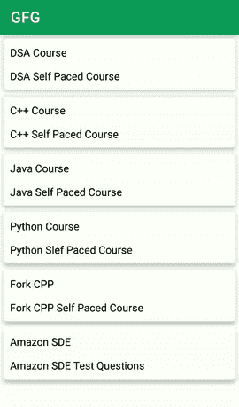

# 在安卓回收视图

中滑动删除和撤销

> 原文:[https://www . geeksforgeeks . org/在 android-recyclerview 中滑动以删除和撤消/](https://www.geeksforgeeks.org/swipe-to-delete-and-undo-in-android-recyclerview/)

我们已经看到许多应用程序中有一个[回收视图](https://www.geeksforgeeks.org/android-recyclerview/)，除此之外，我们还在该回收视图中看到了许多用于滑动删除的功能以及更多功能。我们在 Gmail 应用程序中见过这种类型的功能，我们可以左右滑动或项目来删除或添加到档案中。在这篇文章中，我们将看看带有撤销功能的安卓系统中的滑动删除回收视图项目的实现。

### 我们将在本文中构建什么？

我们将构建一个简单的应用程序，其中我们将显示一个简单的回收视图，该视图显示课程列表及其描述，我们将添加滑动删除和撤销功能。下面给出了一个 GIF 示例，来了解一下在本文中要做什么。请注意，我们将使用 **Java** 语言来实现这个项目。



### **分步实施**

**第一步:创建新项目**

要在安卓工作室创建新项目，请参考[如何在安卓工作室创建/启动新项目](https://www.geeksforgeeks.org/android-how-to-create-start-a-new-project-in-android-studio/)。注意选择 **Java** 作为编程语言。

要实现回收视图，需要三个子部分，这有助于控制回收视图。这三个部分包括:

*   **卡片布局**:卡片布局是一个 XML 文件，它将代表回收器视图中的每个单独的网格项目。
*   **View Holder** : View Holder 类是 java 类，存储了对卡片布局中 UI 元素的引用，在程序执行过程中可以通过数据列表动态修改。
*   **数据类**:数据类是一个对象类，保存要在回收器视图中显示的每个回收器视图项中显示的信息。

**步骤 2:为回收新卡项目创建卡布局**

转到**应用程序> res >布局>右键单击>新建>布局资源文件**，并将文件命名为**卡片 _ 布局**。在这个文件中，所有与回收视图中的卡项目相关的 XML 代码都被写入。下面是 **card_layout.xml** 文件的代码。

## 可扩展标记语言

```java
<?xml version="1.0" encoding="utf-8"?><!--XML implementation of Card Layout-->
<androidx.cardview.widget.CardView
    xmlns:android="http://schemas.android.com/apk/res/android"
    xmlns:app="http://schemas.android.com/apk/res-auto"
    android:layout_width="match_parent"
    android:layout_height="wrap_content"
    android:layout_margin="5dp"
    app:cardCornerRadius="5dp"
    app:cardElevation="5dp">

    <LinearLayout
        android:layout_width="match_parent"
        android:layout_height="wrap_content"
        android:layout_margin="3dp"
        android:orientation="vertical">

        <!--text view for displaying our course name-->
        <TextView
            android:id="@+id/idTVCourseName"
            android:layout_width="match_parent"
            android:layout_height="wrap_content"
            android:layout_margin="2dp"
            android:padding="5dp"
            android:text="Course Name"
            android:textColor="@color/black" />

        <!--text view for displaying
            our course description-->
        <TextView
            android:id="@+id/idTVCourseDesc"
            android:layout_width="match_parent"
            android:layout_height="wrap_content"
            android:layout_margin="2dp"
            android:padding="5dp"
            android:text="Course Description"
            android:textColor="@color/black" />

    </LinearLayout>

</androidx.cardview.widget.CardView>
```

**步骤 3:为模态数据创建一个 Java 类**

转到**应用程序> java >右键单击应用程序的包名>新建> Java 类**并将文件命名为 **RecyclerData** 。此类将处理要显示的每个回收器项目的数据。以下是**RecyclerData.java**文件的代码。

## Java 语言(一种计算机语言，尤用于创建网站)

```java
public class RecyclerData {
    // string for displaying
    // title and description.
    private String title;
    private String description;

    // constructor for our title and description.
    public RecyclerData(String title, String description) {
        this.title = title;
        this.description = description;
    }

    // creating getter and setter methods.
    public String getTitle() {
        return title;
    }

    public void setTitle(String title) {
        this.title = title;
    }

    public String getDescription() {
        return description;
    }

    public void setDescription(String description) {
        this.description = description;
    }  
}
```

**步骤 4:为适配器**创建一个新的 java 类

同样，创建一个新的 Java 类，并将该文件命名为 RecyclerViewAdapter。适配器是负责回收视图的主要类。它包含所有在回收视图中有用的方法。

> **注**:视图持有者类也是在适配器类本身实现的。

这些处理回收视图的方法包括:

*   **oncreateviewpholder**:此方法为回收器视图放大卡片布局项目。
*   **onBindViewHolder** :此方法将数据设置为卡片项目的特定视图。它还处理与点击 Recycler 视图的项目相关的方法。
*   **getItemCount** :这个方法返回 RecyclerView 的长度。

以下是**RecyclerViewAdapter.java**文件的代码。代码中添加了注释，以更详细地理解代码。

## Java 语言(一种计算机语言，尤用于创建网站)

```java
import android.content.Context;
import android.view.LayoutInflater;
import android.view.View;
import android.view.ViewGroup;
import android.widget.TextView;

import androidx.annotation.NonNull;
import androidx.recyclerview.widget.RecyclerView;

import java.util.ArrayList;

public class RecyclerViewAdapter extends RecyclerView.Adapter<RecyclerViewAdapter.RecyclerViewHolder> {

    // creating a variable for our array list and context.
    private ArrayList<RecyclerData> courseDataArrayList;
    private Context mcontext;

    // creating a constructor class.
    public RecyclerViewAdapter(ArrayList<RecyclerData> recyclerDataArrayList, Context mcontext) {
        this.courseDataArrayList = recyclerDataArrayList;
        this.mcontext = mcontext;
    }

    @NonNull
    @Override
    public RecyclerViewHolder onCreateViewHolder(@NonNull ViewGroup parent, int viewType) {
        // Inflate Layout
        View view = LayoutInflater.from(parent.getContext()).inflate(R.layout.card_layout, parent, false);
        return new RecyclerViewHolder(view);
    }

    @Override
    public void onBindViewHolder(@NonNull RecyclerViewHolder holder, int position) {
        // Set the data to textview from our modal class.
        RecyclerData recyclerData = courseDataArrayList.get(position);
        holder.courseNameTV.setText(recyclerData.getTitle());
        holder.courseDescTV.setText(recyclerData.getDescription());
    }

    @Override
    public int getItemCount() {
        // this method returns
          // the size of recyclerview
        return courseDataArrayList.size();
    }

    // View Holder Class to handle Recycler View.
    public class RecyclerViewHolder extends RecyclerView.ViewHolder {

        // creating a variable for our text view.
        private TextView courseNameTV;
        private TextView courseDescTV;

        public RecyclerViewHolder(@NonNull View itemView) {
            super(itemView);
            // initializing our text views.
            courseNameTV = itemView.findViewById(R.id.idTVCourseName);
            courseDescTV = itemView.findViewById(R.id.idTVCourseDesc);
        }
    }
}
```

**第 5 步:使用 activity_main.xml 文件**

导航到**应用程序> res >布局> activity_main.xml** 并将下面的代码添加到该文件中。下面是 **activity_main.xml** 文件的代码。

## 可扩展标记语言

```java
<?xml version="1.0" encoding="utf-8"?>
<RelativeLayout
    xmlns:android="http://schemas.android.com/apk/res/android"
    xmlns:tools="http://schemas.android.com/tools"
    android:layout_width="match_parent"
    android:layout_height="match_parent"
    android:layout_gravity="center"
    android:gravity="center"
    android:orientation="vertical"
    tools:context=".MainActivity">

    <!--creating a recycler view for
        displaying our list of courses-->
    <androidx.recyclerview.widget.RecyclerView
        android:id="@+id/idRVCourse"
        android:layout_width="match_parent"
        android:layout_height="match_parent" />

</RelativeLayout>
```

**步骤 6:使用 MainActivity.java 文件**

转到**MainActivity.java**文件，参考以下代码。以下是**MainActivity.java**文件的代码。代码中添加了注释，以更详细地理解代码。

## Java 语言(一种计算机语言，尤用于创建网站)

```java
import android.os.Bundle;
import android.view.View;

import androidx.annotation.NonNull;
import androidx.appcompat.app.AppCompatActivity;
import androidx.recyclerview.widget.ItemTouchHelper;
import androidx.recyclerview.widget.LinearLayoutManager;
import androidx.recyclerview.widget.RecyclerView;

import com.google.android.material.snackbar.Snackbar;

import java.util.ArrayList;

public class MainActivity extends AppCompatActivity {

    // creating a variable for recycler view,
    // array list and adapter class.
    private RecyclerView courseRV;
    private ArrayList<RecyclerData> recyclerDataArrayList;
    private RecyclerViewAdapter recyclerViewAdapter;

    @Override
    protected void onCreate(Bundle savedInstanceState) {
        super.onCreate(savedInstanceState);
        setContentView(R.layout.activity_main);

        // initializing our variables.
        courseRV = findViewById(R.id.idRVCourse);

        // creating new array list.
        recyclerDataArrayList = new ArrayList<>();

        // in below line we are adding data to our array list.
        recyclerDataArrayList.add(new RecyclerData("DSA Course", "DSA Self Paced Course"));
        recyclerDataArrayList.add(new RecyclerData("C++ Course", "C++ Self Paced Course"));
        recyclerDataArrayList.add(new RecyclerData("Java Course", "Java Self Paced Course"));
        recyclerDataArrayList.add(new RecyclerData("Python Course", "Python Self Paced Course"));
        recyclerDataArrayList.add(new RecyclerData("Fork CPP", "Fork CPP Self Paced Course"));
        recyclerDataArrayList.add(new RecyclerData("Amazon SDE", "Amazon SDE Test Questions"));

        // initializing our adapter class with our array list and context.
        recyclerViewAdapter = new RecyclerViewAdapter(recyclerDataArrayList, this);

        // below line is to set layout manager for our recycler view.
        LinearLayoutManager manager = new LinearLayoutManager(this);

        // setting layout manager for our recycler view.
        courseRV.setLayoutManager(manager);

        // below line is to set adapter
        // to our recycler view.
        courseRV.setAdapter(recyclerViewAdapter);

        // on below line we are creating a method to create item touch helper
        // method for adding swipe to delete functionality.
        // in this we are specifying drag direction and position to right
        new ItemTouchHelper(new ItemTouchHelper.SimpleCallback(0, ItemTouchHelper.RIGHT) {
            @Override
            public boolean onMove(@NonNull RecyclerView recyclerView, @NonNull RecyclerView.ViewHolder viewHolder, @NonNull RecyclerView.ViewHolder target) {
                // this method is called
                // when the item is moved.
                return false;
            }

            @Override
            public void onSwiped(@NonNull RecyclerView.ViewHolder viewHolder, int direction) {
                // this method is called when we swipe our item to right direction.
                // on below line we are getting the item at a particular position.
                RecyclerData deletedCourse = recyclerDataArrayList.get(viewHolder.getAdapterPosition());

                // below line is to get the position
                // of the item at that position.
                int position = viewHolder.getAdapterPosition();

                // this method is called when item is swiped.
                // below line is to remove item from our array list.
                recyclerDataArrayList.remove(viewHolder.getAdapterPosition());

                // below line is to notify our item is removed from adapter.
                recyclerViewAdapter.notifyItemRemoved(viewHolder.getAdapterPosition());

                // below line is to display our snackbar with action.
                Snackbar.make(courseRV, deletedCourse.getTitle(), Snackbar.LENGTH_LONG).setAction("Undo", new View.OnClickListener() {
                    @Override
                    public void onClick(View v) {
                        // adding on click listener to our action of snack bar.
                        // below line is to add our item to array list with a position.
                        recyclerDataArrayList.add(position, deletedCourse);

                        // below line is to notify item is
                        // added to our adapter class.
                        recyclerViewAdapter.notifyItemInserted(position);
                    }
                }).show();
            }
            // at last we are adding this
            // to our recycler view.
        }).attachToRecyclerView(courseRV);
    }
}
```

现在运行您的应用程序，并查看应用程序的输出。

### **输出:**

<video class="wp-video-shortcode" id="video-557914-1" width="640" height="360" preload="metadata" controls=""><source type="video/mp4" src="https://media.geeksforgeeks.org/wp-content/uploads/20210211184826/Screenrecorder-2021-02-11-18-32-32-273.mp4?_=1">[https://media.geeksforgeeks.org/wp-content/uploads/20210211184826/Screenrecorder-2021-02-11-18-32-32-273.mp4](https://media.geeksforgeeks.org/wp-content/uploads/20210211184826/Screenrecorder-2021-02-11-18-32-32-273.mp4)</video>