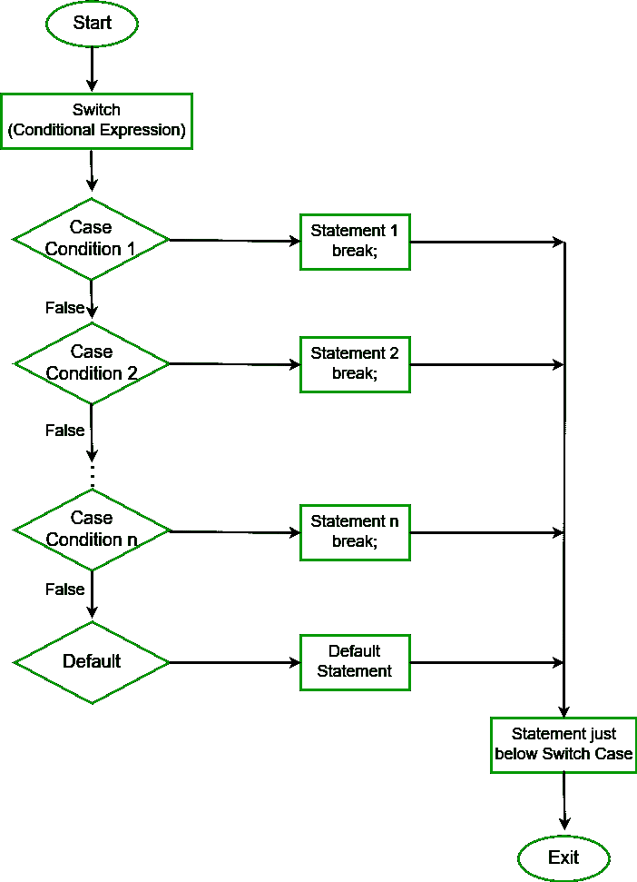

# Java 中的 Switch 语句

> 原文:[https://www.geeksforgeeks.org/switch-statement-in-java/](https://www.geeksforgeeks.org/switch-statement-in-java/)

switch 语句是一个多路分支语句。它提供了一种简单的方法，可以根据表达式的值将执行分派到代码的不同部分。基本上，表达式可以是字节、短、字符和 int 原语数据类型。从 JDK7 开始，它还可以处理枚举类型(java 中的 [Enums](https://www.geeksforgeeks.org/enum-in-java/) )、 [String](https://www.geeksforgeeks.org/string-class-in-java/) 类和 [Wrapper](https://www.geeksforgeeks.org/primitive-wrapper-classes-are-immutable-in-java/) 类。
**开关格语法:**

```
// switch statement 
switch(expression)
{
   // case statements
   // values must be of same type of expression
   case value1 :
      // Statements
      break; // break is optional

   case value2 :
      // Statements
      break; // break is optional

   // We can have any number of case statements
   // below is default statement, used when none of the cases is true. 
   // No break is needed in the default case.
   default : 
      // Statements
}

```

**开关柜流程图:**



**切换语句的一些重要规则:**

*   不允许重复的案例值。
*   案例的值必须与开关中的变量具有相同的数据类型。
*   案例的值必须是常数或文字。不允许变量。
*   break 语句在开关内部用于终止语句序列。
*   break 语句是可选的。如果省略，执行将继续到下一个案例。
*   默认语句是可选的，可以出现在开关块内的任何地方。在这种情况下，如果它不在末尾，那么必须在默认语句之后保留一个 break 语句，以省略下一个 case 语句的执行。

**示例:**
考虑下面的 java 程序，它声明了一个名为 day 的 int，其值代表一天(1-7)。代码使用 switch 语句，根据当天的值显示当天的名称。

## Java 语言(一种计算机语言，尤用于创建网站)

```
// Java program to demonstrate switch case
// with primitive(int) data type
public class Test {
    public static void main(String[] args)
    {
        int day = 5;
        String dayString;

        // switch statement with int data type
        switch (day) {
        case 1:
            dayString = "Monday";
            break;
        case 2:
            dayString = "Tuesday";
            break;
        case 3:
            dayString = "Wednesday";
            break;
        case 4:
            dayString = "Thursday";
            break;
        case 5:
            dayString = "Friday";
            break;
        case 6:
            dayString = "Saturday";
            break;
        case 7:
            dayString = "Sunday";
            break;
        default:
            dayString = "Invalid day";
        }
        System.out.println(dayString);
    }
}
```

输出:

```
Friday

```

**省略中断语句**

As break 语句是可选的。如果我们忽略中断，执行将继续到下一个案例。有时希望多个案例之间没有中断语句。例如，考虑上述程序的更新版本，它还显示一天是工作日还是周末。

## Java 语言(一种计算机语言，尤用于创建网站)

```
// Java program to demonstrate switch case
// with multiple cases without break statements
public class Test {
    public static void main(String[] args)
    {
        int day = 2;
        String dayType;
        String dayString;

        switch (day) {
        case 1:
            dayString = "Monday";
            break;
        case 2:
            dayString = "Tuesday";
            break;
        case 3:
            dayString = "Wednesday";
            break;
        case 4:
            dayString = "Thursday";
            break;
        case 5:
            dayString = "Friday";
            break;
        case 6:
            dayString = "Saturday";
            break;
        case 7:
            dayString = "Sunday";
            break;
        default:
            dayString = "Invalid day";
        }

        switch (day) {
        // multiple cases without break statements

        case 1:
        case 2:
        case 3:
        case 4:
        case 5:
            dayType = "Weekday";
            break;
        case 6:
        case 7:
            dayType = "Weekend";
            break;

        default:
            dayType = "Invalid daytype";
        }

        System.out.println(dayString + " is a " + dayType);
    }
}
```

输出:

```
Tuesday is a Weekday

```

**嵌套开关案例陈述**

我们可以将开关用作外部开关的语句序列的一部分。这被称为嵌套开关。由于 switch 语句定义了自己的块，因此内部开关和外部开关中的 case 常量之间不会产生冲突。例如:

## Java 语言(一种计算机语言，尤用于创建网站)

```
// Java program to demonstrate
// nested switch case statement
public class Test {
    public static void main(String[] args)
    {
        String Branch = "CSE";
        int year = 2;

        switch (year) {
        case 1:
            System.out.println("elective courses : Advance english, Algebra");
            break;
        case 2:
            switch (Branch) // nested switch
            {
            case "CSE":
            case "CCE":
                System.out.println("elective courses : Machine Learning, Big Data");
                break;

            case "ECE":
                System.out.println("elective courses : Antenna Engineering");
                break;

            default:
                System.out.println("Elective courses : Optimization");
            }
        }
    }
}
```

输出:

```
elective courses : Machine Learning, Big Data

```

本文由**高拉夫·米格拉尼**供稿。如果你喜欢 GeeksforGeeks 并想投稿，你也可以使用[contribute.geeksforgeeks.org](http://www.contribute.geeksforgeeks.org)写一篇文章或者把你的文章邮寄到 contribute@geeksforgeeks.org。看到你的文章出现在极客博客主页上，帮助其他极客。
如果你发现任何不正确的地方，或者你想分享更多关于上面讨论的话题的信息，请写评论。