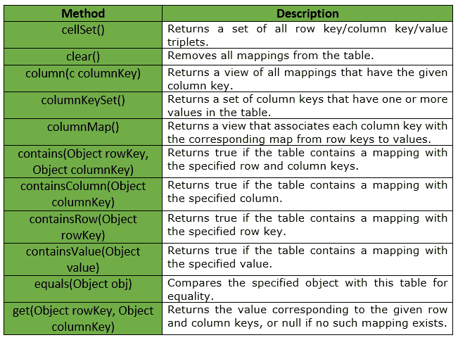
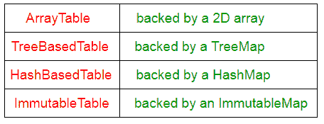

# 表|番石榴|爪哇

> 原文:[https://www.geeksforgeeks.org/table-guava-java/](https://www.geeksforgeeks.org/table-guava-java/)

番石榴的表格是一个集合，代表一个类似表格的结构，包含 ***行、列和相关的单元格值*** 。行和列充当有序的键对。

行和列作为一对**有序的**键。如果我们必须以传统的方式管理它，那么结构将是一个行的映射，其中每行包含一个列和单元格值的映射，例如，**映射< **行键，映射< **列键，单元格值** >** >** 。

**申报:**以下为**com . Google . common . collect . table<**R、C、V**T7**界面申报:

```
@GwtCompatible
public interface Table<R, C, V>

```

**参数:**

*   **R :** 表格行键的类型。
*   **C :** 表格列键的类型。
*   **V :** 映射值的类型。

表接口提供的方法有:

番石榴为表接口提供了不同种类的实现，如下表所示:

**要点:**

*   表可能是稀疏的，只有一小部分行键/列键对拥有相应的值。
*   在某些实现中，按列键的数据访问可能比按行键的数据访问具有更少的支持操作或更差的性能。
*   所有修改表的方法都是可选的，表返回的视图可以修改，也可以不修改。当不支持修改时，这些方法将抛出**不支持操作异常。**

下面给出的是表界面提供的一些其他方法:

**示例:**

```
// Java code to show implementation of
// Guava's Table interface
import java.util.Map;
import java.util.Set;

import com.google.common.collect.HashBasedTable;
import com.google.common.collect.Table;

class GFG {

    // Driver method
    public static void main(String args[])
    {

        // creating a table to store Student information
        Table<String, String, String> studentTable = HashBasedTable.create();

        // Adding student details in the table
        // The first field represents the department
        // of student, second field represents the
        // Roll no. and third field represents the
        // student name
        studentTable.put("CSE", "5", "Dhiman");
        studentTable.put("CSE", "7", "Shubham");
        studentTable.put("CSE", "9", "Abhishek");
        studentTable.put("CSE", "12", "Sahil");

        studentTable.put("ECE", "15", "Ram");
        studentTable.put("ECE", "18", "Anmol");
        studentTable.put("ECE", "20", "Akhil");
        studentTable.put("ECE", "25", "Amrit");

        // get Map corresponding to ECE department
        Map<String, String> eceMap = studentTable.row("ECE");

        System.out.println("List of ECE students : ");

        for (Map.Entry<String, String> student : eceMap.entrySet()) {
            System.out.println("Student Roll No : " + student.getKey() + ", Student Name : " + student.getValue());
        }

        System.out.println();

        // get a Map corresponding to Roll no. 12
        Map<String, String> stuMap = studentTable.column("12");

        for (Map.Entry<String, String> student : stuMap.entrySet()) {
            System.out.println("Student Roll No : " + student.getKey() + ", Student Name : " + student.getValue());
        }
    }
}
```

输出:

```
List of ECE students : 
Student Roll No : 15, Student Name : Ram
Student Roll No : 18, Student Name : Anmol
Student Roll No : 20, Student Name : Akhil
Student Roll No : 25, Student Name : Amrit

Student Roll No : CSE, Student Name : Sahil

```

**参考:**T2】谷歌番石榴