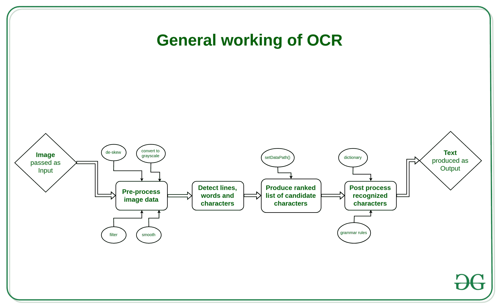
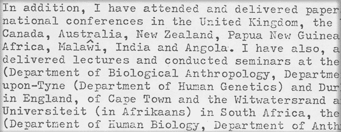
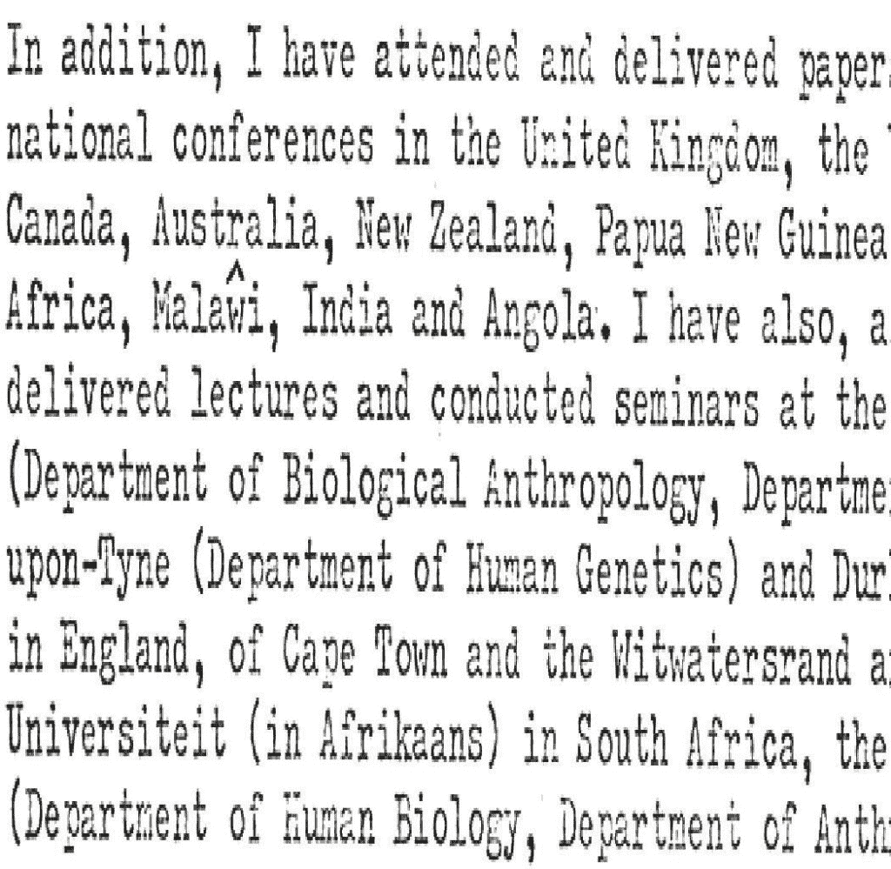

# 用 Java 进行镶嵌光学字符识别，示例

> 原文:[https://www . geesforgeks . org/tesseract-ocr-with-Java-with-examples/](https://www.geeksforgeeks.org/tesseract-ocr-with-java-with-examples/)

在本文中，我们将学习如何使用**宇宙魔方 API** 在 Java 中使用宇宙魔方 OCR。

**<u>什么是宇宙魔方 OCR？</u>**
宇宙魔方 OCR 是由**惠普实验室**于 **1985** 开发，2005 年开源的光学字符读取引擎。从 2006 年开始，它由谷歌开发。宇宙魔方支持 Unicode (UTF-8)，可以“开箱即用”地识别 100 多种语言，因此也可以用于构建不同的语言扫描软件。最新的宇宙魔方版本是**宇宙魔方 4** 。它增加了一个新的基于神经网络(LSTM)的光学字符识别引擎，该引擎专注于**行识别**，但仍然支持通过识别字符模式工作的传统宇宙魔方光学字符识别引擎。

**<u>OCR 是如何工作的？</u>T3】**

一般来说，光学字符识别的工作原理如下:

1.  预处理图像数据，例如:转换为灰度，平滑，去歪斜，过滤。
2.  检测线条、单词和字符。
3.  基于训练好的数据集生成候选字符的排序列表。(这里 setDataPath()方法用于设置教练数据的路径)
4.  对识别出的字符进行后期处理，根据上一步的置信度和语言数据选择最佳字符。语言数据包括词典、语法规则等。

[](https://media.geeksforgeeks.org/wp-content/uploads/20190530190230/General-working-of-OCR-3.jpg)

**<u>优势</u>**

光学字符识别的优点很多，但也就是:

*   它提高了办公室工作的效率和效力
*   即时搜索内容的能力非常有用，尤其是在需要处理大量扫描或大量文档流入的办公室环境中。
*   光学字符识别是快速的，确保文件的内容保持完整，同时节省时间。
*   工作流程增加了，因为员工不再需要浪费时间在体力劳动上，可以更快、更高效地工作。

**<u>劣势</u>**

*   光学字符识别仅限于语言识别。
*   制作不同语言的培训师数据并实现它需要付出很多努力。
*   人们还需要在图像处理上做额外的工作，因为当涉及到光学字符识别的性能时，它是最重要的部分。
*   在做了如此大量的工作之后，没有一种光学字符识别能够提供 100%的准确率，即使在光学字符识别之后，我们也必须通过邻近的机器学习方法来确定未识别的字符，或者手动纠正它。

**<u>如何使用宇宙魔方 OCR</u>**

1.  第一步是从链接下载 [Tess4J](https://sourceforge.net/projects/tess4j/) API
2.  从下载的文件中提取文件
3.  打开您的集成开发环境，创建一个新项目
4.  将 jar 文件与您的项目链接起来。参考此[链接](https://www.edureka.co/community/4028/how-to-import-a-jar-file-in-eclipse)。
5.  请通过此路径迁移”..\Tess4J-3.4.8-src\Tess4J\dist”。

现在，您已经完成了项目中的链接 jar，并准备使用宇宙魔方引擎。

**<u>对清晰图像进行光学字符识别</u>**

现在您已经链接了 jar 文件，我们可以开始编码了。下面的代码读取一个图像文件，并在控制台上执行光学字符识别和显示文本。

## Java 语言(一种计算机语言，尤用于创建网站)

```
import java.io.File;

import net.sourceforge.tess4j.Tesseract;
import net.sourceforge.tess4j.TesseractException;

public class Test {
    public static void main(String[] args)
    {
        Tesseract tesseract = new Tesseract();
        try {

            tesseract.setDatapath("D:/Tess4J/tessdata");

            // the path of your tess data folder
            // inside the extracted file
            String text
                = tesseract.doOCR(new File("image.jpg"));

            // path of your image file
            System.out.print(text);
        }
        catch (TesseractException e) {
            e.printStackTrace();
        }
    }
```

> **输入:**
> [](https://cdn-images-1.medium.com/max/1200/1*klTODXvF6Zjh3SRpOdIpbA.png)
> 
> **输出:**
> 
> ```
> 05221859
> ```
> 
> **工作:**
> 
> <video class="wp-video-shortcode" id="video-309834-1" width="665" height="374" preload="metadata" controls=""><source type="video/mp4" src="https://media.geeksforgeeks.org/wp-content/uploads/20190526042014/Untitled-Project1.mp4?_=1">[https://media.geeksforgeeks.org/wp-content/uploads/20190526042014/Untitled-Project1.mp4](https://media.geeksforgeeks.org/wp-content/uploads/20190526042014/Untitled-Project1.mp4)</video>

**<u>对不清晰图像进行光学字符识别</u>**

请注意，上面选择的图像实际上是非常清晰和灰度化的，但这在大多数情况下不会发生。在大多数情况下，我们会得到一个**噪声图像**，从而得到一个非常多管闲事的输出。为了处理它，我们需要对图像进行一些处理，称为**图像处理**。

当前景文本与背景有非常清晰的分割时，宇宙魔方效果最好。在实践中，保证良好的细分可能极具挑战性。如果图像在背景上有噪点，您可能无法从宇宙魔方获得高质量的输出，原因有很多。图像去噪属于图像处理的一部分。为此，我们需要知道应该以什么方式处理图像。

可以[参考本文](https://docparser.com/blog/improve-ocr-accuracy/)详细了解如何提高准确率。为了在 JAVA 中实现同样的功能，我们将制作一个基于智能的小模型，它将扫描图像的 RGB 内容，然后将其转换为灰度内容，我们还将对图像执行一些缩放效果。

下面的例子是一个关于如何根据图像的 RGB 内容对图像进行灰度缩放的示例代码。因此，如果图像非常暗，那么它们会变得更亮更清晰，如果图像是白色的，那么它们会被缩放到很小的暗对比度，以便文本可见。

## Java 语言(一种计算机语言，尤用于创建网站)

```
import java.awt.Graphics2D;
import net.sourceforge.tess4j.*;
import java.awt.Image;
import java.awt.image.*;
import java.io.*;

import javax.imageio.ImageIO;

public class ScanedImage {

    public static void
    processImg(BufferedImage ipimage,
               float scaleFactor,
               float offset)
        throws IOException, TesseractException
    {
        // Making an empty image buffer
        // to store image later
        // ipimage is an image buffer
        // of input image
        BufferedImage opimage
            = new BufferedImage(1050,
                                1024,
                                ipimage.getType());

        // creating a 2D platform
        // on the buffer image
        // for drawing the new image
        Graphics2D graphic
            = opimage.createGraphics();

        // drawing new image starting from 0 0
        // of size 1050 x 1024 (zoomed images)
        // null is the ImageObserver class object
        graphic.drawImage(ipimage, 0, 0,
                          1050, 1024, null);
        graphic.dispose();

        // rescale OP object
        // for gray scaling images
        RescaleOp rescale
            = new RescaleOp(scaleFactor, offset, null);

        // performing scaling
        // and writing on a .png file
        BufferedImage fopimage
            = rescale.filter(opimage, null);
        ImageIO
            .write(fopimage,
                   "jpg",
                   new File("D:\\Tess4J\\Testing and learning\\output.png"));

        // Instantiating the Tesseract class
        // which is used to perform OCR
        Tesseract it = new Tesseract();

        it.setDatapath("D:\\Program Files\\Workspace\\Tess4J");

        // doing OCR on the image
        // and storing result in string str
        String str = it.doOCR(fopimage);
        System.out.println(str);
    }

    public static void main(String args[]) throws Exception
    {
        File f
            = new File(
                "D:\\Tess4J\\Testing and learning\\Final Learning Results\\input.jpg");

        BufferedImage ipimage = ImageIO.read(f);

        // getting RGB content of the whole image file
        double d
            = ipimage
                  .getRGB(ipimage.getTileWidth() / 2,
                          ipimage.getTileHeight() / 2);

        // comparing the values
        // and setting new scaling values
        // that are later on used by RescaleOP
        if (d >= -1.4211511E7 && d < -7254228) {
            processImg(ipimage, 3f, -10f);
        }
        else if (d >= -7254228 && d < -2171170) {
            processImg(ipimage, 1.455f, -47f);
        }
        else if (d >= -2171170 && d < -1907998) {
            processImg(ipimage, 1.35f, -10f);
        }
        else if (d >= -1907998 && d < -257) {
            processImg(ipimage, 1.19f, 0.5f);
        }
        else if (d >= -257 && d < -1) {
            processImg(ipimage, 1f, 0.5f);
        }
        else if (d >= -1 && d < 2) {
            processImg(ipimage, 1f, 0.35f);
        }
    }
}
```

> **输入:**
> 
> 
> 
> input.png
> 
> **输出:**
> 
> 
> 
> 输出.png
> 
> **工作:**
> 
> <video class="wp-video-shortcode" id="video-309834-2" width="665" height="374" preload="metadata" controls=""><source type="video/mp4" src="https://media.geeksforgeeks.org/wp-content/uploads/20190530131100/Untitled-Project3.mp4?_=2">[https://media.geeksforgeeks.org/wp-content/uploads/20190530131100/Untitled-Project3.mp4](https://media.geeksforgeeks.org/wp-content/uploads/20190530131100/Untitled-Project3.mp4)</video>