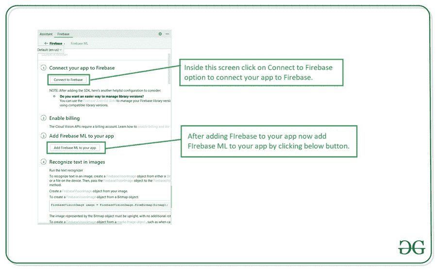

# 安卓中使用 Firebase ML 套件的文本检测器

> 原文:[https://www . geesforgeks . org/text-检测器-in-Android-use-firebase-ml-kit/](https://www.geeksforgeeks.org/text-detector-in-android-using-firebase-ml-kit/)

如今，许多应用程序在其应用程序中使用机器学习来简化大多数任务。我们已经看到了许多从任何图像中检测文本的应用程序。该图像可能包括车牌、图像等。在本文中，我们将看一下使用 Firebase ML 工具包在 Android 中实现**文本检测器。**

### **本文我们要构建什么？**

我们将构建一个简单的应用程序，在其中我们将捕获我们的应用程序中任何文本的图像，然后我们将从该特定图像中提取文本，并在文本字段中显示该文本。下面给出了一个示例视频，让我们了解一下在本文中要做什么。请注意，我们将使用 **Java** 语言来实现这个项目。

<video class="wp-video-shortcode" id="video-557165-1" width="640" height="360" preload="metadata" controls=""><source type="video/mp4" src="https://media.geeksforgeeks.org/wp-content/uploads/20210208200030/Screenrecorder-2021-02-08-19-45-24-848.mp4?_=1">[https://media.geeksforgeeks.org/wp-content/uploads/20210208200030/Screenrecorder-2021-02-08-19-45-24-848.mp4](https://media.geeksforgeeks.org/wp-content/uploads/20210208200030/Screenrecorder-2021-02-08-19-45-24-848.mp4)</video>

### **分步实施**

**第一步:创建新项目**

要在安卓工作室创建新项目，请参考[如何在安卓工作室创建/启动新项目](https://www.geeksforgeeks.org/android-how-to-create-start-a-new-project-in-android-studio/)。注意选择 **Java** 作为编程语言。

**第二步:将你的应用连接到 Firebase**

在 Android Studio 中创建新项目后，将您的应用程序连接到 Firebase。用于将您的应用程序连接到 firebase。导航到顶部栏上的工具。之后点击 Firebase。右侧将打开一个新窗口。在该窗口中，单击 Firebase ML，然后单击使用 Firebase ML 来识别图像中的文本。你可以看到截图下面的选项。


点击此选项后，您将看到下面的屏幕。在此屏幕上，单击连接到 Firebase 选项，将您的应用程序连接到 Firebase。你会看到下面的屏幕。



单击连接选项将您的应用程序连接到 Firebase，并将以下依赖项添加到您的 build.gradle 文件中。

**第三步:添加依赖关系到 build.gradle 文件**

导航到**应用程序>梯度脚本>构建.梯度**文件，并添加以下代码。代码中添加了注释，以便更详细地了解。

> **注意:**如果在**MainActivity.java**文件中出现错误，请使用以下版本(15.0.0)用于 firebase ML 套件。

> firebase ml 套件的依赖项
> 
> 实现' com . Google . firebase:firebase-ml-vision:15 . 0 . 0 '
> 
> firebase 核心的依赖关系。
> 
> 实现' com . Google . firebase:firebase-core:15 . 0 . 2 '

**第四步:在你的安卓应用**中添加相机权限来访问相机

导航到**应用程序> AndroidManifest.xml** 文件，并在其中添加以下代码。代码中添加了注释，以便更详细地了解。

## 可扩展标记语言

```
<!--below line is use to add camera feature in our app-->
<uses-feature android:name="android.hardware.camera" android:required="true"/>

<!--permission for internet-->
<uses-permission android:name="android.permission.INTERNET"/>
```