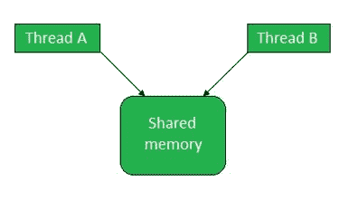
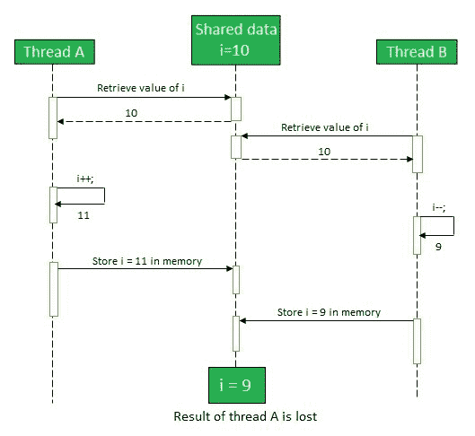
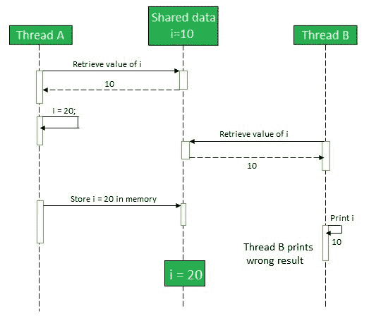

# Java 中的线程干扰和内存一致性错误

> 原文:[https://www . geesforgeks . org/thread-interference-and-memory-consistency-errors-in-Java/](https://www.geeksforgeeks.org/thread-interference-and-memory-consistency-errors-in-java/)

[Java](https://www.geeksforgeeks.org/java/) 允许[多线程](https://www.geeksforgeeks.org/multithreading-in-java/)，这涉及程序的两个或多个部分的并发执行。它通过同时执行多个任务来提高 CPU 利用率。[线程](https://www.geeksforgeeks.org/operating-system-threads-types/)通过共享对象引用和成员变量相互通信。
**当两个线程访问同一个共享内存时**


多线程中的这种通信如果实施不当，会导致两种类型的错误:

1.  螺纹干涉
2.  内存不一致

### 螺纹干涉误差

当多个线程共享同一个内存时，两个或多个对同一数据执行不同操作的不同线程可能会相互交织，并在内存中创建不一致的数据。当线程执行具有多个步骤的操作并且它们的步骤序列重叠时，它们会交错。这被称为线程干扰。

即使是像使用语句 i++或 I–递增或递减变量值(比如 I)这样的小操作，虚拟机也会执行如下多个步骤:

1.  从内存中检索 I 的值
2.  将 I 的值递增/递减 1
3.  将新的 I 递增/递减值存储回存储器

如果有两个线程 A 和 B 在同一个对象上操作，A 执行递增操作，B 同时执行递减操作，可能会导致数据不一致。如果 I 的初始值是 10。线程 A 从内存中读取 I 的值为 10，并将其值增加到 11。在将新值存储到内存之前，线程 B 从内存中读取 I 的值为 10，因为内存尚未更新。现在，线程 B 将 I 的值减为 9。现在内存中的新值可能是 9 或 11，而预期值实际上是 10。一个线程的结果可能会丢失并被另一个覆盖，或者根本不会有错误。由于不可预测，线程干扰 bug 很难检测和修复。

**螺纹干涉误差序列图**



**示例:**

```java
// Java program to explain the
// concept of thread interference.
import java.io.*;

// Creating thread by creating the
// objects of that class
class SharedClass {
    static int i=10;
    void increment()
    {
        for(int j=0;j<50;j++)
        {
                // incrementing value of i 
            i=i+1;
            System.out.println("i after increment "+i);
        }
    }
    void decrement()
    {
        for(int j=0;j<50;j++)
        {
                // decrementing value of i 
            i=i-1;
            System.out.println("i after decrement "+i);
        }
    }
}

class GFG {
    public static void main(String[] args)
    {
        final SharedClass s1 = new SharedClass();
        Thread t1 = new Thread()
        {
            @Override
            public void run()
            {
                s1.increment();
            }
        };
        Thread t2 = new Thread()
        {
            @Override
            public void run()
            {
                s1.decrement();
            }
        };
        t1.start();
        t2.start();
    }
}
```

在上面的代码中，预期输出的最后一行应该是“递增 10 后的 I”或“递减 10 后的 I”，但实际输出可能会因线程的干扰而有所不同。线程干扰是不可预测的，试着运行上面的代码几次，在某些情况下找到线程干扰错误。显然可以看到交错线程操作。

**如何避免线程干扰错误**
通过以下方式使代码线程安全，可以避免线程干扰:

*   [同步](https://www.geeksforgeeks.org/process-synchronization-set-1/)
*   多线程对同一对象的访问限制
*   [将变量声明为最终变量。](https://www.geeksforgeeks.org/instance-variable-final-java/)
*   [将变量声明为易变的。](https://www.geeksforgeeks.org/volatile-keyword-in-java/)
*   [创建不可变对象。](https://www.geeksforgeeks.org/create-immutable-class-java/)

### 内存一致性错误

在多线程中，一个线程所做的更改可能对其他线程不可见，并且它们对同一共享数据的视图不一致。这就是所谓的内存一致性错误。

内存一致性更多的是基于架构的概念，而不是基于 Java 的概念。对主存储器的访问可能不会以中央处理器启动它们的相同顺序发生，尤其是对于经常通过硬件写缓冲区以便中央处理器不需要等待它们的写操作。CPU 保证从所有 CPU 的角度来看，对单个内存位置的写入顺序是保持不变的，即使 CPU 感知其他 CPU 的写入时间与实际时间不同。由于缺乏正确数据的可见性，这有时会导致内存不一致。

**内存一致性错误序列图**



**如何避免内存一致性错误**
内存一致性错误可以通过建立**先发生关系**来避免。这种关系保证了一个线程执行的内存写操作对于同一共享内存上的任何其他线程的读操作都是可见的。

以下操作可以创建先发生关系:

*   [thread . start()](https://www.geeksforgeeks.org/start-function-multithreading-java/)–该语句使导致创建新线程的代码的效果对新线程可见。
*   [thread . join()](https://www.geeksforgeeks.org/joining-threads-in-java/)–该语句使执行连接的线程可以看到线程中代码的效果。

### 线程干扰和内存一致性错误之间的区别

| 螺纹干涉误差 | 内存一致性错误 |
| --- | --- |
| 线程干扰处理两个线程执行过程的交错。 | 内存不一致与可见性有关，涉及硬件内存。 |
| 可以通过授予对线程的独占访问权来避免线程干扰，也就是说一次只有一个线程应该访问共享内存。 | 内存一致性错误可以通过建立先发生关系来处理，这只是保证一个特定语句的内存写入对另一个特定语句可见。 |