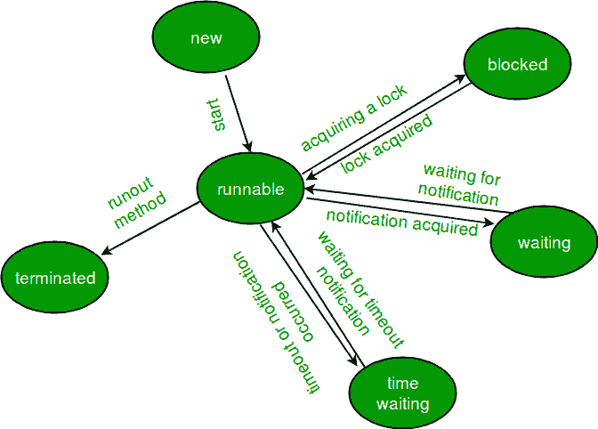

# Java 中线程 isAlive()方法示例

> 原文:[https://www . geesforgeks . org/thread-isalive-method-in-Java-with-examples/](https://www.geeksforgeeks.org/thread-isalive-method-in-java-with-examples/)

java 中的 Thread 类提供了许多方法，这些方法对于理解线程的工作非常重要，因为线程阶段是由它们触发的。Java 多线程借助 ***isAlive()和 join()方法提供了两种查找方式。**T3】*

一个线程知道另一个线程何时结束。让我们通过下图来描述线程生命周期的各个阶段，这有助于我们通过点来理解这些方法的工作方式。



现在让我们更深入地讨论 Thread 类的 isAlive()方法。基本上，这种方法在内部与线程的生命周期阶段非常紧密地并行工作。它测试这个线程是否是活动的。如果一个线程已经启动，并且还没有死亡，那么它就是活动的。从线程运行到线程不运行有一个过渡期。

run()方法返回后，在线程停止之前有一小段时间。如果我们想知道线程类的 start 方法是否已经被调用或者线程是否已经被终止，我们必须使用 isAlive()方法。这个方法用来找出一个线程是否已经实际启动并且还没有终止。

**语法:**

```java
final boolean isAlive()
```

**返回值:**布尔值返回

> **注意:**返回时，如果调用该函数的线程仍在运行，则该函数返回真。否则返回 false。

**例**

## Java 语言(一种计算机语言，尤用于创建网站)

```java
// Java program to Illustrate isAlive() Method
// of Thread class

// Main class extending Thread class
public class oneThread extends Thread {

    // Method 1
    // run() method for thread
    public void run()
    {

        // Print statement
        System.out.println("geeks ");

        // Try block to check for exceptions
        try {

            // making thread to sleep for 300 nano-seconds
           // using sleep() method 
            Thread.sleep(300);
        }

        // Catch block to handle InterruptedException
        catch (InterruptedException ie) {
        }

        // Display message when exception occured
        System.out.println("forgeeks ");
    }

    // Method 2
    // Main driver method
    public static void main(String[] args)
    {
        // Creating threads using above class as
        // it is extending Thread class
        oneThread c1 = new oneThread();
        oneThread c2 = new oneThread();

        // Starting threads
        c1.start();
        c2.start();

        // Checking whethr thread is alive or not
        // Returning boolean true if alive else false
        System.out.println(c1.isAlive());
        System.out.println(c2.isAlive());
    }
}
```

**输出:**

```java
geeks 
true
true
geeks 
forgeeks 
forgeeks
```

本文由**Shivani ghishial**供稿。如果你喜欢 GeeksforGeeks 并想投稿，你也可以使用[write.geeksforgeeks.org](http://www.write.geeksforgeeks.org)写一篇文章或者把你的文章邮寄到 review-team@geeksforgeeks.org。看到你的文章出现在极客博客主页上，帮助其他极客。如果你发现任何不正确的地方，或者你想分享更多关于上面讨论的话题的信息，请写评论。