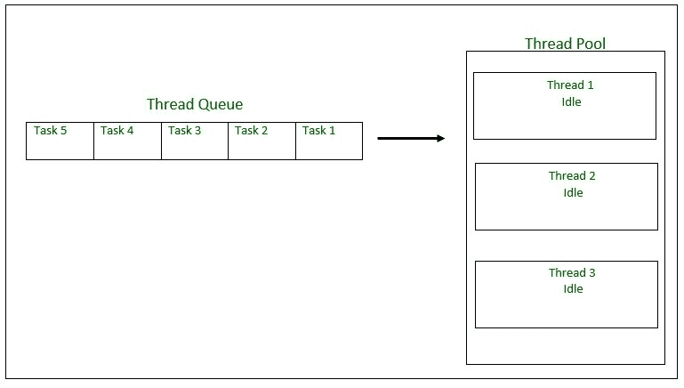
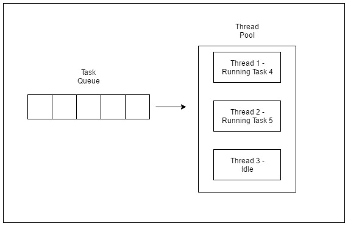

# Java 中的线程池

> 原文:[https://www.geeksforgeeks.org/thread-pools-java/](https://www.geeksforgeeks.org/thread-pools-java/)

**背景**

服务器程序(如数据库和网络服务器)重复执行来自多个客户端的请求，并且这些程序是围绕处理大量短任务而定向的。构建服务器应用程序的一种方法是在每次请求到达时创建一个新线程，并在新创建的线程中为这个新请求提供服务。虽然这种方法看起来很容易实现，但它有很大的缺点。与处理实际请求相比，为每个请求创建新线程的服务器在创建和销毁线程时会花费更多时间和消耗更多系统资源。

由于活动线程消耗系统资源，同时创建太多线程的 [JVM](https://www.geeksforgeeks.org/jvm-works-jvm-architecture/) 会导致系统内存不足。这就需要限制正在创建的线程数量。

**什么是 Java 中的线程池？**

**线程池重用先前创建的线程来执行当前任务，并提供了线程周期开销和资源抖动问题的解决方案。**由于请求到达时线程已经存在，因此消除了线程创建带来的延迟，使应用程序更具响应性。

*   Java 提供了以 Executor 接口为中心的 Executor 框架，它的子接口–**Executor service**和类–**ThreadPoolExecutor**，实现了这两个接口。通过使用执行器，只需要实现 Runnable 对象，并将它们发送给执行器来执行。
*   它们允许您利用线程，但是专注于您希望线程执行的任务，而不是线程机制。
*   To use thread pools, we first create a object of ExecutorService and pass a set of tasks to it. ThreadPoolExecutor class allows to set the core and maximum pool size.The runnables that are run by a particular thread are executed sequentially.
    [](https://media.geeksforgeeks.org/wp-content/uploads/tpinit.jpg)

    大小为 3 个线程的线程池初始化。任务队列= 5 个可运行对象

    **执行器线程池方法**

    ```
    Method                         Description
    newFixedThreadPool(int)           Creates a fixed size thread pool.
    newCachedThreadPool()             Creates a thread pool that creates new 
                                      threads as needed, but will reuse previously 
                                      constructed threads when they are available
    newSingleThreadExecutor()         Creates a single thread. 

    ```

    在固定线程池的情况下，如果执行程序当前正在运行所有线程，则挂起的任务被放在队列中，并在线程空闲时执行。

    **线程池示例**

    在下面的教程中，我们将看一个线程池执行器的基本示例——FixedThreadPool。

    **应遵循的步骤**

    ```
    1\. Create a task(Runnable Object) to execute
    2\. Create Executor Pool using Executors
    3\. Pass tasks to Executor Pool
    4\. Shutdown the Executor Pool

    ```

    ```
    // Java program to illustrate 
    // ThreadPool
    import java.text.SimpleDateFormat; 
    import java.util.Date;
    import java.util.concurrent.ExecutorService;
    import java.util.concurrent.Executors;

    // Task class to be executed (Step 1)
    class Task implements Runnable   
    {
        private String name;

        public Task(String s)
        {
            name = s;
        }

        // Prints task name and sleeps for 1s
        // This Whole process is repeated 5 times
        public void run()
        {
            try
            {
                for (int i = 0; i<=5; i++)
                {
                    if (i==0)
                    {
                        Date d = new Date();
                        SimpleDateFormat ft = new SimpleDateFormat("hh:mm:ss");
                        System.out.println("Initialization Time for"
                                + " task name - "+ name +" = " +ft.format(d));   
                        //prints the initialization time for every task 
                    }
                    else
                    {
                        Date d = new Date();
                        SimpleDateFormat ft = new SimpleDateFormat("hh:mm:ss");
                        System.out.println("Executing Time for task name - "+
                                name +" = " +ft.format(d));   
                        // prints the execution time for every task 
                    }
                    Thread.sleep(1000);
                }
                System.out.println(name+" complete");
            }

            catch(InterruptedException e)
            {
                e.printStackTrace();
            }
        }
    }
    public class Test
    {
         // Maximum number of threads in thread pool
        static final int MAX_T = 3;             

        public static void main(String[] args)
        {
            // creates five tasks
            Runnable r1 = new Task("task 1");
            Runnable r2 = new Task("task 2");
            Runnable r3 = new Task("task 3");
            Runnable r4 = new Task("task 4");
            Runnable r5 = new Task("task 5");      

            // creates a thread pool with MAX_T no. of 
            // threads as the fixed pool size(Step 2)
            ExecutorService pool = Executors.newFixedThreadPool(MAX_T);  

            // passes the Task objects to the pool to execute (Step 3)
            pool.execute(r1);
            pool.execute(r2);
            pool.execute(r3);
            pool.execute(r4);
            pool.execute(r5); 

            // pool shutdown ( Step 4)
            pool.shutdown();    
        }
    }
    ```

    **样品执行**

    ```
    Output:
    Initialization Time for task name - task 2 = 02:32:56
    Initialization Time for task name - task 1 = 02:32:56
    Initialization Time for task name - task 3 = 02:32:56
    Executing Time for task name - task 1 = 02:32:57
    Executing Time for task name - task 2 = 02:32:57
    Executing Time for task name - task 3 = 02:32:57
    Executing Time for task name - task 1 = 02:32:58
    Executing Time for task name - task 2 = 02:32:58
    Executing Time for task name - task 3 = 02:32:58
    Executing Time for task name - task 1 = 02:32:59
    Executing Time for task name - task 2 = 02:32:59
    Executing Time for task name - task 3 = 02:32:59
    Executing Time for task name - task 1 = 02:33:00
    Executing Time for task name - task 3 = 02:33:00
    Executing Time for task name - task 2 = 02:33:00
    Executing Time for task name - task 2 = 02:33:01
    Executing Time for task name - task 1 = 02:33:01
    Executing Time for task name - task 3 = 02:33:01
    task 2 complete
    task 1 complete
    task 3 complete
    Initialization Time for task name - task 5 = 02:33:02
    Initialization Time for task name - task 4 = 02:33:02
    Executing Time for task name - task 4 = 02:33:03
    Executing Time for task name - task 5 = 02:33:03
    Executing Time for task name - task 5 = 02:33:04
    Executing Time for task name - task 4 = 02:33:04
    Executing Time for task name - task 4 = 02:33:05
    Executing Time for task name - task 5 = 02:33:05
    Executing Time for task name - task 5 = 02:33:06
    Executing Time for task name - task 4 = 02:33:06
    Executing Time for task name - task 5 = 02:33:07
    Executing Time for task name - task 4 = 02:33:07
    task 5 complete
    task 4 complete

    ```

    正如在程序执行中看到的，任务 4 或任务 5 仅在池中的线程空闲时执行。在此之前，额外的任务被放在队列中。

    [](https://media.geeksforgeeks.org/wp-content/uploads/tprun1.jpg)

    执行前三个任务的线程池

    [](https://media.geeksforgeeks.org/wp-content/uploads/tprun2.jpg)

    执行任务 4 和 5 的线程池

    ```
    One of the main advantages of using this approach is when you want to process 100 requests at a time, but do not want to create 100 Threads for the same, so as to reduce JVM overload. You can use this approach to create a ThreadPool of 10 Threads and you can submit 100 requests to this ThreadPool. 
    ThreadPool will create maximum of 10 threads to process 10 requests at a time.  After process completion of any single Thread, 
    ThreadPool will internally allocate the 11th request to this Thread 
    and will keep on doing the same to all the remaining requests.

    ```

    **使用线程池的风险**

    1.  **[死锁](https://www.geeksforgeeks.org/deadlock-in-java-multithreading/) :** 虽然死锁可以发生在任何多线程程序中，但线程池引入了另一种死锁情况，即所有正在执行的线程都在等待队列中等待的阻塞线程的结果，因为线程不可用于执行。
    2.  **线程泄漏:**如果线程从池中移除以执行任务，但在任务完成时没有返回给它，则会发生线程泄漏。举个例子，如果线程抛出一个异常，而池类没有捕捉到这个异常，那么线程将简单地退出，将线程池的大小减少一。如果这种情况重复多次，那么池最终将变成空的，并且没有线程可用于执行其他请求。
    3.  **资源抖动:**如果线程池的大小非常大，那么在线程之间的上下文切换中就会浪费时间。如前所述，线程数超过最佳数量可能会导致资源不足，从而导致资源崩溃。

    **重要点**

    1.  不要对同时等待其他任务结果的任务进行排队。这可能导致如上所述的死锁情况。
    2.  在长时间操作中使用线程时要小心。这可能会导致线程永远等待，并最终导致资源泄漏。
    3.  线程池必须在最后明确结束。如果不这样做，程序将继续执行，永远不会结束。在池中调用 shutdown()结束执行器。如果您试图在关闭后向执行器发送另一个任务，它将引发 RejectedExecutionException。
    4.  我们需要了解任务，以便有效地调整线程池。如果任务之间有很大的差异，那么对不同类型的任务使用不同的线程池是有意义的，这样可以适当地调整它们。
    5.  您可以限制 JVM 中可以运行的最大线程数，从而减少 JVM 内存不足的可能性。
    6.  如果您需要实现您的循环来创建新的线程进行处理，使用线程池将有助于更快地处理，因为线程池在达到其最大限制后不会创建新的线程。
    7.  线程处理完成后，线程池可以使用同一个线程来执行另一个进程(这样可以节省创建另一个线程的时间和资源。)

    **调整线程池**

    *   线程池的最佳大小取决于可用处理器的数量和任务的性质。在只有计算类型进程的队列的 N 处理器系统上，N 或 N+1 的最大线程池大小将实现最大效率。但是任务可能会等待输入/输出，在这种情况下，我们会考虑请求的等待时间和服务时间之比；导致最大池大小为 N*(1+ W/S)以实现最高效率。

    线程池是组织服务器应用程序的有用工具。这在概念上非常简单，但是在实现和使用时有几个问题需要注意，例如死锁、资源抖动。执行器服务的使用使得实现更加容易。

    本文由 **Abhishek** 供稿。如果你喜欢 GeeksforGeeks 并想投稿，你也可以使用[contribute.geeksforgeeks.org](http://contribute.geeksforgeeks.org)写一篇文章或者把你的文章邮寄到 contribute@geeksforgeeks.org。看到你的文章出现在极客博客主页上，帮助其他极客。

    如果你发现任何不正确的地方，或者你想分享更多关于上面讨论的话题的信息，请写评论。