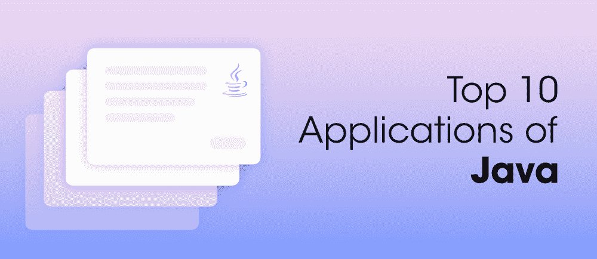

# Java 在现实世界中的十大应用

> 原文:[https://www . geesforgeks . org/top-10-真实世界中的 java 应用/](https://www.geeksforgeeks.org/top-10-applications-of-java-in-real-world/)

Java 是编程语言的女王。它是软件开发人员最喜欢的编程语言的骄傲。Java 最近庆祝了它的 25 周年，并不断更新以适应最新的技术进步。令人惊讶的是，目前大约有 30 亿台设备使用 Java 进行开发。Java 有一个惊人的设计，结合了在任何机器上运行的灵活性。它是众多应用程序开发和主要技术进步的主要组成部分。

[**Java**](https://www.geeksforgeeks.org/java/) 因其惊人的特性成为最健壮的编程语言。它的一些特性是平台无关性、高性能、面向对象、支持自动垃圾管理等等。在本博客中，我们将详细讨论 Java 在现实世界中的**十大应用。**

*   *桌面 GUI*
*   *移动应用*
*   *人工智能*
*   *网络应用*
*   *大数据技术*
*   *游戏应用程序*
*   *业务应用*
*   *嵌入式系统*
*   *云应用*
*   *科学应用*

让我们开始吧。

### 1.桌面图形用户界面

使用 Java 可以完美地设计桌面应用程序。像 Swing、AWT、JavaFX 这样的 API 提供了一种开发 GUI 应用程序的现代方式。java 在桌面应用程序中的使用提供了一些奇妙的好处，比如易于学习、视觉反馈、多个实例的同时显示等等。

### 2.移动应用

Java 是一个跨平台框架，用于构建跨智能手机和其他小屏幕设备运行的应用程序。根据一项调查，Java 是移动应用程序开发中使用第二广泛的语言。使用 Java 创建的移动应用程序包括一些流行的应用程序，如网飞、推特、Spotify 等。

使用 Java 构建移动应用的原因是:

*   *帮助编写简单代码*
*   *跨平台运行*
*   *与柯特林的高相容性*
*   *高安全性*

### 3.人工智能

Java 是人工智能项目的最佳语言之一。它的基础设施很好地嵌入了智能软件，以增强人工智能编程。它有惊人的特性，比如与用户更好的交互、易于调试、易于编码的特性、标准小部件工具等等。Java 的使用正好给人工智能过程带来了完美。

### 4.网络应用

Java 非常适合开发 web 应用程序，因为它能够与大量系统交互。它允许我们创建与界面交互的动态 web 应用程序。JSP、web 服务器、spring、Hibernate 的出现为 web 开发过程提供了可行性。使用 Java 进行 web 开发有几个优点:

*   *各种原料药的存在*
*   *优秀的 IDEs 和工具*
*   *代码的可重用性*
*   *增强的安全功能*

还有更多。

### 5.大数据技术

它是一个软件工具，旨在从复杂的数据结构中分析和提取信息。它广泛应用于其他技术，如深度学习、机器学习和人工学习。Java 是大数据的观点。Java 通常用于像 Apatar、Apache Camel 和 Apache Kafka 这样用于提取复杂信息的 ETL 应用程序。Java 的进一步使用提供了显著的特性，如自动垃圾选择和堆栈提供系统。所有这些都为它提供了超越其他技术的优势，因此 Java 被广泛应用于大数据技术。

### 6.游戏应用

Java 已经被证明是游戏开发最理想的选择，因为有各种各样的开源框架。像《碟中谍 3》、《《我的世界》》和《沥青 6》等热门游戏都是用 Java 开发的。它支持达尔维克虚拟机和 jMonkeyEngine，后者在构建二维和三维安卓游戏方面提供了空间。

### 7.商业应用

Java 帮助我们为业务需求开发健壮的应用程序。它可以用于从小规模应用程序开发到大型企业解决方案。该语言不断发展和更新，以满足最新的业务需求。它提供了增强的功能，例如:

*   *柔性集成*
*   *大企业工作量管理的强大表现*
*   *跨平台兼容性*

还有更多。所有这些惊人的特性使 Java 成为最适合企业开发的解决方案。

### 8.嵌入式系统

它指的是小单元的组合，这些小单元组合起来执行较大系统的集体功能。Java 已经被证明是解决日益增加的软件复杂性的最佳解决方案。如今，大量开发人员在嵌入式系统中使用 Java。Java 有各种各样的库来简化开发人员的生活。这些可以简单地由嵌入式应用程序重用，这极大地提高了生产力。此外，面向对象编程的出现使得开发嵌入式系统变得更加容易，即使只有很少的经验。Java 的所有这些特性使开发人员更容易管理复杂的系统。

### 9.云应用

云计算是指在没有用户直接管理的情况下，按需访问计算机资源。Java 已经在云应用中崭露头角。它以可承受的成本为信息技术基础设施提供解决方案。此外，它还充当创建云服务器和应用程序的平台。

### 10.科学应用

Java 具有增强的安全特性，这使得它成为开发科学应用程序的最佳选择。它已经成为编写复杂数学运算的有力工具。这些程序是以高度安全和高效的方式设计的。一些最广泛使用的应用程序，如 MATLAB，使用 Java 作为核心系统的组件。

Java 存在于软件开发的每个领域。Java 还有更多的应用，如分布式应用、企业应用、物联网技术等，还有很多有待探索的领域。有很多编程语言，但是 Java 仍然是大多数开发人员的首选。